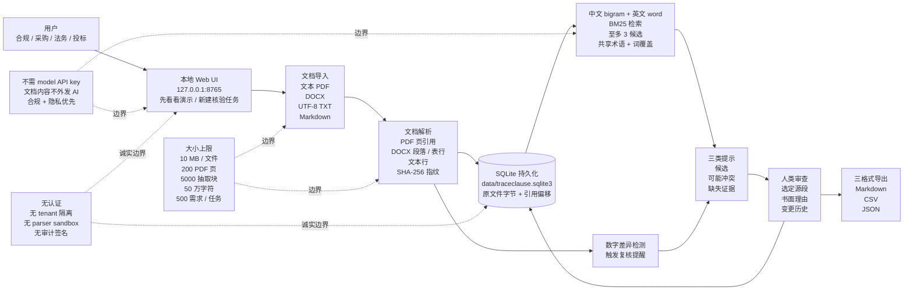

# LingxiangXu/traceclause

## 一句话定位
本地优先的需求文档证据审查工作台 —— 对比需求文档 vs 方案 / 响应文档，BM25 检索候选证据，SHA-256 指纹 + 精确引用偏移保证完整性，人类审查选定源段 + 书面理由 + 变更历史，全程数据本地化、文档内容不外发 AI。

## 它解决的问题
合规 / 采购 / 投标 / 招标场景的痛点是 **「需求文档 vs 方案 / 响应文档需要逐条核对证据 + 数字 / 引用 / 覆盖范围容易漏 + 文档内容不能外发到第三方 AI 服务 + 审计证据需要可追溯」**。传统方案是 Word 批注 + Excel 表格 + 人工核对（慢 / 易漏 / 不可追溯）。TraceClause 用本地优先 + BM25 检索 + SHA-256 指纹 + 引用偏移 + 人类审查 + 三格式导出 是「本地优先 + 证据可追溯 + AI 提示 vs 人类审查边界」三件套工程化形式。

## 为什么值得关注（2026-09-19）
- **Stars:** 58（截至 2026-09-19），1 天 58⭐，早期严肃信号
- **Forks:** 4，fork/star 6.9%（接近昨日 thruwire/foreman 6.4%，「严肃本地工具」早期 fork 率特征）
- **License:** MIT
- **语言:** Python 3.11+
- **活跃度:** created 2026-09-18，pushed_at 2026-09-18，持续高活跃
- **规模:** 98 KB（可独立部署的最小工作台）
- **架构:** FastAPI + SQLite + 中文 bigram + 英文 word BM25
- **界面:** 中文（v0.1.0 单用户基线）
- **支持:** Windows + Linux（CI 覆盖）+ Docker Compose 配置（未验证）+ macOS（未覆盖）

## 热度来源判断
TraceClause 的热度是 **「合规 / 采购 / 投标文档证据审查刚需 × 本地优先 + 不外发 AI × SHA-256 指纹 + 引用偏移 + 人类审查边界 × 诚实表态 6 项早期边界」** 的组合。2026 Q3 趋势从「云办公 API 反 SaaS 编排」（前日 skill-lab/feishu-chat-archive）+「本地优先 MCP 软件质量评估」（昨日 NiazMorshed2007/jev-review）演进到「本地优先文档证据审查 + 合规证据链」—— TraceClause 把「反 SaaS + 本地优先 + 证据可追溯」推到合规场景。README 明确表态「**Automatic hints identify material to inspect; they do not establish compliance or verify that a described feature actually works**」是「AI 提示 vs 人类审查边界」的关键工程化形式 —— 避免「AI 直接给合规结论」的合规风险（合规结论必须人类给）。**6 项诚实表态边界**（无 OCR / 无 DOCX 页号推断 / 无 header / footer / textbox / nested table + 无认证 + 无审计签名 + Docker Compose 未验证 + CI 不覆盖 Docker / macOS）是「v0.1.0 严肃基线」特征 —— 明确「能用 vs 不能用」+ 「未来 6 项演进路径」。58⭐ / 4 forks + 本地优先 + BM25 + SHA-256 + 三格式导出 + 6 项诚实边界 反映「早期严肃本地合规工具」早期信号。热度**真实且具合规场景价值** —— 但需警惕：v0.1.0 是单用户基线 + 6 项明确边界（OCR / DOCX 页号 / parser sandbox / 审计签名 / Docker 验证 / macOS CI）需未来版本覆盖。

## 关键技术亮点
1. **本地优先 + 数据本地化** —— `data/traceclause.sqlite3` 相对工作目录 + `TRACECLAUSE_DB` 环境变量可覆盖
2. **文档内容不外发 AI** —— 不需 model API key + 文档内容不外发第三方 AI 服务（合规 / 隐私优先）
3. **多格式输入** —— 文本 PDF / DOCX / UTF-8 TXT / Markdown 导入
4. **引用精度** —— PDF 页引用 + DOCX 段落 / 表行引用 + 文本行引用（「细粒度引用」工程化形式）
5. **SHA-256 指纹 + 精确需求引用偏移** —— 证据完整性 + 反篡改
6. **中文 bigram + 英文 word BM25** —— 多语言检索 + 至多 3 候选 + 共享术语 + 词覆盖（「可解释检索」工程化形式）
7. **三类提示** —— 候选 / 可能冲突 / 缺失证据（「多角度提示而非单一结论」工程化形式）
8. **数字差异触发复核提醒** —— 「合规 + 数字一致性专门检查」的具体路径
9. **人类审查选定源段 + 书面理由 + 变更历史** —— 「人审 + 记录 + 不可篡改」的具体形式
10. **三格式导出** —— Markdown / CSV / JSON（可对接不同下游工具）
11. **AI 提示 vs 人类审查边界** —— 「Automatic hints identify material to inspect; they do not establish compliance or verify that a described feature actually works」是「合规工具严肃边界」
12. **6 项诚实边界** —— 无 OCR + 无 DOCX 页号推断 + 无 header / footer / textbox / nested table + 无认证 + 无审计签名 + Docker Compose 未验证 + CI 不覆盖 Docker / macOS
13. **大小上限** —— 10 MB 单文件 + 200 PDF 页 + 5000 抽取块 + 50 万字符 + 500 需求 / 任务
14. **MIT + Python 3.11+ + FastAPI + SQLite + 98 KB** —— 可独立部署的最小工作台

## 架构师速览

| 决策问题 | 研究判断 | 证据边界 |
|---|---|---|
| 系统边界 | 本地优先文档需求 + 证据审查工作台；Python 3.11+ · FastAPI · SQLite；多格式输入 + BM25 检索 + SHA-256 指纹 + 引用偏移 + 人类审查 + 三格式导出；不需 model API key + 文档内容不外发 AI；数据本地化 `data/traceclause.sqlite3`；无认证 + 无 tenant 隔离 + 无 parser sandbox | 来自 README 关于「Local document requirements and evidence review workbench」「PDF, DOCX, UTF-8 TXT and Markdown import」「Chinese character-bigram and English word BM25 retrieval」「SQLite persistence」「No OCR for scanned PDFs」「no authentication, tenant isolation or parser sandbox」的明示；具体 BM25 索引存储格式、SHA-256 校验时机、人类审查 schema、SQLite 表结构在仓库源码未展开 |
| 主路径 | 用户启动 `uvicorn traceclause.app:app --host 127.0.0.1 --port 8765` → 打开 127.0.0.1:8765 → 点击「先看看演示」创建 demo review 或「新建核验任务」导入需求 + 方案文档对 → 文档解析（PDF 页 / DOCX 段落 / 文本行 + SHA-256 指纹 + 引用偏移） → 中文 bigram / 英文 word BM25 检索至多 3 候选 → 三类提示（候选 / 可能冲突 / 缺失证据）+ 数字差异复核提醒 → 人类审查选定源段 + 书面理由 + 变更历史 → 导出 Markdown / CSV / JSON 报告 | 主路径来自 README 关于「Open http://127.0.0.1:8765 and click 先看看演示 to create a demo review」「新建核验任务 imports your own pair of documents」「Select a clause, inspect a candidate passage, write a rationale, and save a review」「导出核验报告 exports the results」的描述；具体 demo review 数据源、BM25 索引 schema、SQLite 表结构、导出格式在仓库源码未展开 |
| 关键权衡 | 本地优先 vs 云 SaaS（数据隐私 vs 零运维）/ 不外发 AI vs 调用第三方 AI（合规 vs 能力）/ SHA-256 指纹 vs 无指纹（证据完整性 vs 简单）/ 三类提示 vs 单一结论（多角度 vs 简洁）/ 人类审查 vs AI 自动结论（合规边界 vs 自动化）/ 多格式输入 vs 单一格式（覆盖广度 vs 复杂度）/ v0.1.0 单用户基线 vs 多用户（简洁 vs 协作） | 权衡 7 因素均从 README + 6 项诚实边界推导；具体 BM25 索引细节、SQLite 表结构、文档解析边界、人类审查 schema 在仓库源码未展开 |
| 最小 PoC | macOS / Linux / Windows + Python 3.11+ + `git clone https://github.com/LingxiangXu/traceclause.git` + `python3 -m venv .venv` + `.venv/bin/pip install -e .` + `.venv/bin/python -m uvicorn traceclause.app:app --host 127.0.0.1 --port 8765` → 打开 http://127.0.0.1:8765 → 点击「先看看演示」或「新建核验任务」导入需求 + 方案 → BM25 检索候选 → 选定源段 + 书面理由 → 导出 Markdown 报告 | PoC 由「Python 3.11+ · FastAPI · SQLite · BM25 · SHA-256」推导；具体 demo review 数据源、BM25 索引细节、文档解析 schema、SQLite 表结构、导出格式在仓库源码待核验 |

## 架构图（MMD）

> 证据边界：此图只采用本档案已有可核验描述；"待核验"节点不应视为项目实现事实。

## 架构启发
TraceClause 的核心启发是 **「合规 / 审计工具的可信度瓶颈不在 AI 能力而在证据可追溯 + 数据本地化 + 人类审查边界」**。当 AI 能给出合规结论时，关键问题是「这个结论有证据支撑吗 / 证据可追溯吗 / 文档数据不外发吗 / 结论是否人类审查」—— 这些都需要工程化保证。TraceClause 用「SHA-256 指纹 + 引用偏移 + 变更历史 + 文档内容不外发 AI + 人类审查边界 + 三格式导出」是「证据完整性 + 数据本地化 + AI 提示 vs 人类审查边界」三件套工程化形式。**Automatic hints do not establish compliance** 是关键边界声明 —— AI 只提示「哪些需要审查」，合规结论必须人类给，避免「AI 自动合规结论」的合规风险。**6 项诚实表态边界**（无 OCR / 无 DOCX 页号 / 无 parser sandbox / 无审计签名 / Docker 未验证 / macOS CI 未覆盖）是「v0.1.0 严肃基线」特征 —— 明确「能用 vs 不能用」+ 「未来 6 项演进路径」。**对企业**：合规 / 采购 / 法务团队可在不外发文档前提下做证据审查 + 审计追溯；**对个人开发者**：适合「需求文档 vs 实际方案」自查（如投标 / 验收）；**对学术**：可作为「需求 vs 实现一致性的证据链工具」研究使用。

## 定位判断
**工具型项目（本地优先需求文档证据审查工作台）。** TraceClause 不是又一个 AI 文档分析工具（那是 ChatPDF / Notion AI），而是 **「合规 / 采购 / 投标 / 招标文档证据审查 + 不外发 + 可追溯」** —— 把 AI 文档分析从「云 SaaS + AI 直接给结论」升级到「本地优先 + AI 提示 + 人类审查边界 + 证据可追溯」。58⭐ / 4 forks / 本地优先 + BM25 + SHA-256 + 三格式导出 + 6 项诚实边界 反映「早期严肃本地合规工具」早期信号。**真正决定长期价值的是「OCR / DOCX 页号推断 / parser sandbox / 审计签名 / Docker 验证 / macOS CI」6 项边界是否被未来版本覆盖** —— 这是「v0.1.0 严肃基线」向「v1.0 生产可用」的演进路径。**对企业合规 / 采购 / 法务 / 投标团队**，TraceClause 是「不外发文档 + 证据可追溯 + AI 提示 vs 人类审查边界」的具体路径；**对个人开发者**，可作为「需求 vs 实现一致性证据链工具」使用。

## 风险 / 局限 / 泡沫点
- **v0.1.0 单用户基线** —— 无认证 + 无 tenant 隔离 + 无多用户协作 + 无审计签名 + 无 parser sandbox
- **6 项明确边界** —— 无 OCR 扫描 PDF + 无 DOCX 页号推断 + 无 header / footer / textbox / nested table + 无审计签名 + Docker Compose 未验证 + CI 不覆盖 Docker / macOS
- **大小上限** —— 10 MB 单文件 + 200 PDF 页 + 5000 抽取块 + 50 万字符 + 500 需求 / 任务，超出上限需手工拆分
- **界面仅中文** —— v0.1.0 是单用户基线 + 界面当前中文（README 中文 + Web UI 中文）
- **BM25 检索局限** —— 中文 bigram + 英文 word BM25 不支持语义检索 + 不支持多语言混合 + 不支持 OCR 后 PDF
- **数字差异检测局限** —— 「Numerical discrepancies may trigger a review reminder」是被动检测不是主动分析
- **审计历史未签名** —— `Audit history is not signed or tamper-evident`，审计追溯需要外部工具保证
- **依赖诚实使用** —— README 明确「Keep it on a trusted local machine, bound to 127.0.0.1」，不适合多租户 / 公网部署

## 与同类项目的关系
- **vs skill-lab/feishu-chat-archive（前日）：** feishu-chat-archive 是「中国云办公 API 反 SaaS 编排」，traceclause 是「本地需求文档 + 反 SaaS 证据审查」；两者共同点「反 SaaS + 本地数据」但领域不同（IM 归档 vs 合规文档）
- **vs NiazMorshed2007/jev-review（昨日）：** jev-review 是「本地优先 MCP 软件质量评估」，traceclause 是「本地优先文档证据审查」；两者共同点「本地优先 + 4 项明确无（无 backend / database / telemetry / proxy）」但领域不同（软件质量 vs 文档合规）
- **vs ChatPDF / Notion AI / ChatDOC：** 那些是云 SaaS AI 文档分析，traceclause 是本地优先 + AI 提示 + 人类审查边界；traceclause 强调「不外发 AI + 证据可追溯 + 人类审查合规结论」
- **vs SonarQube / CodeClimate（代码质量）：** 那些是代码质量分析，traceclause 是文档需求 vs 证据审查；领域不同
- **vs Word 批注 + Excel 表格（人工核对）：** 那是慢 / 易漏 / 不可追溯的传统方案，traceclause 是「本地工具 + BM25 检索 + SHA-256 指纹 + 人类审查 + 三格式导出」的具体替代

## 是否值得持续跟踪
**值得跟踪（合规 / 采购 / 投标文档证据审查工具）。** TraceClause 代表了合规工具从「云 SaaS + AI 自动结论」演进到「本地优先 + AI 提示 + 人类审查边界 + 证据可追溯」的诉求，无论其本身成败，这一方向是行业趋势。建议关注：OCR / DOCX 页号推断 / parser sandbox / 审计签名 / Docker 验证 / macOS CI 6 项边界是否被未来版本覆盖。**对企业合规 / 采购 / 法务 / 投标团队**，TraceClause 是「不外发文档 + 证据可追溯 + 人类审查合规结论」的实用工具，值得直接试用（前提是接受 v0.1.0 + 6 项明确边界）。**对学术**，可作为「需求 vs 实现一致性证据链工具」研究使用。

## 后续观察点
- OCR 扫描 PDF 支持是否加入（解决扫描版 PDF 无法检索问题）
- DOCX 页号推断 + header / footer / textbox / nested table 支持是否加入
- parser sandbox 是否加入（防止恶意 PDF / DOCX 攻击）
- 审计签名 + tamper-evident 是否加入（合规审计追溯）
- Docker 镜像构建 + 运行时验证是否完成（解决 README 中「未验证」边界）
- macOS CI 是否覆盖（解决 README 中「不覆盖」边界）
- 多用户 + 认证 + tenant 隔离是否加入（企业协作场景）
- 语义检索是否替代 BM25（语义相似度 vs 关键词检索）

---
> 数据来源: GitHub API (2026-09-19) | Stars: 58 | Forks: 4 | License: MIT | 语言: Python 3.11+ | 创建: 2026-09-18 | 规模: 98 KB
