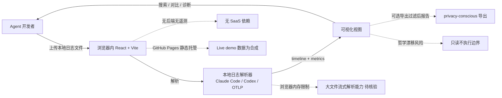

# FankChen/tracecrate

## 一句话定位
TraceCrate——Local-first AI Agent Trace Workbench；客户端解析 Claude Code / Codex / OTLP 日志，生成可搜索 timeline + recorded metrics + heuristic diagnostics + side-by-side 对比；无后端、无遥测、无账号、无 API key。

## 它解决的问题
2025-2026 年 AI Coding Agent（Claude Code / Codex / Aider 等）在开发者工作流中渗透，但运行结果的可观测性是空白——Langfuse / Helicone / Phoenix 等 AI observability 平台都要 SaaS 接入或本地部署服务端，企业对"agent 行为日志外发"有隐私顾虑。**TraceCrate 把"只看 / 不执行"的只读工作台完全 client-side 化**——用户打开本地日志文件，浏览器内解析、对比、导出，无需任何后端服务。这是面向"agent 用户不信任 SaaS 但又想看自己 trace"的精准切入。

## 为什么值得关注（2026-09-12）
- 2 天 92⭐ / fork 2——早期阶段
- MIT license——商业友好
- Live demo 已上线（fankchen.github.io/tracecrate）
- v0.1.0 已发布（GitHub Releases）
- React + Vite + Node.js ≥22.12（24 推荐）
- 仅客户端，不执行 agent 不运行 recorded commands
- 截图明确标注"all events and values are synthetic demo data, not benchmark results"——透明诚信

## 热度来源判断
TraceCrate 处于 AI observability 赛道——Langfuse、Helicone、Phoenix、Arize、LangSmith 等都在抢"AI Agent 可观测性"的位子。**TraceCrate 的差异化是「local-first + 只读 + 无后端」三哲学合一**——不与 SaaS observability 平台正面竞争，而是占据"用户不信任 SaaS"的细分。**热度来源是「AI Agent 可观测性需求 × 企业隐私顾虑 × 浏览器内本地解析技术成熟」三因素叠加**。但 fork=2 / 92⭐ 反映早期阶段，主要是被「隐私 + 哲学」吸引的用户群。**热度真实但属于「细分市场」**，能否扩展取决于支持的日志格式丰富度。

## 关键技术亮点
1. **Local-first 架构**：浏览器内解析本地日志文件，无后端无遥测无账号无 API key
2. **多格式日志解析**：Claude Code / Codex / OTLP（OpenTelemetry）三种主流日志格式
3. **可搜索 timeline + recorded metrics**：把 agent 运行 trace 转换成可视化 timeline + 性能指标
4. **side-by-side 对比**：多个 agent run 并排对比，便于 A/B 测试 prompt / 模型 / 工具
5. **heuristic diagnostics**：启发式诊断（识别异常模式、超时、错误循环等）
6. **privacy-conscious 导出**：可导出报告但不含敏感数据
7. **Live demo 透明诚信**：截图明确标注"all events and values are synthetic demo data, not benchmark results"

## 架构师速览

| 决策问题 | 研究判断 | 证据边界 |
|---|---|---|
| 系统边界 | 单页 Web App（React + Vite）+ 浏览器内本地日志解析；Live demo 静态托管（GitHub Pages）；无后端服务 | 仅基于 README + GitHub 元数据；具体日志解析器实现（OTLP 兼容深度）、性能基准、移动端兼容均待核验 |
| 主路径 | 用户上传/选择本地日志文件 → 浏览器内解析 → 生成 timeline + metrics → 用户交互（搜索 / 对比 / 诊断）→ 可选导出报告 | 主路径为 README 语义抽象；大文件解析性能、并发会话管理、浏览器存储限制均待核验 |
| 关键权衡 | local-first 隐私 vs 日志格式兼容性 vs 仅客户端功能边界 vs "导出"产品哲学漂移 vs 早期阶段生态 | 档案明示「privacy-first」哲学与仅客户端不执行特性；导出功能边界、Claude Code / Codex 日志格式变化适应机制均待核验 |
| 最小 PoC | 浏览器打开 Live demo（fankchen.github.io/tracecrate）；选一个 Claude Code JSONL 日志；查看 timeline；做 side-by-side 对比两个 run；导出过滤后的报告 | PoC 范围与退出路径由档案"先 demo / 后本地、最小化数据外发、可审计"原则推导；具体 OTLP 兼容深度、性能基准、扩展能力均待核验 |
| 依赖与红线 | 依赖 Node.js ≥22.12；MIT license；浏览器内解析意味着大日志文件受浏览器内存限制；GitHub Pages 托管 demo 数据均为合成 | 依赖与红线均来自 README + GitHub 元数据；具体大文件流式解析能力、移动端 PWA 支持、多语言均待核验 |

## 架构图（MMD）

> 证据边界：此图只采用本档案已有可核验描述；“待核验”节点不应视为项目实现事实。

## 架构启发
TraceCrate 的核心启发是 **「只读工作台完全 client-side 化」**——不与 SaaS observability 平台正面竞争，而是占据"用户不信任 SaaS"的细分。**更深层的启发是「截图透明诚信」**——明确标注"all events and values are synthetic demo data, not benchmark results"，避免误导用户。**最值得借鉴的是「多格式日志解析 + side-by-side 对比」的工程选择**——不追求支持所有 agent，而是把主流（Claude Code / Codex / OTLP）做扎实，配合 A/B 对比工作流。**哲学边界（只读不执行）是产品灵魂，不能漂移**。

## 定位判断
**工具型项目（local-first AI observability 工作台）。** TraceCrate 与 Langfuse / Helicone / Phoenix / Arize / LangSmith 处于同一赛道，但走"local-first + 只读 + 无后端"的差异化路线。**真正的差异化是「隐私哲学」**——不与 SaaS observability 平台正面竞争，而是占据"用户不信任 SaaS"的细分。能否扩展取决于：(a) 支持的日志格式丰富度（决定用户覆盖）；(b) 浏览器内大文件解析性能（决定实际可用性）；(c) "导出"功能的隐私边界（决定哲学是否漂移）；(d) 是否扩展到更多 agent（Aider / Cursor / Continue 等）。当前定位是"最有哲学深度的 local-first observability 工作台"，向主流 AI observability 演进是合理路径。

## 风险 / 局限 / 泡沫点
- **早期阶段**：fork=2 / 92⭐ 反映用户基础小，扩展生态尚未形成
- **浏览器内存限制**：大文件解析受限于浏览器内存；流式解析能力待核验
- **Claude Code / Codex 日志格式变化风险**：如果上游 agent 改日志格式，TraceCrate 需要同步适配
- **"导出"哲学漂移风险**：如果未来用户要求"导出到 SaaS"，产品哲学可能漂移
- **缺乏社区运营**：目前没有 Discord / Reddit 等社区渠道
- **平台竞争激烈**：Langfuse / Helicone / Phoenix / Arize / LangSmith 都是更成熟的产品

## 与同类项目的关系
- **vs Langfuse / Helicone / Phoenix / Arize / LangSmith**：这些是 SaaS 或 self-hosted 服务端 observability 平台；TraceCrate 是纯客户端只读工作台
- **vs LangSmith**：LangSmith 是 LangChain 官方；TraceCrate 不绑定 LangChain 生态
- **vs Aider / Cursor / Continue 内置 trace viewer**：那些是 agent 自身的简易 viewer；TraceCrate 是独立跨 agent 工作台
- **vs OpenTelemetry 自托管 + Jaeger / Tempo**：那些是通用 OTLP 平台；TraceCrate 是 AI agent 专用且 client-side
- **vs 浏览器内 SQL / 数据分析工具（如 DuckDB-WASM）**：那些是通用数据分析；TraceCrate 是 AI trace 专用

## 是否值得持续跟踪
**值得跟踪（local-first observability 哲学）。** TraceCrate 代表了"agent 用户不信任 SaaS 但又想看自己 trace"的细分需求，无论其本身成败，这一方向会持续影响 AI observability 赛道。建议关注：(a) 支持的日志格式丰富度（决定用户覆盖）；(b) 浏览器内大文件解析性能（决定实际可用性）；(c) "导出"功能的隐私边界（决定哲学是否漂移）；(d) 是否扩展到更多 agent。**对 AI Agent 隐私敏感用户，这是必看项目**。对 AI observability 观察者，它是"local-first 哲学"的代表样本。

## 后续观察点
- 支持的日志格式是否扩展（Aider / Cursor / Continue 等）
- 浏览器内大文件流式解析能力
- "导出"功能的隐私边界如何演进
- 是否扩展为 PWA（移动端支持）
- 是否出现"扩展点"允许用户自定义解析器
- Live demo 数据集是否真实化（用真实 trace 替代合成数据）

---

*首次记录：2026-09-12*
