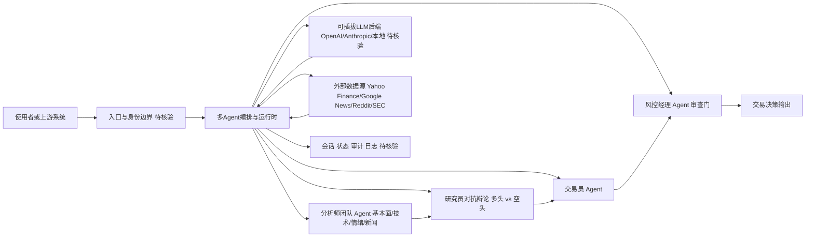

# TauricResearch/TradingAgents

## 一句话定位
多 Agent LLM 金融交易框架——模拟真实交易公司组织架构，将分析师、交易员、风控经理、研究员等角色建模为专业化 Agent，协同完成投资决策。

## 它解决的问题
金融交易决策是高度复杂的多维度问题——需要同时分析基本面数据、技术指标、市场情绪、新闻事件、宏观政策。单一 LLM 难以同时处理这些维度且容易产生偏见。TradingAgents 通过多 Agent 架构模拟真实交易公司的分工：基本面分析师 Agent 负责财报分析，技术分析师 Agent 负责图表模式识别，情绪分析师 Agent 监控社交媒体，最终由"交易员 Agent"综合各方分析做出决策。这种结构化分工显著提升了分析深度和决策质量。

## 为什么值得关注
- **96,008 stars:** 接近 10 万 stars，GitHub 上最热门的金融 AI 项目
- **论文支撑:** 有配套 arXiv 论文 (arxiv.org/pdf/2412.20138)，学术与工程结合
- **真实公司架构模拟:** 将交易公司组织结构直接映射为 Agent 拓扑
- **18,582 forks:** 大量用户在实际使用和修改
- **Apache-2.0 许可证:** 利于商业化应用

## 热度来源判断
热度来自三股力量：(1) 金融行业对 AI 的巨大投入和 FOMO 情绪；(2) 多 Agent 系统作为 AI 前沿架构的技术话题性；(3) 个人投资者/量化爱好者对"AI 选股"的幻想和需求。TauricResearch 团队通过论文发布 + 社交媒体推广 + 开源代码的组合拳实现了病毒式传播。

## 关键技术亮点亮点
- 交易公司架构映射：分析师（基本面/技术/情绪/新闻）→ 研究员（多头/空头）→ 交易员 → 风控经理的完整决策链
- 辩论机制：多头研究员和空头研究员进行对抗式辩论，减少单一偏见
- 实时数据集成：支持 Yahoo Finance、Google News、Reddit、SEC 文件等多源数据
- 可插拔 LLM 后端：支持 OpenAI、Anthropic、本地模型
- 回测框架：历史数据验证策略有效性
- 风险评估模块：交易决策必须通过风控 Agent 审查

## 架构师速览

| 决策问题 | 研究判断 | 证据边界 |
|---|---|---|
| 系统边界 | TradingAgents 是一个以多 Agent 编排为核心、围绕金融决策场景组织的项目，位于"上游系统/使用者 → 入口与身份边界 → 编排运行时 → 模型/工具/会话状态"的中间层，把分析师、研究员、交易员、风控等角色建模为可协作的 Agent。 | 边界与角色分工来源于档案"真实公司架构模拟"与 Agent 拓扑描述；具体入口形态、鉴权方式、部署单元未在档案中给出，需源码核验。 |
| 主路径 | 主路径为：使用者发起请求 → 入口/身份层 → 编排与多 Agent 运行时 → 调用 LLM 后端与外部数据/工具（Yahoo Finance、Google News、Reddit、SEC 等）→ 经多头/空头研究员辩论与风控审查 → 生成交易决策并回写会话、状态与审计。 | 主路径基于档案"关键技术亮点"中的角色链、辩论机制、数据集成、风控模块描述串联；具体消息协议、状态存储格式、回测管线未在档案中给出。 |
| 关键权衡 | 三个最关键的权衡是：(1) 多 Agent 辩论带来的分析深度 vs. 决策延迟，档案已显式指出"不适合高频交易"；(2) 可插拔 LLM 后端（OpenAI/Anthropic/本地）带来的扩展性 vs. 输出稳定性与幻觉风险，档案强调金融容错率极低；(3) 多源实时数据接入（Yahoo/News/Reddit/SEC）的覆盖面 vs. 数据时效性与合规风险，档案已列出监管审查风险。 | 权衡判断直接引用档案"风险/局限/泡沫点"中的延迟、幻觉、数据时效性、监管风险条目；具体的延迟量级、SLO、合规要求未给出。 |
| 最小 PoC | 建议以"单标的、单数据源（Yahoo Finance）、单 LLM 后端、关闭辩论/风控旁路"的最小配置复现一次端到端决策流，并在沙箱环境回测，把决策时延、幻觉样本、可审计日志与退出路径作为验收项，再决定是否扩展到多 Agent 辩论、风控审查与多源数据接入。 | PoC 设计仅依据档案给出的角色链与可插拔后端/数据源特性；具体的最小工具集、回测框架 API、风控 Agent 接口细节"待核验"。 |

## 架构启发
TradingAgents 的核心启发是"用组织架构设计 Agent 拓扑"。对架构师的启发是：**复杂决策问题的多 Agent 分工不应随意设计，而应参考成熟的人类组织结构**——交易公司经过数百年演化出的分工模式（分析师→研究员→交易员→风控）本身就是经过验证的最优架构。将这种"社会工程"迁移到 AI 系统是一种务实的架构策略。

## 架构图（MMD）

> 证据边界：此图只采用本档案已有可核验描述；“待核验”节点不应视为项目实现事实。

## 定位判断
**平台候选（强）。** 已超越框架定位，成为金融 AI Agent 领域的事实标准。96k stars + 论文 + 活跃维护构成强大的生态势能。但其作为"投资决策工具"的实际有效性仍需长期验证——stars 高不等于投资回报高。

## 风险/局限/泡沫点
- **金融泡沫风险最大:** 96k stars 中大量来自"AI 炒股"幻想者，实际投资效果未经验证
- **LLM 幻觉:** 金融决策容错率极低，LLM 的任何幻觉都可能导致重大损失
- **延迟问题:** 多 Agent 协商导致决策延迟，不适合高频交易场景
- **数据时效性:** LLM 的训练数据滞后于市场变化
- **监管风险:** AI 驱动的金融交易面临日益严格的监管审查
- **幸存者偏差:** 开源成功的案例被放大，失败的交易策略不会被公开

## 与同类项目的关系
- 与 **FinGPT**（AI4Finance）在金融 LLM 维度互补——FinGPT 做模型，TradingAgents 做架构
- 与 **Qlib**（微软量化平台）形成"AI Agent vs 传统量化"的对比
- 与 **CrewAI**、**AutoGen** 在多 Agent 框架维度是上下层关系——TradingAgents 基于通用框架构建
- 在学术维度，与 Stanford STORM、MetaGPT 在"多 Agent 系统模拟人类组织"方向上同源

## 是否值得持续跟踪
**强烈推荐跟踪。** 无论作为多 Agent 架构的参考实现还是金融 AI 的风向标，TradingAgents 都具有高研究价值。但需注意区分"架构价值"（高）和"投资价值"（待验证）。

## 后续观察点
- 是否有真实的量化基金采用此框架（而非仅学术/个人使用）
- 多 Agent 辩论机制是否能有效降低 LLM 幻觉
- 是否扩展到加密货币、期权、外汇等更多资产类别
- 监管环境变化对 AI 交易框架的影响
- 学术引用和行业采用的增长趋势

---
> 数据来源: GitHub API (TauricResearch/TradingAgents) | 星标: 96,008 | 语言: Python | 许可证: Apache-2.0
