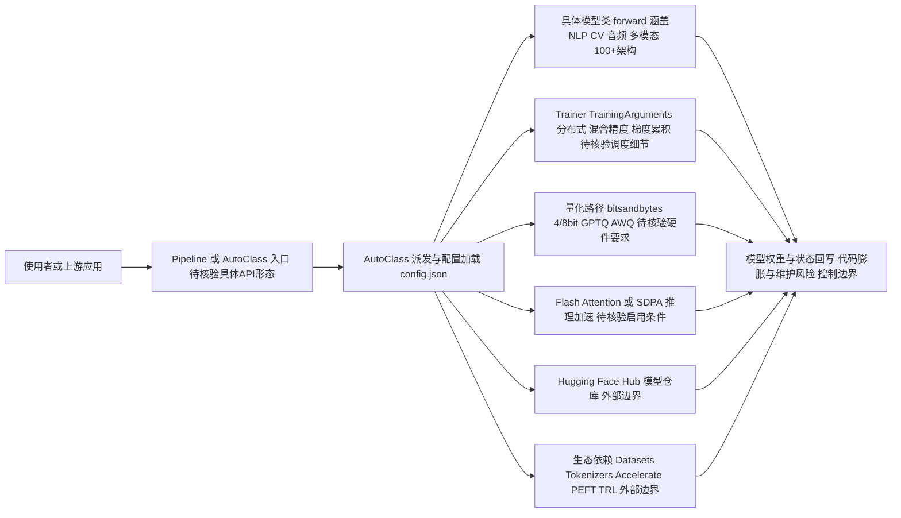

# huggingface/transformers

## 一句话定位
Hugging Face 出品的深度学习模型库，提供数万种预训练模型（NLP、视觉、音频、多模态）的统一 API，是 Transformer 生态的事实标准基础设施。

## 它解决的问题
深度学习模型的使用门槛极高——每种架构（BERT、GPT、T5、ViT、Whisper）有不同的代码结构、预处理流程、权重格式。研究者要复现论文、工程师要部署模型，都需要大量胶水代码。Transformers 库通过统一的 `AutoModel.from_pretrained()` 接口，让"下载模型 → 推理 / 微调"只需三行代码，极大降低了模型使用的工程门槛。

## 为什么值得关注
- **Stars:** 163,431 stars，GitHub Top 20 级别，是 AI 领域 Star 数最高的项目之一
- **模型覆盖:** 支持 100+ 模型架构，NLP / CV / Audio / Multimodal 全覆盖，新模型通常在发布数天内即被集成
- **生态中枢:** 与 Hub (模型仓库)、Datasets、Tokenizers、Accelerate、PEFT 深度整合，形成完整 ML 工具链
- **多框架:** PyTorch / TensorFlow / JAX 三框架后端，尽管实际以 PyTorch 为主
- **产业标准:** 几乎所有开源模型（Llama、Qwen、DeepSeek、GLM）都以 Transformers 格式发布

## 热度来源判断
热度来自三个不可替代性：(1) Hugging Face Hub 已成为开源模型的中央仓库，Transformers 是消费这些模型的原生客户端，地位类似 npm 之于 Node 生态；(2) 大模型浪潮使得"加载预训练模型"成为高频操作，Transformers 是默认入口；(3) 社区贡献机制成熟——模型作者提交 PR 集成新架构，形成自增长飞轮。

## 关键技术亮点亮点
- **AutoClass 体系:** `AutoModel`、`AutoTokenizer`、`AutoProcessor` 根据 config 自动选择正确的类，用户无需关心架构细节
- **Pipeline API:** 高级封装，一行代码完成推理（`pipeline("text-generation", model="...")`）
- **Trainer / TrainingArguments:** 标准化训练循环，支持分布式、混合精度、梯度累积，减少样板代码
- **Flash Attention 集成:** 自动检测并启用 Flash Attention / SDPA，提升推理速度
- **量化支持:** 内置 bitsandbytes (4-bit/8-bit)、GPTQ、AWQ 量化加载

## 架构师速览

| 决策问题 | 研究判断 | 证据边界 |
|---|---|---|
| 系统边界 | Transformers 在 Hugging Face Hub（模型来源）、Datasets/Tokenizers/Accelerate/PEFT（配套工具）、PyTorch/TensorFlow/JAX（计算后端）之间充当"模型消费层 + 编排层"，对外通过 AutoClass 与 Pipeline API 暴露统一接口 | 档案明确列出 AutoModel、Pipeline、Trainer、Flash Attention、bitsandbytes/GPTQ/AWQ 等组件；多框架承诺与配套生态有提及，但部署形态与持久化细节需源码核验 |
| 主路径 | 入口（from_pretrained / pipeline）→ AutoClass 按 config.json 派发 → 具体模型类 forward → 训练侧走 Trainer/TrainingArguments（分布式、混合精度、梯度累积），推理侧可启用 Flash Attention/SDPA 或量化路径 | 主路径来自 AutoClass、Trainer、Flash Attention 集成、量化支持等档案事实；具体协议、调度实现未在档案中描述 |
| 关键权衡 | 覆盖广度（100+ 架构、新模型数天内集成）vs 代码膨胀与维护负担；多框架承诺 vs 实际以 PyTorch 为主；统一易用 vs 推理性能不足（生产常需迁 vLLM/TGI） | 全部权衡直接来自档案"风险/局限"与"为什么值得关注"章节；不引入未证实的性能数据 |
| 最小 PoC | 用 `pipeline("text-generation", model=...)` 或 `AutoModel.from_pretrained()` 加载一个开源权重（如 DeepSeek/Qwen/GLM/Gemma 任一），跑通推理；再叠加 Trainer 做一次小规模微调，验证 AutoClass、Trainer、Accelerate/PEFT 联动 | PoC 基于 Pipeline、AutoClass、Trainer 三项已确认 API；具体模型 ID、量化方案、硬件要求未在档案中声明，需另行核验 |

## 架构启发
Transformers 的架构核心是"约定优于配置"——所有模型遵循统一的接口契约（`forward()` 输入输出格式一致），通过 `config.json` 声明模型参数，权重以标准格式存储。这种设计使得模型成为可互换的组件，配合 Hub 实现了"模型即数据"的范式。其 `add_new_model.py` 模板和 CONTRIBUTING 指南也值得学习——它们将"集成新架构"标准化为可重复的流程。

## 架构图（MMD）

> 证据边界：此图只采用本档案已有可核验描述；“待核验”节点不应视为项目实现事实。

## 定位判断
**基础设施型项目。** Transformers 是 AI 生态的底层依赖库，地位类似于 React 之于前端、Linux 之于服务器。它不是一个"应用"或"平台"，而是支撑上层应用的基石。其价值在于生态锁定——一旦模型格式、API 约定形成标准，迁移成本极高。

## 风险 / 局限 / 泡沫点
- **代码膨胀:** 支持 100+ 模型导致代码库极其庞大，维护负担重，PR 合并周期长
- **PyTorch 依赖:** TensorFlow 后端实际维护不足，多框架承诺打折扣
- **推理优化不足:** Transformers 不是推理引擎，生产部署通常需迁移到 vLLM / TensorRT
- **新架构滞后:** 闭源模型（如 GPT-4、Claude）不在覆盖范围内，仅支持开源模型

## 与同类项目的关系
- **vs vLLM / TGI:** Transformers 用于加载和微调模型，vLLM / TGI 用于高效推理服务，互补关系
- **vs timm:** timm 专注视觉模型，Transformers 覆盖更广
- **vs sentence-transformers:** sentence-transformers 基于 Transformers 构建，专注嵌入向量
- **vs JAX/Flax:** Transformers 可选 JAX 后端，但 Flax 是独立框架

## 是否值得持续跟踪
**是，但关注点应聚焦于生态演进。** Transformers 本身的 API 已高度稳定，日常使用无需频繁追踪。但值得关注的是：新模型架构的集成速度、对新兴推理优化（如 MoE、线性注意力）的支持、以及与 Accelerate / PEFT / TRL 生态的整合深度。

## 后续观察点
- 对下一代架构（Mamba / SSM、线性 Transformer）的支持程度
- 是否在推理层（而非仅训练/加载层）提供竞争力
- Hub 生态是否出现强有力的替代（如 ModelScope 的竞争）
- 代码模块化拆分进度（减少安装体积和依赖冲突）
- 对 Agent / 工具调用场景的原生支持（如内置 function calling 工具）

---
> 数据来源: GitHub API (2026-08-07) | 首次发现: 2026-07-28
