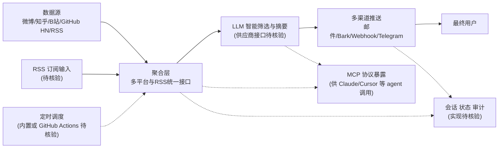

# sansan0/TrendRadar

## 一句话定位
AI 驱动的舆情监控与热点筛选工具——聚合多平台热点和 RSS 订阅，用 LLM 智能筛选和推送，帮助用户告别信息过载。

## 它解决的问题
信息过载是这个时代的核心痛点：每天有海量热点、新闻、技术动态在各大平台产生，人工筛选效率极低且容易遗漏。TrendRadar 聚合多平台数据源，用 AI 按用户兴趣自动筛选重要信息，通过邮件、Bark 推送等渠道及时通知，让用户只看到自己关心的内容。

## 为什么值得关注
- **Stars:** 61,251 stars！增速极快，信息聚合类项目头部
- **Forks:** 24,858，大量用户 fork 部署私有实例
- **Python 实现**，Docker 部署，自托管友好
- **多平台聚合**：微博、知乎、B站、GitHub、 Hacker News 等
- **MCP 支持**：可接入 AI agent 工具链
- **零成本定时运行**：支持 GitHub Actions 等免费方案

## 热度来源判断
- **信息焦虑刚需（极高）**：所有互联网用户都面临信息过载
- **AI 筛选概念（高）**：用 LLM 做内容筛选是天然应用场景
- **中文开发者/运营需求（高）**：多平台聚合对中文用户特别有价值
- **自托管/隐私趋势（中高）**：数据不上交第三方
- **零成本部署（高）**：GitHub Actions 免费运行降低门槛

## 关键技术亮点亮点
1. **多平台数据聚合**：统一接口对接微博/知乎/B站/HN/GitHub Trending 等
2. **LLM 智能筛选**：用大模型按关键词/兴趣/重要性筛选和摘要
3. **多渠道推送**：邮件、Bark、Webhook、Telegram 等
4. **RSS 兼容**：既是 RSS 消费者也是 RSS 生产者
5. **MCP 协议支持**：可被 Claude/Cursor 等 agent 调用
6. **Docker 一键部署**：降低自托管门槛
7. **定时任务调度**：内置或对接 GitHub Actions

## 架构师速览

| 决策问题 | 研究判断 | 证据边界 |
|---|---|---|
| 系统边界 | TrendRadar 是一个聚合多平台热点（微博/知乎/B站/GitHub/HN 等）与 RSS，用 LLM 筛选后经邮件/Bark/Webhook/Telegram 推送的编排层；MCP 协议使其可被外部 AI agent 调用 | 数据源具体列表、推送渠道覆盖度以源码为准 |
| 主路径 | 配置→多平台/RSS 采集→LLM 智能筛选与摘要→多渠道推送→可选 MCP 暴露给 agent；支持 GitHub Actions 等零成本定时调度 | 调度器内置还是外置、LLM 接口形态未在档案中明说，须读 README |
| 关键权衡 | 跨平台反爬封锁与平台 ToS 合规 vs 多源覆盖广度；LLM 持续 API 成本 vs 筛选准确性收益；61k stars 高热度下单一维护者的可持续性 | Fork 数异常（24k）已被档案标记为可疑，活跃度需独立核验 |
| 最小 PoC | 以单一低风险来源（如 GitHub Trending 或 HN）+ 一种推送渠道（邮件或 Bark）+ 一个 LLM 关键词筛选规则在 Docker 中跑通，再接入 MCP | 部署形态、依赖服务、默认调度周期未在档案中证实 |

## 架构启发
- **AI + 信息聚合 = 新型信息消费方式**：不是更多数据而是更少但更准
- **自托管信息管道**：用户掌控自己的信息过滤规则
- **MCP 作为信息接口**：让 agent 主动获取热点信息

## 架构图（MMD）

> 证据边界：此图只采用本档案已有可核验描述；“待核验”节点不应视为项目实现事实。

## 定位判断
**爆款工具型项目**。精准命中信息过载痛点，用 AI 筛选+多平台聚合+零成本部署的组合拳，实现了病毒式增长。有从工具向个人 AI 信息助手演进的潜力。

## 风险/局限/泡沫点
- **平台反爬风险**：微博/知乎/B站等平台可能封堵数据采集
- **LLM 成本**：大量内容筛选需要 API 调用，有持续成本
- **信息茧房**：AI 筛选可能让用户视野更窄
- **Fork 数异常高**（24k）：可能存在刷 fork 或模板化部署，活跃度需核实
- **维护可持续性**：61k stars 项目对个人维护者是巨大压力
- **平台 ToS 合规**：聚合平台数据可能违反用户协议

## 与同类项目的关系
- **vs RSSHub**：RSSHub 做数据源（生成 RSS），TrendRadar 做消费端（筛选+推送）
- **vs RSS 阅读器（Feedly/Inoreader）**：传统 RSS 是被动订阅，TrendRadar 是主动 AI 筛选
- **vs即刻/今日头条**：算法推荐是平台控制，TrendRadar 是用户自控
- **vs AI 摘要工具**：TrendRadar 不只摘要还做筛选和推送

## 是否值得持续跟踪
**强烈推荐跟踪。** 61k stars 的增速说明精准命中痛点。作为个人 AI 信息助手的基础设施，值得关注其架构和产品迭代方向。

## 后续观察点
- 平台反爬对策和数据源稳定性
- 是否推出托管 SaaS 版本（降低部署门槛）
- LLM 筛选的准确率和个性化能力
- 商业化路径（开源+付费托管？）
- 是否从信息聚合扩展到内容创作辅助
- 社区贡献的新数据源插件数量

---
> 数据来源: GitHub API (2026-07-17) | Stars: 61,251 | Forks: 24,858 | 语言: Python
