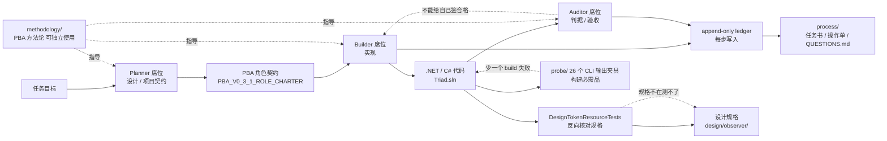

# Wu030616/Triad

## 一句话定位
**PBA（Planner-Builder-Auditor）方法论 + .NET 实现**——把"干"和"判"拆到三个独立席位：**任何一席都不能给自己签合格**，并把每一步真实运行结果写入 append-only ledger，使整个过程事后可逐条复核。中文社区出品的、有方法论自觉的"agent 治理基础设施"候选样本。

## 它解决的问题
2026 年多 agent 协作"工程活"普遍有 3 个痛点：(1) **agent 自审自签**——agent 自己干活、自己验收，于是它说"已完成"——这不是模型能力问题，是结构问题（"你无法从一个人的自述里判断这份自述的真假"）；(2) **缺乏角色分离**——所有决策集中在一个 agent 上，无相互制衡；(3) **审计 trail 缺失**——任务执行过程没有 append-only log，事后无法逐条复核。Triad 把 PBA 三席位作为结构基础，**"任何一席都不能给自己签合格"是核心约束**，并把 ledger 写入作为审计基础。

## 为什么值得关注（2026-08-25）
- **2 天 13⭐**（GitHub API 可核验）：agent-governance 赛道早期信号，star 数低但结构完整
- **C# / .NET 实现**：`Triad.sln` 12938 bytes，真实可运行的 .NET solution——不是文档级 demo
- **七目录对应"设计 / 实现 / 证据"三件事**：methodology（PBA 方法论与角色契约）/ design（界面设计规格 + DesignTokenResourceTests 反向核对）/ src（PBA .NET 实现）/ tests（判据写成可执行形式）/ probe（26 个 CLI 真实输出夹具，构建必需品）/ ledger（一轮真实运行的完整账本切片）/ process（任务书 / 操作单 / 交接件 / QUESTIONS.md 债务册）
- **可独立使用的方法论文档**：`methodology/PBA_V0_3_1_ROLE_CHARTER.md` 明示三席位权责边界，可独立阅读
- **真实 ledger 切片**：`ledger/` 目录存在"一轮真实运行的完整账本切片"——这不是凭空示例
- **probe 夹具作为构建必需品**：`probe/` 内 26 个文件通过 `<Content Include>` 嵌入 `.csproj`，少一个 `dotnet build` 就失败——是构建必需而非附赠样本
- **DesignTokenResourceTests 反向核对**：`design/observer/` 内测试向上找到 `Triad.sln`，再回头读设计规格，把规格里的配色与对比度表逐条比对代码里的资源字面量——规格不在，测试连被测对象都取不到

## 热度来源判断
Triad 的热度来自 **"agent governance 空白 × 中文社区方法论自觉 × 结构完整性"** 的组合：(1) agent governance 在 2026 年下半年被广泛讨论，但"如何真的在工程层实现"仍是空白；(2) 中文社区少见的"理论 + 工程 + 证据"三件套样本，方法论自觉性强；(3) 七目录对应"设计 / 实现 / 证据"的结构完整性在 agent 项目中罕见。**主要风险：** Star 极低（13⭐/0 forks）表明社区关注度尚未形成；中文文档可能限制英文用户采纳；PBA 方法论是否真的能 scale 到 5+ agent 协作仍待观察。

## 关键技术亮点
1. **PBA 三席位结构性分离**：Planner（设计）/ Builder（实现）/ Auditor（判据）——任何一席都不能给自己签合格
2. **Append-only ledger**：所有任务执行步骤写入 append-only log，事后可逐条复核
3. **DesignTokenResourceTests 反向核对**：测试向上找到 solution，向下核对代码资源字面量与设计规格——规格驱动实现的硬约束
4. **probe/ 夹具作为构建必需品**：26 个真实 CLI 输出夹具嵌入 `.csproj`，少一个 build 就失败——保证测试真实性
5. **可独立使用的方法论**：`methodology/` 目录可单独阅读、独立应用，不依赖 .NET 实现
6. **QUESTIONS.md 债务册**：`process/QUESTIONS.md` 跟踪判据长什么样 / 哪一步被驳回 / 返工改了什么——过程透明
7. **真实运行账本切片**：`ledger/` 不是文档示例，是真实运行的完整账本切片

## 架构师速览

| 决策问题 | 研究判断 | 证据边界 |
|---|---|---|
| 系统边界 | PBA 三席位（Planner/Builder/Auditor）+ append-only ledger；七目录对应"设计/实现/证据"三件事；.NET / C# 实现（Triad.sln 12938 bytes） | 边界由 README 中文描述确认；具体三席位的实现位置（methodology/ vs src/ vs tests/）需源码核验；probe 26 个 CLI 覆盖的具体 harness 需源码核验 |
| 主路径 | Planner 设计（含 PBA 项目契约）→ Builder 实现 → Auditor 验收 → append-only ledger 记录每步 → DesignTokenResourceTests 反向核对代码与设计规格 | 主路径由 README 七目录描述确认；具体每席位的决策范围 / 互相否决机制 / ledger 写入时机需 `methodology/PBA_V0_3_1_ROLE_CHARTER.md` 与源码核验 |
| 关键权衡 | 三席位制 vs 效率（三席位互相制衡会降低速度）；append-only ledger 完整性 vs 体积（长期运行 ledger 膨胀）；方法论独立性 vs 实现耦合（methodology/ 可独立用但与 src/ 强关联） | 取舍由 README "任何一席都不能给自己签合格" + append-only ledger 描述确认；具体三席位效率成本、ledger 压缩策略未公开 |
| 最小 PoC | clone repo → 读 `methodology/README_白话版.md` → 读 `PBA_V0_3_1_ROLE_CHARTER.md` → 在一个新项目应用 PBA 三席位 → 参考 `ledger/` 切片写自己的 append-only ledger → 参考 `probe/` 准备 CLI 输出夹具 | PoC 流程由 README 中文描述推导；具体 PBA 角色契约细节 / ledger schema 需 `methodology/` 内核验 |
| 证据边界 | README + 七目录结构 + topics；具体 PBA 角色权责边界、ledger 真实性、probe 覆盖范围均需在 methodology/ 与源码内进一步核验 | 已核验事实来自 README 与 API；其他来自语义推断 |

## 架构图（MMD）

> 证据边界：此图只采用本档案已有可核验描述；"待核验"节点不应视为项目实现事实。

## 架构启发
Triad 的核心启发是 **"agent 不能给自己签字"应当成为多 agent 协作的默认约束**——这是结构性问题而非模型能力问题，把"互不信任"作为默认假设。更深层的启发：**append-only ledger 是 agent 治理的审计基础**——任何多 agent 协作系统都应保留可逐条复核的过程记录（这与 Git commit history 类似，但更细粒度）。再深一层：**"方法论 + 工程 + 证据"三件套的稀缺性**——大部分 agent 项目只做工程层（demo），少有项目同时具备方法论自觉（methodology/）、真实工程实现（src/）、真实证据（ledger/）。Triad 在这一点上罕见地完整。

## 定位判断
**工具型（agent governance 方法论 + 实现）。** Triad 在"agent governance"赛道是中文社区少见的"理论 + 工程 + 证据"三件套样本，2 天 13⭐ / 0 forks 显示早期关注度低。**主要竞争 / 互补关系：** hermes-conductor（forcewake/hermes-conductor）从工程化（worktree lanes + verification gates）切入多 agent 协作；Triad 从结构化分工（PBA 三席位）切入——两个不同方向的方法论。**值得 6-12 月观察**，特别是关注中文技术社区是否采纳 PBA 方法论。

## 风险 / 局限 / 泡沫点
- **Star 极低（13⭐ / 0 forks）**：社区关注度尚未形成，是否被广泛采纳待观察
- **中文文档可能限制英文用户采纳**：README 与 methodology/ 主体为中文，英文翻译未覆盖——国际化不足
- **PBA 方法论 scale 性待观察**：三席位互相制衡会降低效率，5+ agent 协作时是否仍可管理未公开核验
- **Auditor 独立性边界未细化**：Auditor 席位是否真的独立于 Planner/Builder？技术上如何保证？需 `methodology/PBA_V0_3_1_ROLE_CHARTER.md` 内核验
- **append-only ledger 长期存储成本**：长期运行 ledger 膨胀，压缩 / 归档策略未公开
- **probe 26 个 CLI 覆盖范围未公开**：覆盖哪些主流 agent harness？升级兼容性？README 未明示
- **.NET 生态绑定**：依赖 .NET / C#，非 .NET 团队需自行 port 方法论

## 与同类项目的关系
- **vs forcewake/hermes-conductor**：hermes-conductor 从工程化（worktree lanes + verification gates）切入，Triad 从结构化分工（PBA 三席位）切入——两个不同方向的方法论
- **vs backpass**：backpass 切的是 AGENTS.md 自动改写（memory 元层），Triad 切的是 multi-agent 协作的席位分离（governance 元层）——范围更广
- **vs Forsy-AI/biosecurity-agent**：biosecurity-agent 把"已观察 / 已推断 / 已模拟"三类声明显式分离，Triad 把"规划 / 实现 / 审计"三类角色显式分离——同代产物的不同应用
- **vs OpenBot / cumora / herdrm**：这些是 runtime 形态，Triad 是 governance 方法论——互补
- **vs x64dbg-mcp-server（8-24）**：x64dbg-mcp-server 在调试器侧天然留 audit log，Triad 在 governance 层显式 append-only ledger——同代产物

## 是否值得持续跟踪
**值得观察（中文社区方法论自觉样本）。** 对所有关注 agent governance 的团队：**强烈建议花 1-2 小时读 `methodology/README_白话版.md` + `PBA_V0_3_1_ROLE_CHARTER.md`**——这是当前中文社区最完整的多 agent 治理方法论之一；对做 agent 平台的产品经理：**与 hermes-conductor 对照阅读，理解"工程化"与"结构化"两种路径**；对中文技术社区：**这是值得被更多海外项目借鉴与翻译的方法论样本**。

## 后续观察点
- 英文翻译 / 国际化进展
- PBA 方法论在 5+ agent 协作场景的 scale 验证
- Auditor 席位的独立性技术实现
- ledger 长期存储 / 压缩 / 归档策略
- probe 26 个 CLI 覆盖的具体 harness 与升级兼容性
- 中文技术社区是否采纳 PBA 方法论
- 与 hermes-conductor / 其他多 agent 治理项目的协同 / 整合

---
> 数据来源: GitHub API (2026-08-25) | Stars: 13 | Forks: 0 | License: LICENSE 文件 11338 bytes（许可内容需进一步核对） | 语言: C# | 创建: 2026-08-23
