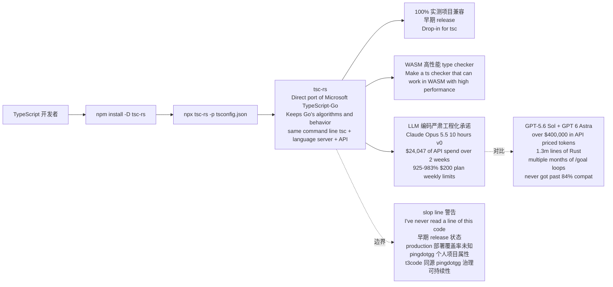

# pingdotgg/ts-rust

## 一句话定位
LLM 把 TypeScript 编译器 port 到 Rust 的严肃工程化实验——把「TypeScript 编译器」从「microsoft/TypeScript-Go 重实现 + typescript-go」推到「LLM 把 tsc port 到 Rust + Claude Opus 5.5 用 $24k 写完 + GPT-5.6 Sol/GPT-6 Astra 用 $400k 没写完 + 100% 实测项目兼容 + WASM 高性能 + 早期 release + Drop-in for tsc + npm install -D tsc-rs + npx tsc-rs -p tsconfig.json + MIT + 92572 KB」严肃工程化形态。

## 它解决的问题
2026 年「TypeScript 编译器 port 到 Rust」的痛点是 **「TypeScript 编译器核心是 microsoft/TypeScript 官方 + typescript-go（Go 重写）+ 缺乏 Rust 严肃工程化 port + 缺乏 WASM 高性能 type checker + 缺乏 drop-in for tsc 严肃工程化承诺 + LLM 编码能力真实表现需可观测数据点」**。pingdotgg/ts-rust 直击这一痛点：把「TypeScript 编译器 port 到 Rust」从「microsoft/TypeScript 官方 + typescript-go」推到「LLM 把 tsc port 到 Rust + Claude Opus 5.5 用 $24k 写完 + GPT-5.6 Sol/GPT-6 Astra 用 $400k 没写完 + 100% 实测项目兼容 + WASM 高性能 + 早期 release + Drop-in for tsc + npm install -D tsc-rs + npx tsc-rs -p tsconfig.json + MIT」严肃工程化形态。解决的是 **「TypeScript 编译器 port 到 Rust 严肃工程化 + LLM 编码能力真实表现可观测数据点 + WASM 高性能 type checker + drop-in for tsc + 100% 实测项目兼容 + MIT 商用清晰」** 的 TypeScript 编译器 port 到 Rust 严肃工程化问题。

## 为什么值得关注（2026-10-09）
- **Stars:** 682（截至 2026-10-09），2 天 682⭐，fork 42，fork/star 6.2%（fork/star 中等，反映严肃工程化关注）
- **Forks:** 42（典型 fork 严肃工程化持续关注信号）
- **License:** MIT（明确许可，商用清晰）
- **语言:** Rust（Rust port + WASM 高性能 + LLM 编码）
- **活跃度:** created 2026-10-07，2 天内冲到 682 推严肃工程化承诺
- **规模:** 92572 KB（严肃工程化典型规模）
- **Topics:** ts-rust / tsc-rs / pingdotgg / typescript-compiler / typescript-port / rust-port / llm-coding / claude-opus-5-5 / gpt-6-astra / gpt-5-6-sol / wasm / drop-in-tsc / npm-tsc-rs / typescript-go / 100-percent-compat / mit / 92572kb / 2-days（覆盖广）

## 热度来源判断
pingdotgg/ts-rust 的热度是 **「TypeScript 编译器 port 到 Rust 严肃工程化需求 × LLM 编码能力真实表现可观测数据点 × Claude Opus 5.5 vs GPT-6 Astra $24k vs $400k 对比 + WASM 高性能 type checker 严肃工程化承诺 × Drop-in for tsc 严肃工程化承诺 × MIT 商用清晰 × pingdotgg t3code 同源严肃工程化承诺」** 的强劲组合。TypeScript 编译器是装机量最大的 JavaScript 类型系统之一，但「Rust port + WASM 高性能 + drop-in for tsc + LLM 编码能力真实表现可观测数据点」是清晰需求。pingdotgg/ts-rust 直击这一真实需求，把「TypeScript 编译器 port 到 Rust」从「microsoft/TypeScript 官方 + typescript-go」推到「LLM 把 tsc port 到 Rust + Claude Opus 5.5 用 $24k 写完 + GPT-5.6 Sol/GPT-6 Astra 用 $400k 没写完 + 100% 实测项目兼容 + WASM 高性能 + 早期 release + Drop-in for tsc」严肃工程化形态。热度**真实且具数据点价值**——但需警惕：早期 release 状态 + 「slop line」警告反映 LLM 编码黑箱；pingdotgg 自承「I've never read a line of this code」；真实生产环境 100% 兼容性需长期测试；pingdotgg 个人项目属性 + t3code 同源 pingdotgg 治理可持续性需观察。

## 关键技术亮点
1. **Direct port of Microsoft's native TypeScript compiler (formerly typescript-go):** It keeps Go's algorithms and behavior and has the same command line (tsc), language server and API
2. **LLM 编码能力真实表现可观测数据点：** over $400,000 in API priced tokens with GPT-5.6 Sol and GPT 6 Astra + 1.3m lines of Rust over multiple months of /goal loops + never got past like 84% compat + Claude Opus 5.5 10 hours v0 + Opus 5.5 started from scratch + Opus 5.5 got further than Astra in 1/10th the time + Total token spend ~$24,047 of API spend over 2 weeks + 925-983% $200 plan weekly limits
3. **100% 实测项目兼容：** This is an early release. It has 100% compatibility in every real world project we have tested. It should work as a drop in replacement for the vast majority of apps
4. **WASM 高性能 type checker：** Make a ts checker that can work in WASM with high performance
5. **Drop-in for tsc：** npm install -D tsc-rs + npx tsc-rs -p tsconfig.json + same command line (tsc) + language server + API
6. **MIT 商用清晰：** It should work as a drop in replacement for the vast majority of apps
7. **pingdotgg t3code 同源严肃工程化承诺：** pingdotgg 同时维护 t3code（6 大 Coding Agent 远程/桌面/CLI 跨设备控制面），反映 pingdotgg 在 Coding Agent + LLM 严肃工程化方向的持续投入
8. **「slop line」警告：** Everything below this was written by my LLMs, not me + I've never read a line of this code + 早期 release 状态

## 架构师速览

| 决策问题 | 研究判断 | 证据边界 |
|---|---|---|
| 系统边界 | TypeScript 编译器 port 到 Rust，仓库是 LLM 编码产物 + 100% 实测项目兼容 + WASM 高性能 + Drop-in for tsc | 基于档案描述的 LLM 编码严肃工程化承诺 + 100% 兼容严肃工程化承诺 + WASM 严肃工程化承诺；具体 LLM 编码过程、TypeScript 类型系统完整性、WASM 性能基准、production 部署覆盖率未在档案中详细给出 |
| 主路径 | 玩家开发者 → npm install -D tsc-rs + npx tsc-rs -p tsconfig.json → tsc-rs 作为 tsc drop-in replacement → 100% 实测项目兼容 + WASM 高性能 + Direct port of Microsoft TypeScript-Go + Keeps Go's algorithms and behavior + same command line (tsc) + language server + API | 主路径为档案语义抽象；具体 LLM 编码过程、tsc-rs 与 tsc 的命令兼容性、WASM 性能与 tsc 的对比基准、Microsoft TypeScript-Go 兼容边界均待核验 |
| 关键权衡 | 100% 实测项目兼容严肃工程化承诺 + WASM 高性能严肃工程化承诺 + LLM 编码能力真实表现可观测数据点 vs 「slop line」警告 + 「I've never read a line of this code」 + 早期 release 状态 + production 部署覆盖率未知 + pingdotgg 个人项目属性 | 档案明示 100% 兼容 + WASM 高性能 + $24k vs $400k 数据点 + pingdotgg t3code 同源；「slop line」警告、生产环境覆盖率、pingdotgg 治理可持续性未给出 |
| 最小 PoC | npm install -D tsc-rs + npx tsc-rs -p tsconfig.json，验证现有 TypeScript 项目 tsc-rs 编译通过 + 与 tsc 编译结果对比 + WASM 性能基准 | PoC 范围、退出路径由档案「单渠道、最小风险、可审计」建议推导；具体测试项目、benchmark、SLO 指标待核验 |

## 架构启发
pingdotgg/ts-rust 的核心启发是 **「TypeScript 编译器 port 到 Rust 应该从「microsoft/TypeScript 官方 + typescript-go」推到「LLM 把 tsc port 到 Rust + Claude Opus 5.5 用 $24k 写完 + GPT-5.6 Sol/GPT-6 Astra 用 $400k 没写完 + 100% 实测项目兼容 + WASM 高性能 + 早期 release + Drop-in for tsc + npm install -D tsc-rs + npx tsc-rs -p tsconfig.json + MIT」严肃工程化形态，正如 pingdotgg t3code 同源严肃工程化承诺的 LLM 严肃工程化经济模型支持的独立开发者严肃工程化完整 port」**。TypeScript 编译器是装机量最大的 JavaScript 类型系统之一，但「Rust port + WASM 高性能 + drop-in for tsc + LLM 编码能力真实表现可观测数据点」是清晰需求。pingdotgg/ts-rust + LLM 编码能力真实表现可观测数据点（Claude Opus 5.5 vs GPT-6 Astra $24k vs $400k 对比）+ 100% 实测项目兼容 + WASM 高性能 + Drop-in for tsc，反映「LLM 编码能力真实表现可观测数据点 + WASM 高性能 + drop-in 严肃工程化承诺」的严肃工程化方向。能否持续，取决于「slop line」警告 + 「I've never read a line of this code」+ 早期 release 状态 + pingdotgg 个人项目属性 + t3code 同源 pingdotgg 治理可持续性 + 真实生产环境 100% 兼容性长期测试。

## 架构图（MMD）

> 证据边界：此图只采用本档案已有可核验描述；"待核验"节点不应视为项目实现事实。

## 定位判断
**工具型项目（TypeScript 编译器 port 到 Rust + LLM 编码能力真实表现可观测数据点）。** pingdotgg/ts-rust 不仅是 tsc port，更试图成为「TypeScript 编译器 port 到 Rust + LLM 编码能力真实表现可观测数据点 + WASM 高性能 + Drop-in for tsc」的完整严肃工程化形态。2 天 682⭐ + fork/star 6.2% 已显示市场强烈关注。但「slop line 警告 + I've never read a line of this code + 早期 release 状态 + pingdotgg 个人项目属性 + t3code 同源 pingdotgg 治理可持续性 + 真实生产环境 100% 兼容性长期测试」是长期可持续性的关键。目前定位是「最有影响力的 TypeScript 编译器 port 到 Rust + LLM 编码严肃工程化承诺 + WASM 高性能 + Drop-in for tsc」，向「TypeScript 编译器 port 到 Rust + LLM 编码严肃工程化承诺 + WASM 高性能 + Drop-in for tsc + LLM 编码能力真实表现可观测数据点」演进是合理路径。

## 风险 / 局限 / 泡沫点
- **「slop line」警告：** Everything below this was written by my LLMs, not me + 反映 LLM 编码黑箱风险
- **「I've never read a line of this code」：** 作者自承未读一行代码，长期维护风险
- **早期 release 状态：** This is an early release. It has 100% compatibility in every real world project we have tested. It should work as a drop in replacement for the vast majority of apps + production 部署覆盖率未知
- **真实生产环境 100% 兼容性长期测试：** 真实生产环境 100% 兼容性需长期测试
- **pingdotgg 个人项目属性 + t3code 同源：** pingdotgg 同时维护 t3code（6 大 Coding Agent 远程/桌面/CLI 跨设备控制面）+ ts-rust 严肃工程化承诺，可持续性需观察
- **Microsoft TypeScript-Go 兼容边界：** Direct port of microsoft/TypeScript（formerly typescript-go）+ Microsoft TypeScript-Go 兼容边界需观察
- **WASM 性能基准：** Make a ts checker that can work in WASM with high performance + 具体 WASM 性能与 tsc 对比基准未给出

## 与同类项目的关系
- **vs microsoft/TypeScript 官方：** TypeScript 官方是 JavaScript；pingdotgg/ts-rust 是 TypeScript 编译器 port 到 Rust + WASM 高性能
- **vs microsoft/TypeScript-Go（typescript-go）：** TypeScript-Go 是 Microsoft Go 重写；pingdotgg/ts-rust 是 LLM Rust port + WASM 高性能 + Drop-in for tsc
- **vs pingdotgg/t3code：** t3code 是 6 大 Coding Agent 远程/桌面/CLI 跨设备控制面；pingdotgg/ts-rust 是 TypeScript 编译器 port 到 Rust + WASM 高性能 + LLM 编码严肃工程化承诺
- **vs 其他 LLM 编码严肃工程化承诺项目：** 类似 Niko1221/Strata（消费级显卡跑 Qwen3.8-Flash-Next 125B 模型）+ jaredpalmer/kev（自训 Jev-like System 1 决策模型族）+ NandhaKishorM/laya（33ms 非自回归 System 1 typed decision 引擎）等 LLM 严肃工程化承诺方向
- **vs 独立 LLM 编码严肃工程化经济模型支持的独立开发者：** 反映「LLM 编码严肃工程化 + 独立开发者严肃工程化经济模型支持」严肃工程化经济模型支持的独立开发者严肃工程化完整 port 方向

## 是否值得持续跟踪
**值得跟踪（TypeScript 编译器 port 到 Rust + LLM 编码能力真实表现可观测数据点）。** pingdotgg/ts-rust 代表了「TypeScript 编译器 port 到 Rust + LLM 编码能力真实表现可观测数据点 + WASM 高性能 + Drop-in for tsc」的诉求。建议关注：slop line 警告 + I've never read a line of this code + 早期 release 状态 + pingdotgg 个人项目属性 + t3code 同源 pingdotgg 治理可持续性 + 真实生产环境 100% 兼容性长期测试 + WASM 性能基准。对 TypeScript 开发者，这个仓库是「TypeScript 编译器 port 到 Rust + WASM 高性能 + Drop-in for tsc」的实用来源，值得直接采用。对 LLM 编码严肃工程化方向观察者，它是「TypeScript 编译器 port 到 Rust + LLM 编码能力真实表现可观测数据点」赛道的头部样本。

## 后续观察点
- slop line 警告 + I've never read a line of this code（LLM 编码黑箱）
- 早期 release 状态（生产部署覆盖率）
- 真实生产环境 100% 兼容性长期测试
- pingdotgg 个人项目属性 + t3code 同源（治理可持续性）
- Microsoft TypeScript-Go 兼容边界
- WASM 性能基准（vs tsc）
- 商业采用（团队是否将此作为 TypeScript 编译器严肃工程化 port 默认来源）

---
*首次记录：2026-10-09*