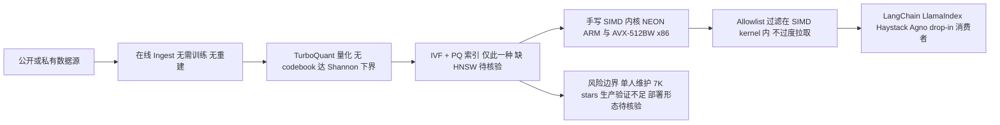

# turbovec

## 一句话定位
基于 Google Research TurboQuant 算法的 Rust 向量索引库，10M 文档从 31GB 压缩到 4GB，搜索速度击败 FAISS。

## 它解决的问题
向量搜索是 RAG 系统的核心，但现有方案（FAISS、Annoy）要么内存占用大，要么需要训练/重建索引。turbovec 用 TurboQuant 量化算法解决了内存和延迟问题。

## 为什么值得关注（2026-06-08）
1. 10M 文档 31GB → 4GB，内存压缩 ~87%
2. 击败 FAISS IndexPQFastScan 12-20%（ARM）
3. 在线 ingest，无需训练/重建索引
4. **+1,533 stars/天，全网日增速第一**（2026-06-08）
5. Stars 从 3.4K 翻倍至 7K，仅用 ~10 天
6. 支持 LangChain / LlamaIndex / Haystack / Agno 框架

## 热度来源判断
- **真实需求。** RAG 系统的内存和延迟是真实痛点
- TurboQuant 论文（arXiv:2504.19874）提供了理论基础
- 纯本地、无外部依赖，适合隐私敏感场景
- API 简洁，drop-in 替换现有方案

## 关键技术亮点亮点
1. **TurboQuant 量化**：达到 Shannon 下界的无训练量化器，无需 codebook 训练
2. **SIMD 优化**：手写 NEON (ARM) 和 AVX-512BW (x86) 内核
3. **Allowlist 过滤**：搜索时直接在 SIMD kernel 内过滤，不 over-fetch
4. **在线 Ingest**：添加向量即索引，无重建步骤
5. **多框架集成**：LangChain / LlamaIndex / Haystack / Agno 的 drop-in 替换

## 架构师速览

| 决策问题 | 研究判断 | 证据边界 |
|---|---|---|
| 系统边界 | turbovec 是 Rust 实现的向量索引库，依赖 TurboQuant 量化与手写 SIMD 内核，Python 侧提供 LangChain / LlamaIndex / Haystack / Agno 的 drop-in 集成；属于 RAG 检索侧的内存/计算密集组件，不含完整向量数据库能力 | 档案明示"索引库"、仅 IVF + PQ 索引、缺少 HNSW 等图索引，与 Milvus / Qdrant 的差距在档案"风险/局限"段列出 |
| 主路径 | 数据源 → 在线 ingest（无需训练/重建） → TurboQuant 量化 + SIMD（NEON / AVX-512BW）内核 → 索引驻留内存（10M 文档 31GB → 4GB） → 框架消费层做带 allowlist 过滤的检索 | ingest/量化/SIMD/内存压缩均来自档案"关键技术亮点"；具体协议、持久化、部署形态未在档案中描述，须源码核验 |
| 关键权衡 | 内存与延迟收益（~87% 压缩、ARM 上对 FAISS IndexPQFastScan +12–20%）换的是覆盖度（仅 IVF + PQ）、生产验证不足（7K stars、单人维护）以及纯本地部署的扩展性上限 | 性能数字来自档案"为什么值得关注"段；生产可用性、稳定性、召回基准在档案中均未给出 |
| 最小 PoC | 选可审计数据集，验证三条：① TurboQuant 量化前后召回/精度 ② ARM/x86 目标平台上的 SIMD 加速与延迟 ③ LangChain / LlamaIndex / Haystack / Agno drop-in 替换路径及 allowlist 过滤行为；把单维护者风险、退出路径与 SLO 写入验收项 | 框架集成清单与 allowlist 过滤来自档案；具体 API、版本兼容、构建产物与平台要求档案未列，需以仓库文档核验 |

## 架构启发
- **量化是向量索引的未来**：TurboQuant 证明了无训练量化可以达到接近原始精度
- **SIMD 内核的关键性**：在量化基础上，手写 SIMD 是性能差异的关键
- **API 简洁性的价值**：drop-in 替换使迁移成本极低

## 架构图（MMD）

> 证据边界：此图只采用本档案已有可核验描述；“待核验”节点不应视为项目实现事实。

## 定位判断
- **基础设施候选**。向量索引是 RAG 栈的核心组件
- 目前是索引库，但有潜力发展为完整的向量数据库

## 风险/局限/泡沫点
1. 7K 规模仍较小，生产验证不足
2. 单人项目（RyanCodrai），维护风险
3. 目前只有 IVF + PQ 索引，缺少 HNSW 等图索引
4. 与 Milvus / Qdrant 等完整向量数据库功能差距大
5. 日增 1,533 stars 可能含趋势追逐成分，需观察留存

## 与同类项目的关系
- **vs FAISS**：turbovec 更轻量、更省内存，但功能覆盖少
- **vs Qdrant**：Qdrant 是完整向量数据库，turbovec 是索引库
- **vs Milvus**：Milvus 面向企业级，turbovec 面向嵌入式场景

## 是否值得持续跟踪
**建议评估。** 如果你的 RAG 系统有内存或延迟瓶颈，turbovec 值得评估。

## 后续观察点
1. 生产环境中的稳定性和准确性
2. 是否会发展出更多索引类型（HNSW 等）
3. 社区贡献者增长
4. 与主流向量数据库的竞争/合作关系
5. 7K→10K 增速是否可持续

---

## 更新记录

### 2026-06-08
- Stars: 3.4K → 7K（翻倍，+1,533/天 全网日增速第一）
- Score: 83 → 85
- 新增 SIMD 标签
- 判断：向量检索性能优化是真实需求，日增速验证了基础设施级价值
