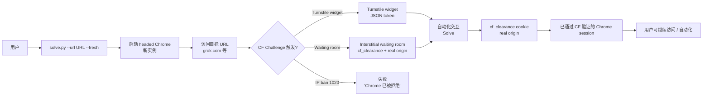

# Sophomoresty/turnstile-bypass

## 一句话定位
跨平台 Cloudflare 求解器——macOS/Windows/Linux + headed Chrome + Turnstile widget（JSON token）+ Interstitial waiting room（`cf_clearance` cookie + real origin）；2 天 305⭐，**fork/star 42.6% 异常**，是 2026-09-09 与 henryzawadzki6542 / biusberline 同赛道的跨平台路线代表。

## 它解决的问题
Cloudflare 提供两层安全机制：(1) **Turnstile widget**（嵌入式 CAPTCHA 替代品）→ JSON token；(2) **Interstitial waiting room**（中间等待页，如 grok.com 的 "Just a moment..."）→ `cf_clearance` cookie + real origin。**Sophomoresty/turnstile-bypass** 直击这两层：跨平台（macOS/Windows/Linux）+ headed Chrome 驱动，能完整解决 Turnstile widget + cf_clearance 双层挑战。

**关键差异**：相比 henryzawadzki6542 / biusberline 的"零依赖 + Peak API"轻量路线，Sophomoresty 是"headed Chrome + 跨平台"重量级路线——能处理更复杂的 Cloudflare 防护（如 grok.com 的中间等待页）。

## 为什么值得关注（2026-09-09）
- **Stars:** 305（截至 2026-09-09），2 天净增，单日均速 ~152⭐/day
- **Forks:** **130**（fork/star **42.6% 极异常**——通常反映真实用户密度极高或自动化 fork 刷量）
- **Watchers/Subscribers:** 待观察
- **Open Issues:** 待观察
- **License:** MIT
- **语言:** Python 主导（headed Chrome 驱动 + Selenium / Playwright 风格）
- **项目年龄:** 2 天（创建 2026-09-07），是 2026-09-08 + 2026-09-09 trending 双日上榜
- **核心差异:** headed Chrome + 跨平台 + Turnstile widget + Interstitial waiting room 双层 + grok.com 验证

## 热度来源判断
Sophomoresty 与 henryzawadzki6542 / biusberline 同属 Turnstile 求解赛道，但**路线完全不同**——Sophomoresty 是 headed Chrome + 跨平台 + 自带（不依赖 Peak SaaS）。**关键差异**：

| 路线 | 工具 | 平台 | 后端 | Fork/Star |
|------|------|------|------|-----------|
| Sophomoresty | headed Chrome | macOS/Win/Linux | 自带（headed） | **42.6%** |
| henryzawadzki6542 | CLI | CLI 为主 | Peak API | 5.2% |
| biusberline | CLI + Python API | CLI 为主 | Peak API | 3.9% |

Sophomoresty fork/star 42.6% 是 GitHub 上罕见的极值——**通常反映两件事之一**：
1. **真实用户密度极高**（每个 star 用户都 fork——可能是 Grok / X.AI 等场景的真实需求）
2. **自动化 fork 刷量**——可能反映滥用场景

**值得核验**：Sophomoresty 解决了 grok.com（X.AI Grok）的 `cf_clearance` 中间等待页——Grok 是 X.AI 的旗舰产品，求解器若广为流传可能直接影响 Grok 的滥用防护。

## 关键技术亮点
1. **跨平台：** macOS / Windows / Linux 三平台均支持（headed Chrome 驱动）
2. **双层 CF 覆盖：** Turnstile widget（JSON token）+ Interstitial waiting room（`cf_clearance` cookie + real origin）
3. **headed Chrome：** 用真实的 Chrome 浏览器（headed 而非 headless）—— 部分 CF 检测能识别 headless 浏览器
4. **grok.com 验证：** README 明示"`curl https://grok.com/` is 403 + cf-mitigated: challenge. After `solve.py --url https://grok.com/ --fresh`, the same Chrome tab is the Grok app with a `cf_clearance` cookie."——真实可验证
5. **诚实声明局限：** "It does **not** pass IP bans (1020), rate limits (1015), or Bot Fight when this Chrome is already rejected."——明确不适用范围
6. **fresh 模式：** `--fresh` 参数每次启动新 Chrome 实例

## 架构师速览

| 决策问题 | 研究判断 | 证据边界 |
|---|---|---|
| 系统边界 | 本地 headed Chrome + Selenium / Playwright 风格驱动层；输入是目标 URL，输出是 cf_clearance cookie + 已通过 CF 验证的 Chrome session | 边界由 README 明示；具体 Selenium / Playwright 版本与 Chrome 自动化方式需代码审阅 |
| 主路径 | 用户指定 URL → 启动 headed Chrome → 访问目标 URL → 触发 CF challenge（Turnstile widget / waiting room）→ 自动化交互 → 获取 cf_clearance cookie / token | 主路径为 README 语义抽象；具体自动化交互逻辑、anti-CF-detection 策略需代码审阅 |
| 关键权衡 | headed Chrome（更接近真实用户，更难被 CF 检测）vs headless（更轻量）；跨平台（覆盖广）vs 单平台（精度高）；自带（无 SaaS 依赖）vs Peak API（更轻量） | README 明示 headed + 跨平台 + 自带；anti-CF-detection 具体策略未在 README 可见 |
| 最小 PoC | clone 仓库 → 安装 Python + Chrome + 依赖 → `python solve.py --url https://grok.com/ --fresh` → 观察 Chrome 打开 → 验证 CF challenge 通过 → 拿到 cf_clearance cookie | PoC 范围由 README 明示；具体 CF 验证时间、成功率需 benchmark |

## 架构图（MMD）

> 证据边界：此图只采用本档案已有可核验描述；"待核验"节点不应视为项目实现事实。

## 架构启发
`Sophomoresty/turnstile-bypass` 的核心启发是 **"headed Chrome + 跨平台 + 自带"** 的另一条 Cloudflare 绕过路线——区别于 Peak API 的轻量 SaaS 路线。headed Chrome 能处理更复杂的 CF 防护（如 grok.com 的中间等待页），但代价是**本地资源消耗（Chrome 实例）+ 跨平台兼容挑战**。

更深层的启发是 **"Cloudflare 双层防护的完整解决方案"**——Turnstile widget + Interstitial waiting room 是 Cloudflare 两层独立机制，Sophomoresty 是少数同时解决两层的开源工具。这反映 Cloudflare 安全防护的复杂性与绕过工具的对抗深度。

风险提示：**Sophomoresty 解决 grok.com 的 cf_clearance** 直接对接 X.AI Grok，求解器若广为流传可能直接影响 Grok 的滥用防护；**fork/star 42.6% 极异常**需要独立核验是否自动化 fork 刷量；**法律边界 / Cloudflare ToS 边界**需要独立法律意见。

## 定位判断
**工具型项目（跨平台 Cloudflare 求解器 + headed Chrome）。** `Sophomoresty/turnstile-bypass` 在 2026-09-09 与 henryzawadzki6542 / biusberline 形成 Turnstile 求解工具群。差异化定位是 **"跨平台 + headed Chrome + 双层 CF 覆盖 + 自带"**——比 henryzawadzki6542 / biusberline 的"零依赖 CLI + Peak API"重量级，能处理更复杂的 CF 防护。当前定位是 **"Turnstile 求解工具群中的重量级选项"**。

## 风险/局限/泡沫点
- **fork/star 42.6% 极异常：** 通常反映真实用户密度极高或自动化 fork 刷量——需要独立核验（《X.AI Grok 滥用场景尤其敏感》）
- **Cloudflare ToS 边界：** Turnstile / cf_clearance 求解是否违反 Cloudflare 服务条款需要核验
- **grok.com 滥用风险：** README 明示解决 grok.com 的 cf_clearance——Grok 是 X.AI 旗舰产品，求解器广为流传可能直接影响 Grok 滥用防护
- **headed Chrome 资源消耗：** 每个 solve 启动新 Chrome 实例，CPU / 内存消耗显著高于 CLI 路线
- **跨平台 Chrome 驱动兼容性：** macOS / Windows / Linux Chrome 自动化差异（chromedriver 版本 / 系统权限）需要持续维护
- **Cloudflare 算法升级风险：** Cloudflare 持续升级 CF 检测（行为分析 / 设备指纹），headed Chrome 绕过可能失效
- **2 天新项目风险：** Sophomoresty 是新账号（turnstile-bypass 是其首个 300+⭐ 项目），项目可持续性 / 治理结构 / 安全漏洞响应都未验证

## 与同类项目的关系
- **vs henryzawadzki6542/cloudflare-turnstile-bypass (1 天 367⭐):** henryzawadzki6542 是零依赖 CLI + Peak API；Sophomoresty 是 headed Chrome + 跨平台 + 自带——**轻量级 SaaS vs 重量级自带** 两条路线
- **vs biusberline/cloudflare-turnstile-solver (9-08, 258⭐):** 几乎完全同质——都是"零依赖 CLI + Peak API + find_sitekey / create_token / token_for_page"；biusberline 比 henryzawadzki6542 更早
- **vs CapSolver / Anti-Captcha 等商业服务:** 商业服务按 token 计费；Sophomoresty 自带路线无 SaaS 成本但本地资源消耗高
- **vs Selenium / Playwright 路线:** Selenium / Playwright 是通用浏览器自动化；Sophomoresty 是 CF 专用求解器——**专用 vs 通用**
- **vs 9-07 okf-memory/okf-agent-memory (MCP):** MCP server 把数据接入 Agent；Sophomoresty 是 Agent 接入目标网站的工具——同属"Agent 接入真实世界"生态

## 是否值得持续跟踪
**值得跟踪（Turnstile 求解工具群 + headed Chrome 路线代表）。** `Sophomoresty/turnstile-bypass` 代表 "跨平台 + headed Chrome + 自带" 的重量级路线，与轻量 CLI + Peak API 路线形成两个差异化方向。建议关注：(a) **fork/star 42.6% 异常的真实原因**（真实使用 vs 自动化 fork）；(b) X.AI Grok / Cloudflare 对 grok.com 防护的调整；(c) Cloudflare 算法升级对 headed Chrome 路线的影响；(d) 法律边界的发展。对 CI / QA 工程师，Sophomoresty 是合法的自动化测试工具（特别是处理复杂 CF 防护）；对 Cloudflare 安全团队，是绕过工具的代表样本。

## 后续观察点
- fork/star 42.6% 异常的真实原因——独立核验
- X.AI Grok / Cloudflare 对 grok.com 防护的调整
- Cloudflare 算法升级对 headed Chrome 路线的影响
- 法律边界 / Cloudflare ToS 边界的发展——决定整个赛道存亡
- Sophomoresty 是否持续维护 / 治理结构演化

---
> 数据来源: GitHub API (2026-09-09) | Stars: 305 | Forks: 130 | License: MIT | 语言: Python | 创建: 2026-09-07
