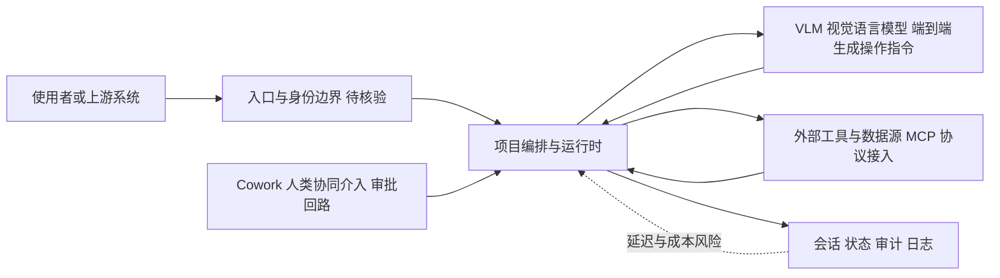

# bytedance/UI-TARS-desktop

## 一句话定位
字节跳动开源的多模态 AI agent 全栈——连接尖端视觉-语言模型与 agent 基础设施，实现真正的"看屏幕、操作电脑"能力。

## 它解决的问题
让 AI agent 像人一样操作电脑（点击、输入、滚动、拖拽）是 AGI 落地的核心场景之一。但现有方案（如 Anthropic computer use）要么是闭源 API，要么缺乏完整的桌面端 agent 框架。UI-TARS-desktop 提供了从视觉感知模型到桌面操作执行的完整开源技术栈，让开发者可以构建自己的 computer-use agent。

## 为什么值得关注
- **Stars:** 38,497 stars，computer-use 赛道头部项目
- **Forks:** 3,881，大量社区衍生项目
- **字节跳动出品**，有强大的模型研发和工程能力支撑
- **完整技术栈**：涵盖 VLM 模型 + agent 框架 + 桌面应用
- **支持 MCP 协议**，可扩展工具能力
- 持续活跃维护（2026-08-05 更新）

## 热度来源判断
- **computer-use 是 2025-2026 最热赛道（极高）**：Anthropic、OpenAI、Google 都在推
- **字节品牌 + 开源策略（高）**：大厂开源高品质 AI 项目自带流量
- **Doubao 模型生态（中高）**：与字节内部模型形成联动
- **多模态 agent 刚需（高）**：RPA、测试自动化、辅助操作等场景需求明确

## 关键技术亮点亮点
1. **端到端 VLM 驱动**：视觉语言模型直接从截图生成操作指令，无需 DOM/API 访问
2. **跨平台桌面操作**：支持 macOS、Windows、Linux 的鼠标键盘控制
3. **Cowork 模式**：人与 agent 可协同操作，agent 不独占控制权
4. **MCP 工具集成**：通过 MCP 协议接入外部工具和数据源
5. **GUI Operator 抽象**：将操作系统交互抽象为统一接口
6. **Agent infra 完整**：含记忆、规划、执行、反馈循环

## 架构师速览

| 决策问题 | 研究判断 | 证据边界 |
|---|---|---|
| 系统边界 | 由入口/身份层、项目编排运行时、模型推理服务、工具与外部系统、会话/状态/审计五大职责构成，跨 macOS/Windows/Linux 三端桌面。 | 仅基于档案中"完整技术栈：VLM 模型 + agent 框架 + 桌面应用"、"跨平台桌面操作"、"MCP 协议接入外部工具"等公开描述抽象；具体模块名、目录结构、持久化方案未在档案中给出。 |
| 主路径 | 截图输入 → 端到端 VLM 直接生成鼠标/键盘操作指令 → 通过 MCP 协议调用外部工具 → 反馈回写到会话与状态（corkwork 模式下人类可介入）。 | 路径来自"端到端 VLM 驱动：从截图生成操作指令"、"MCP 工具集成"、"Cowork 模式：人与 agent 可协同操作"；具体推理框架、调度器、记忆实现待源码核验。 |
| 关键权衡 | 视觉路线带来跨应用通用性，但付出秒级延迟与高推理成本，并伴随 AI 直接操控 OS 的安全风险；MCP 扩展能力同时加深对外部工具的权限耦合。 | 权衡依据档案"风险/局限"段明确列举的延迟、成本、准确性、安全风险；未量化指标，benchmark 数据未在档案中提供。 |
| 最小 PoC | 选定单一桌面平台，固定 1 款 VLM + 最小 MCP 工具集，启用可审计日志与人类审批（corkwork）回路，先验证截图→操作闭环成功率与单步延迟，再扩接入面。 | 建议来自档案"先做最小 PoC"原则与"cowork 范式降低失控风险"论点；具体模型版本、PoC 准入指标、SLO 阈值档案未给出。 |

## 架构启发
- **VLM-native agent 架构**：以视觉模型为核心而非以 API 为核心，更接近人类操作方式
- **cowork 范式**：人机协作而非完全自动化，降低 agent 失控风险
- **模型+框架+应用三层开源**：降低 computer-use 技术的复现和定制门槛

## 架构图（MMD）

> 证据边界：此图只采用本档案已有可核验描述；“待核验”节点不应视为项目实现事实。

## 定位判断
**平台级开源项目**。不只是工具，而是 computer-use agent 的完整技术基础设施。字节试图通过开源建立 GUI agent 生态标准。

## 风险/局限/泡沫点
- **延迟问题**：截图→VLM 推理→执行的全链路延迟较高（秒级），实时性不足
- **成本问题**：VLM 推理成本远高于纯文本/DOM 方案
- **准确性挑战**：复杂 UI（密集表格、自定义控件）识别仍有困难
- **安全风险**：让 AI 控制电脑本身就有安全隐患
- **竞争白热化**：OpenAI Operator、Anthropic computer use、Google Project Mariner 都在做
- **字节项目维护不确定性**：字节历史上对开源项目的长期投入参差不齐

## 与同类项目的关系
- **vs Anthropic computer use**：闭源 API vs 开源全栈
- **vs OpenAI Operator**：Operator 走产品化路线，UI-TARS 走开发者基础设施路线
- **vs alibaba/page-agent**：page-agent 走 DOM 路线（轻量），UI-TARS 走视觉路线（通用），互补
- **vs OS-Copilot / Open Interpreter**：同为开源 computer-use agent，UI-TARS 有字节模型加持

## 是否值得持续跟踪
**强烈推荐跟踪。** computer-use 是 AI agent 落地最核心的能力之一，UI-TARS-desktop 是开源阵营的标杆。其架构设计和模型迭代方向对整个行业有指引意义。

## 后续观察点
- 模型推理速度和成本优化进展
- 是否出现杀手级应用场景（如全自动化办公流程）
- 安全控制机制（如操作审批、沙箱执行）的完善
- 字节内部商业化路径（是否推出云服务版本）
- 与 RPA 厂商（UiPath、Power Automate）的竞合关系
- 开源社区贡献的模型微调和场景适配案例

---
> 数据来源: GitHub API (2026-08-05) | Stars: 38,497 | Forks: 3,881 | 语言: TypeScript
