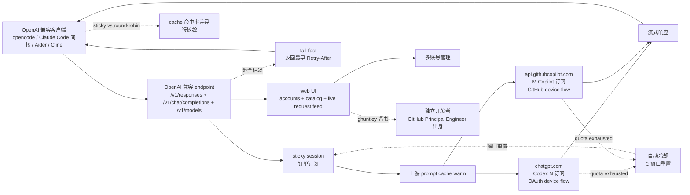

# ghuntley/underclass

## 一句话定位
OpenAI 兼容多订阅池化代理 —— 把多个 ChatGPT/Codex 和 GitHub Copilot 订阅池化在一个 OpenAI 兼容 endpoint 后，通过 sticky sessions 钉单订阅保持上游 prompt cache warm，quota exhausted 自动冷却到窗口重置，池全枯竭 fail-fast 返回最早 Retry-After，并由 ghuntley（GitHub Principal Engineer 出身）独立开发者背书。

## 它解决的问题
当前 AI Coding 多订阅治理的痛点是 **「个人订阅配额上限（ChatGPT Plus 每周消息数 / Codex 配额 / Copilot 配额）是单一账号天花板 + 多账号手动切换繁琐 + 上游 prompt cache 在 round-robin 下命中率极低 + 配额耗尽后不知何时重置 + 池全枯竭时客户端挂起等待 + 无统一 OpenAI 兼容 endpoint」**。underclass 用「OpenAI 兼容 endpoint + sticky session 钉单订阅保持上游 prompt cache warm + quota exhausted 自动冷却到窗口重置 + 池全枯竭 fail-fast 返回最早 Retry-After + chatgpt.com Codex N 订阅 OAuth device flow + api.githubcopilot.com GitHub device flow + web UI accounts / catalog / live request feed」是「AI Coding 多订阅池化 + sticky session + 冷却 + fail-fast + OpenAI 兼容」的具体路径。

## 为什么值得关注（2026-09-21）
- **Stars:** 107（截至 2026-09-21），1 天 107⭐，fork 5
- **License:** MIT（明确许可）
- **语言:** Rust
- **活跃度:** created 2026-09-20，pushed_at 2026-09-20
- **规模:** 170 KB（Rust + 多协议客户端 + sticky session + 冷却 + fail-fast + web UI 的轻量）
- **Topics:** openai / openai-proxy-load-balancer
- **Homepage:** https://ghuntley.com
- **背书:** ghuntley 个人开发者背书（GitHub Principal Engineer 出身 + 转独立）

## 热度来源判断
underclass 的热度是 **「AI Coding 多订阅治理 × OpenAI 兼容 endpoint × sticky session 保持上游 prompt cache warm × quota exhausted 自动冷却 × 池全枯竭 fail-fast × chatgpt.com + api.githubcopilot.com 双源 × ghuntley 独立开发者背书」** 的组合。当前 AI Coding 多订阅用户的痛点是「单一账号配额上限 + 多账号手动切换繁琐 + 上游 prompt cache 命中率低 + 配额耗尽不知何时重置 + 池全枯竭客户端挂起等待」。一个 170 KB Rust 项目直击痛点 + sticky session + 冷却 + fail-fast + 双源 + ghuntley 背书，自然爆火。**fork/star 4.7%** 与昨日 logan-markewich/jeff 4.1% 接近，反映「严肃工具型 Rust 项目」早期 fork 率特征——准备集成到 AI Coding 工作流的开发者 fork。热度**真实且具 AI Coding 多订阅治理价值**——但需警惕：sticky session 在 chatgpt.com / api.githubcopilot.com 订阅配额变化的兼容性 + 池全枯竭 fail-fast 在多用户场景的公平性 + web UI 的可用度 + GitHub device flow 在企业 GitHub 账号的可用度 + sticky session vs round-robin 在上游 cache 命中率的差异 + OpenAI 兼容 endpoint 在第三方客户端的兼容性。

## 关键技术亮点
1. **OpenAI 兼容三端点** ——/v1/responses + /v1/chat/completions + /v1/models
2. **sticky sessions 钉单订阅保持上游 prompt cache warm** ——关键工程化形式
3. **quota exhausted 自动冷却到窗口重置** ——避免无效重试
4. **池全枯竭 fail-fast 返回最早 Retry-After** ——不挂起
5. **chatgpt.com Codex N 订阅 OAuth device flow** ——多 ChatGPT/Codex 订阅
6. **api.githubcopilot.com GitHub device flow** ——多 GitHub Copilot 订阅
7. **web UI accounts / catalog / live request feed** ——多账号管理
8. **ghuntley 个人开发者背书** ——GitHub Principal Engineer 出身 + 转独立开发者
9. **170 KB repo** ——Rust + 多协议客户端 + sticky session + 冷却 + fail-fast + web UI 的轻量
10. **MIT License** ——明确许可
11. **107⭐ / fork 5 / fork/star 4.7%** ——严肃多订阅治理信号

## 架构师速览

| 决策问题 | 研究判断 | 证据边界 |
|---|---|---|
| 系统边界 | OpenAI 兼容多订阅池化代理；/v1/responses + /v1/chat/completions + /v1/models + sticky sessions + health pool + fail-fast saturation + tracing | 仅基于档案描述的 OpenAI 兼容三端点、sticky session、quota 冷却、fail-fast、chatgpt.com / api.githubcopilot.com 双源、web UI；具体 sticky session 算法、quota 窗口检测、fail-fast 公平性策略均待核验 |
| 主路径 | OpenAI 客户端请求 → sticky session 钉单 → 转发 chatgpt.com / api.githubcopilot.com → 上游 prompt cache warm → 流式响应 → quota exhausted 冷却 → 池全枯竭 fail-fast 返回 Retry-After | 主路径为档案语义抽象；具体 sticky session 路由算法、quota 窗口检测机制、fail-fast 公平性策略、web UI 实时性均待核验 |
| 关键权衡 | sticky session vs round-robin 命中率 vs quota 冷却 vs fail-fast 公平性 vs OpenAI 兼容 vs 双源 vs 独立开发者背书 | 档案明示 OpenAI 兼容、sticky session、quota 冷却、fail-fast、双源、ghuntley 背书 6 项权衡；具体 sticky session 命中率基准、quota 窗口兼容性、fail-fast 公平性基准均待核验 |
| 最小 PoC | 配置 chatgpt.com 2 个 OAuth 订阅 + api.githubcopilot.com 2 个 device flow 订阅，跑 sticky session 对话测试，确认 quota 冷却 + fail-fast Retry-After 行为 | PoC 范围、退出路径由档案「sticky session + 冷却 + fail-fast」建议推导；具体 OAuth 配置流程、device flow 流程、sticky session 命中率基准待核验 |

## 架构启发
underclass 的核心启发是 **「AI Coding 多订阅池化代理 + sticky session 保持上游 prompt cache warm + quota 冷却 + fail-fast + OpenAI 兼容 + 双源订阅」**。当前 AI Coding 多订阅治理的痛点是「单一账号配额上限 + 多账号手动切换繁琐 + 上游 prompt cache 命中率低 + 配额耗尽不知何时重置 + 池全枯竭客户端挂起等待」。underclass 用「OpenAI 兼容 endpoint + sticky session + quota 冷却 + fail-fast + chatgpt.com + api.githubcopilot.com 双源 + web UI」是「AI Coding 多订阅池化严肃代理」的参考实现。更深层的启发是：**「sticky session 保持上游 prompt cache warm」是「多订阅代理 + prompt cache 复用」的关键工程化形式**——cache warm 时延迟显著降低 + token 成本显著降低；**「quota exhausted 自动冷却到窗口重置」是「避免无效重试」的工程化形式**——按上游告知的窗口自动冷却；**「池全枯竭 fail-fast 返回最早 Retry-After」是「不挂起等待」的工程化形式**——客户端按上游告知的最早重置时间等待；**「ghuntley 个人开发者背书」是「独立开发者 + 严肃工程化」的工程化形式**——GitHub Principal Engineer 出身 + 转独立开发者，与前日 kitze/skillbox（Kitze 知名独立开发者）同构。能否持续，取决于 sticky session 在 chatgpt.com / api.githubcopilot.com 订阅配额变化的兼容性 + 池全枯竭 fail-fast 在多用户场景的公平性 + web UI 的可用度 + GitHub device flow 在企业 GitHub 账号的可用度 + sticky session vs round-robin 在上游 cache 命中率的差异 + OpenAI 兼容 endpoint 在第三方客户端的兼容性。

## 架构图（MMD）

> 证据边界：此图只采用本档案已有可核验描述；"待核验"节点不应视为项目实现事实。

## 定位判断
**工具型项目（AI Coding 多订阅池化严肃代理）。** underclass 不仅是多账号切换工具，更试图成为「AI Coding 多订阅治理运行时基础设施」——类似 LiteLLM 之于 OpenAI 但聚焦多订阅池化。若成功，它会成为「个人 / 小团队 AI Coding 多订阅治理」的默认选择，具有生态级价值。107⭐ + fork 5 + fork/star 4.7% + 170 KB 已显示「严肃多订阅治理」早期信号。但「生态化」取决于一个关键问题：sticky session 在 chatgpt.com / api.githubcopilot.com 订阅配额变化的兼容性 + 池全枯竭 fail-fast 在多用户场景的公平性 + web UI 的可用度 + GitHub device flow 在企业 GitHub 账号的可用度 + sticky session vs round-robin 在上游 cache 命中率的差异。目前定位是「AI Coding 多订阅池化严肃代理的早期样本」。

## 风险/局限/泡沫点
- **sticky session 命中率** ——sticky session vs round-robin 在上游 cache 命中率的实际差异（cache warm 时延迟显著降低 + token 成本显著降低，但具体基准待验证）
- **quota 窗口兼容性** ——chatgpt.com / api.githubcopilot.com 订阅配额窗口变化可能影响冷却逻辑
- **fail-fast 公平性** ——池全枯竭时 fail-fast 返回最早 Retry-After 在多用户场景的公平性
- **web UI 可用度** ——accounts / catalog / live request feed 的 UI / UX 可用度
- **GitHub device flow 可用度** ——GitHub device flow 在企业 GitHub 账号的可用度（SSO / SAML 等）
- **OpenAI 兼容 endpoint 兼容性** ——在第三方客户端（opencode / Claude Code 间接 / Aider / Cline 等）的兼容性
- **ChatGPT / Codex 订阅 ToS** ——chatgpt.com 个人订阅的 ToS 可能限制池化代理
- **GitHub Copilot 订阅 ToS** ——api.githubcopilot.com 个人订阅的 ToS 可能限制池化代理
- **个人维护** ——ghuntley 个人维护，长期可持续性存疑

## 与同类项目的关系
- **vs clawback/claude-code-cost-ledger (09-17):** cost-ledger 是 session 层成本账本 + canonical JSON + buckets.yaml 治理；underclass 是运行时多订阅池化代理 + sticky session + 冷却 + fail-fast
- **vs NiazMorshed2007/jev-review (09-18):** jev-review 是本地优先 + 无 backend/database/telemetry/proxy；underclass 是本地代理 + 多订阅池化资源治理
- **vs LiteLLM:** LiteLLM 是 LLM provider 统一接口 + 路由；underclass 是多订阅池化代理 + sticky session + 冷却
- **vs OpenAI Proxy:** OpenAI Proxy 是单订阅代理；underclass 是多订阅池化
- **vs kitze/skillbox (09-18):** skillbox 是 Skills 库 + 独立开发者背书；underclass 是多订阅代理 + ghuntley 背书

## 是否值得持续跟踪
**值得跟踪（AI Coding 多订阅池化严肃代理）。** underclass 代表了「AI Coding 多订阅治理从 session 层成本 + 本地优先 → 运行时多订阅池化代理 + sticky session + 冷却 + fail-fast」的诉求，无论其本身成败，这一方向是行业趋势。建议关注：sticky session 在 chatgpt.com / api.githubcopilot.com 订阅配额变化的兼容性 + 池全枯竭 fail-fast 在多用户场景的公平性 + web UI 的可用度 + GitHub device flow 在企业 GitHub 账号的可用度 + sticky session vs round-robin 在上游 cache 命中率的差异 + OpenAI 兼容 endpoint 在第三方客户端的兼容性。对个人 / 小团队 AI Coding 用户，这个项目是把多个订阅池化为一个 endpoint 的严肃工具；对 OpenAI 兼容客户端，可直接接入；对学术，sticky session vs round-robin 的 prompt cache 命中率差异是「AI Coding 多订阅代理」的关键工程化。

## 后续观察点
- sticky session 在 chatgpt.com / api.githubcopilot.com 订阅配额变化的兼容性
- 池全枯竭 fail-fast 在多用户场景的公平性（早 Retry-After 分配策略）
- web UI（accounts / catalog / live request feed）的 UI / UX 可用度
- GitHub device flow 在企业 GitHub 账号（SSO / SAML 等）的可用度
- sticky session vs round-robin 在上游 prompt cache 命中率的实际差异（cache warm 时延迟 + token 成本）
- OpenAI 兼容 endpoint（/v1/responses + /v1/chat/completions + /v1/models）在第三方客户端的兼容性
- ChatGPT / Codex / Copilot 订阅 ToS 对池化代理的限制
- 个人维护可持续性（ghuntley 是否建立社区 / 公司化）
- 与 LiteLLM / OpenAI Proxy 等多订阅代理的协同或竞争

---
> 数据来源: GitHub API (2026-09-21) | Stars: 107 | Forks: 5 | License: MIT | 语言: Rust | 创建: 2026-09-20
