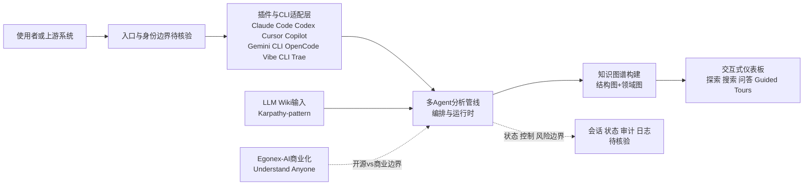

# Understand-Anything

## 一句话定位

将任意代码库、知识库或文档转换为交互式知识图谱（结构图 + 领域图 + 导览），支持探索、搜索和问答，兼容 Claude Code、Codex、Cursor、Copilot、Gemini CLI、OpenCode、Vibe CLI、Trae 等主流 Coding Agent。

## 它解决的问题

Coding Agent 和开发者理解大型代码库时 token 消耗巨大且理解不深。Understand-Anything 通过多 Agent 管线分析项目，构建知识图谱（每个文件、函数、类、依赖关系都是节点），然后提供交互式仪表板进行可视化探索。口号是 "Graphs that teach > graphs that impress"。

## 为什么值得关注

- **77,828 stars / 6,537 forks**，GitHub Trending 周度 Top 1 常客
- 作为 Claude Code Plugin 运行，分析后生成可交互的结构图和业务领域图
- 支持知识库分析：指向 Karpathy-pattern LLM wiki，生成力导向知识图谱 + 社区聚类
- 提供 live demo（understand-anything.com/demo/），可在线体验
- 已迁移到 Egonex-AI 组织运营，有商业化路径（egonex.ai "Understand Anyone"）

## 热度来源判断

- **真实需求 + 视觉冲击力双重驱动。** 代码理解是刚需，交互式知识图谱的视觉效果利于传播
- 17 个 topics 涵盖 claude-skills、codex-skills、gemini-cli-skills、opencode-skills 等，跨平台兼容带来流量
- Live demo 降低体验门槛，促进 star 转化

## 关键技术亮点亮点

1. **多 Agent 分析管线**：不是静态索引，而是 Agent 驱动的代码语义理解
2. **双层图谱**：结构图（文件/函数/类/依赖）+ 领域图（业务流程/领域/步骤）
3. **Guided Tours**：按依赖顺序自动生成架构导览，解决"从哪开始读"的问题
4. **知识库图谱化**：支持 LLM wiki 模式，确定性解析器提取 wikilinks + LLM 发现隐含关系
5. 作为 Claude Code Plugin 原生集成，跨 8+ Agent 平台兼容

## 架构师速览

| 决策问题 | 研究判断 | 证据边界 |
|---|---|---|
| 系统边界 | 以 TypeScript 实现的 Agent 编排层为核心，对外暴露 Claude Code、Codex、Cursor、Copilot、Gemini CLI、OpenCode、Vibe CLI、Trae 等 8+ Coding Agent 插件入口；后台构建结构图与领域图双层知识图谱（节点含文件/函数/类/依赖），并对接 Karpathy-pattern LLM wiki 作为知识库输入 | 仅基于分类"平台候选"、tags、Claude Code Plugin 描述与官网/仓库链接，具体协议、传输层、鉴权、部署形态未在档案中证实 |
| 主路径 | 入口渠道（插件/CLI/dashboard）→ 多 Agent 分析管线 → 知识图谱生成（结构图+领域图+Guided Tours）→ 交互式仪表板（探索/搜索/问答）→ 可视化输出（live demo） | "多 Agent 分析管线"与"Guided Tours 自动生成"为档案所述，具体调度框架、模型路由、状态机、持久化均待核验 |
| 关键权衡 | Agent 驱动语义理解的图谱质量 vs 大型代码库的 token 成本与耗时；跨 8+ Agent 平台扩展速度 vs 实现一致性；视觉冲击力驱动传播 vs 实际生产可用性；开源（MIT）vs Egonex-AI 商业化（"Understand Anyone"）边界 | 档案仅声明 MIT、Egonex 商业化路径与 token 成本"可能很高"的风险，性能基准、SLA、收费模式未列 |
| 最小 PoC | 单一入口渠道（建议 Claude Code Plugin）→ 接入一个中型代码库 + 一份 LLM wiki → 启用最小 Agent 权限与可审计日志 → 验收项：图谱节点覆盖率、Guided Tours 顺序合理性、token 单次成本、跨 Agent 复现一致性、退出/卸载路径 | PoC 范围由档案推导，未给出具体指标阈值或推荐代码库规模 |

## 架构启发

**从"读取代码"到"交互式图谱理解"的范式转换。** 传统代码理解工具做静态索引，Understand-Anything 用 Agent 管线做语义理解并输出可探索的图谱。对 Agent 工具链设计有启发：Agent 的分析结果应该可视化和可交互，而非仅文本输出。

## 架构图（MMD）

> 证据边界：此图只采用本档案已有可核验描述；“待核验”节点不应视为项目实现事实。

## 定位判断

**平台候选。** 77.8K stars 说明需求强烈，已形成 "Agent 代码理解工具链" 赛道的定义性项目。有商业化（Egonex AI）路径。

## 风险 / 局限 / 泡沫点

1. **图谱质量依赖 Agent 分析深度** — 大型代码库的分析 token 成本可能很高
2. **视觉传播效应**：交互式图谱天然利于传播，star 数可能高于实际生产使用
3. 已迁移到 Egonex-AI 组织，开源 vs 商业化的平衡需观察
4. 知识库模式依赖 LLM wiki 的特定格式，通用性待验证

## 与同类项目的关系

- **CodeGraph / 其他代码图谱工具**：Understand-Anything 以交互式 + Agent 驱动为差异化
- **Sourcegraph / code2flow**：静态分析工具，Understand-Anything 是 Agent 时代的同类
- **Karpathy LLM Wiki**：Understand-Anything 的知识库模式直接支持该模式

## 是否值得持续跟踪

**是。** 77.8K stars + 交互式图谱 + 跨平台兼容，是代码理解赛道的代表性项目。

## 后续观察点

1. 在超大型代码库（100万行+）中的分析成本和质量
2. Egonex AI 商业化产品的形态（"Understand Anyone"）
3. 是否形成跨 Agent 平台的代码理解标准
4. 社区贡献的知识库模板和图谱模式增长
