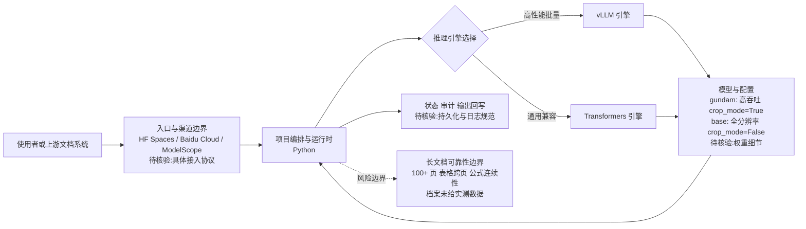

# Unlimited-OCR

## 一句话定位
百度推出的 One-shot Long-horizon OCR 系统，单次推理处理整篇文档，超越 DeepSeek-OCR 的分页拼接范式。

## 它解决的问题
传统 OCR pipeline 需要将长文档切分为单页→逐页识别→后处理拼接，导致页面间信息丢失、表格断裂、排版混乱。企业级文档处理（合同、技术手册、财报）急需端到端的长文档解析能力。

## 为什么值得关注（2026-07-07）
- 19 天达到 13.5K⭐，Baidu 官方背书
- 提出 "One-shot Long-horizon Parsing" 新范式，是 OCR 领域的技术突破
- 直接推进 DeepSeek-OCR，有论文（arXiv:2606.23050）+ 模型权重+在线 Demo
- vLLM 社区已集成支持，可高性能部署

## 热度来源判断
真实需求驱动。OCR 是企业刚需（财务、法律、教育、政务），而长文档 OCR 一直是痛点。Baidu 在 OCR 领域有长期积累（PaddleOCR），技术可信度高。同时受益于 DeepSeek-OCR 建立的关注基础。

## 关键技术亮点亮点
1. **One-shot Long-horizon Parsing**：单次推理处理整篇文档，不需要分页→拼接
2. **双配置模式**：gundam（base_size=1024, image_size=640, crop_mode=True，高吞吐）和 base（base_size=1024, image_size=1024, crop_mode=False，全分辨率）
3. **双推理引擎**：vLLM（高性能批量推理）+ Transformers（通用兼容）
4. **多平台部署**：HuggingFace Spaces 在线 Demo + Baidu Cloud + ModelScope
5. **基于 DeepSeek-OCR 架构推进**：继承视觉-语言模型的端到端识别能力

## 架构师速览

| 决策问题 | 研究判断 | 证据边界 |
|---|---|---|
| 系统边界 | Unlimited-OCR 应作为企业长文档解析流水线的端到端解析组件，与上游入口（HF Spaces / Baidu Cloud / ModelScope）和下游 RAG / 文档处理系统对接，而非独立产品 | 档案明确其为"底层组件"而非终端产品；具体 API 契约、SDK 范围未在档案中披露 |
| 主路径 | 请求 → 入口（HuggingFace Spaces / Baidu Cloud / ModelScope）→ 推理引擎（vLLM 高吞吐 或 Transformers 通用）→ 模型（gundam 模式或 base 模式）→ 输出；本地路径无外部服务依赖 | 档案列出三种部署渠道与两种推理引擎，但内部流水线细节、prompt/控制协议未证实 |
| 关键权衡 | gundam 模式（base_size=1024, image_size=640, crop_mode=True，高吞吐、牺牲分辨率） vs base 模式（image_size=1024, crop_mode=False，全分辨率、保版面）；vLLM 性能 vs Transformers 兼容性 | 双模式参数由档案明确给出；各模式在 100+ 页、表格跨页、公式连续性的实测准确率未在档案中给出 |
| 最小 PoC | 单一渠道（HF Spaces 或 ModelScope）→ gundam 模式 → Transformers 引擎 → 内部基准文档集，验收项含准确率、显存占用、页数上限与退出路径 | 推理引擎与渠道来自档案；38TB 训练数据、显存门槛、页数稳定性等运营指标仍需源码/部署实测 |

## 架构启发
OCR 的演进路径与 LLM 一致：短上下文→长上下文。传统 OCR 的 "切分→识别→拼接" pipeline 正在被 Vision-Language Model 的长序列处理能力吃掉。这不仅是技术升级，而是架构范式的简化——从多阶段 pipeline 走向端到端模型。

关键 trade-off：
- gundam 模式牺牲分辨率换取吞吐（适合批量处理）
- base 模式保持全分辨率（适合复杂版面）
- 38TB 级别的训练数据量说明长程 OCR 的数据门槛很高

## 架构图（MMD）

> 证据边界：此图只采用本档案已有可核验描述；“待核验”节点不应视为项目实现事实。

## 定位判断
在 OCR/VLM 生态中定位为 "基础设施级长文档解析能力"。不是终端用户产品，而是企业文档处理 pipeline 的底层组件。与 PaddleOCR 形成互补——PaddleOCR 覆盖通用 OCR，Unlimited-OCR 攻克长文档端到端解析。

## 风险 / 局限 / 泡沫点
1. **极端长文档可靠性未验证**：One-shot 解析在 100+ 页文档上的准确率、表格跨页、公式连续性仍需独立验证
2. **算力门槛高**：长序列 VLM 推理对 GPU 显存要求显著高于传统 OCR
3. **竞争对手多**：DeepSeek-OCR、GPT-5 Vision、Claude Vision 都在做类似方向，技术壁垒可能快速被追平
4. **训练数据量巨大**（38TB 级别）：限制了复现和改进的可能性

## 与同类项目的关系
- **vs DeepSeek-OCR**：Unlimited-OCR 明确定位为 DeepSeek-OCR 的推进版，核心突破在长文档
- **vs PaddleOCR**：PaddleOCR 是百度成熟的通用 OCR 框架，Unlimited-OCR 聚焦 VLM 端到端长文档解析，互补关系
- **vs GPT-5 Vision / Claude Vision**：闭源 API 也支持长文档解析，Unlimited-OCR 的优势在可私有化部署+中文优化

## 是否值得持续跟踪
**是。** OCR 长程解析是确定性技术趋势，Baidu 有工程能力持续推进。关注其企业落地案例和独立基准测试结果。

## 后续观察点
1. **独立基准测试**：等待第三方在标准数据集上与 DeepSeek-OCR / GPT-5 Vision 的对比评测
2. **极端长文档表现**：100+ 页文档的准确率、表格跨页处理、多栏排版
3. **企业采用信号**：Baidu Cloud 部署量、RAG 系统集成案例、文档处理 pipeline 集成
4. **模型迭代节奏**：是否支持更多语言、手写体、复杂公式

---
*首次记录：2026-07-07*
