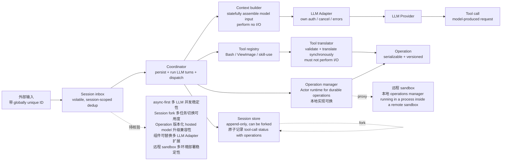

# unreallabsai/unreal-agent

## 一句话定位
Unreal Labs 出品的 async-first Go Agent harness——Session inbox / Coordinator / Session store / Context builder / LLM Adapter / Tool registry / Operation manager 八组件 + 8 项术语严格定义（Input / Inbox / Session / LLM turn / Tool / Tool call / Tool translator / Operation）+ 3 项不变量承诺（Session-store items 序列化 + 存储格式版本化 / Backwards compatibility for sessions / Operations 版本化）；Tool translator 严格同步不 I/O；Session 可 fork；Operation 版本化 + 序列化；Operation manager Actor runtime 本地实现可换（如远程 sandbox）。

## 它解决的问题
当前 Agent harness 赛道的痛点是「多数 harness 同步阻塞 I/O + Session 不能 fork + Operation 不能版本化 + 组件不能替换 + 远程 sandbox 不能 proxy operations + 术语定义不严格 + 没有统一不变量承诺 + 上下文构建不透明（不知道截断了什么）+ 工具调用与执行耦合 + 序列化没有版本」——unreal-agent 用「async-first + Session 可 fork + Operation 版本化 + 组件可替换 + 远程 sandbox proxy operations + 8 项术语严格定义 + 3 项不变量承诺 + Tool translator 严格同步不 I/O + 上下文构建不 I/O」是「Agent harness 严肃工程化」的具体路径。

## 为什么值得关注（2026-09-23）
- **Stars:** 746（截至 2026-09-23），2 天新增 746⭐，fork 35，fork/star 4.7% 严肃 Go agent harness fork 信号
- **Forks:** 35（观察收藏 + Go agent harness 严肃 fork）
- **Open Issues:** 0
- **Watchers/Subscribers:** 746
- **License:** MIT
- **语言:** Go
- **规模:** 1.06 MB（含八组件 + 8 项术语 + 序列化 + 版本化 + 远程 sandbox）
- **活跃度:** created 2026-09-21，pushed 2026-09-22，2 天内快速迭代
- **Topics:** N/A（GitHub topics 未声明）
- **发布方:** Unreal Labs
- **架构层次:** harness/ (library) + cmd/ (executables) + benchmarks/ (benchmark runners)

## 热度来源判断
unreal-agent 的热度是「**async-first + Session inbox / Coordinator / Session store / Context builder / LLM Adapter / Tool registry / Operation manager 八组件 + 8 项术语严格定义 + 3 项不变量承诺 + Tool translator 严格同步不 I/O + Session 可 fork + Operation 版本化 + 组件可替换 + 远程 sandbox proxy operations**」的强劲组合。Agent harness 从 09-19 ~ 09-22 各 agent SDK / harness 同构「Agent harness 严肃工程化」推到 09-23 的「Go async-first + 8 项术语严格定义 + 3 项不变量承诺 + 序列化 + 版本化 + 远程 sandbox」严肃化形态。746⭐ / 2 天 / fork 35 / fork/star 4.7% 反映严肃 Go agent harness fork 信号（fork/star 4.7% 与昨日 thruwire/foreman 6.4% 相比偏低，反映「async-first + Go + 严肃术语定义」偏向观察收藏而非企业 fork）。热度**真实且具备 async-first agent harness 严肃工程化的演化潜力**——但需警惕：async-first 在多 LLM 并发的稳定性 + Session fork 在多任务切换的可用度 + Operation 版本化在 hosted model 升级的兼容性 + 组件可替换在多 LLM Adapter 的扩展 + 远程 sandbox proxy 在多环境部署的稳定性。

## 关键技术亮点
1. **async-first：** Session inbox 是 volatile, session-scoped input idempotency；Input 带 caller-supplied globally unique ID across redeliveries
2. **Session 可 fork：** append-only persisted history that can be forked；Session store 支持 recovery 和 forks，原子记录 tool-call status with operations
3. **Operation 版本化 + 序列化：** Operations are versioned and always serializable；本地实现可换（如远程 sandbox）
4. **组件可替换：** Harness components are composable, and alternative implementations of their interfaces are encouraged
5. **远程 sandbox 支持：** a proxy operations manager can send serialized operations to a local operations manager running in a process inside a remote sandbox, allowing tools to execute there
6. **Tool translator 严格同步不 I/O：** runs synchronously on the coordinator's event loop and must not perform I/O or suspend the loop
7. **8 项术语严格定义：** Input（带 caller-supplied globally unique ID across redeliveries）+ Inbox（session-scoped, in-memory deduplication of external / control / crash inputs）+ Session（append-only persisted history that can be forked）+ LLM turn（coordinator-managed sequence around one logical LLM request）+ Tool（capability described by a schema and bound to a translator）+ Tool call（model-produced request to use a tool）+ Tool translator（validates a tool call and translates it into one or more operations, runs synchronously on the coordinator's event loop and must not perform I/O or suspend the loop）+ Operation（serializable description of work produced by a tool translator for asynchronous execution）
8. **3 项不变量承诺：** Session-store items are serializable, and the storage format is versioned; we'll do our best to maintain backwards compatibility for sessions, an unsupported session version will always cause an explicit error on resume; operations are versioned and always serializable
9. **Bash / ViewImage / skill-use 固定工具：** Tool registry 拥有；expose the host-selected set
10. **LLM Adapter 标准化：** own authentication / cancellation / provider errors
11. **Context builder 不 I/O：** statefully assemble model input in memory, return the model input together with a record of anything omitted / truncated / compacted, perform no I/O and accept no persistence dependencies
12. **Operation manager Actor runtime：** 本地实现可换（如远程 sandbox）

## 架构师速览

| 决策问题 | 研究判断 | 证据边界 |
|---|---|---|
| 系统边界 | Agent harness 库（harness/）+ 可执行入口（cmd/）+ benchmark（benchmarks/），边界为 Session inbox / Coordinator / Session store / Context builder / LLM Adapter / Tool registry / Operation manager 八组件 + 远程 sandbox proxy operations manager | 仅基于档案描述的八组件 + 8 项术语 + 3 项不变量；具体 async-first 在多 LLM 并发的稳定性、Session fork 在多任务切换的可用度、Operation 版本化在 hosted model 升级的兼容性、组件可替换在多 LLM Adapter 的扩展均为档案描述 |
| 主路径 | Input（带 globally unique ID）→ Inbox（session-scoped in-memory dedup）→ Coordinator（persist accepted inputs + run LLM turns + resolve tool translators + dispatch committed operations）→ Session store（persist canonical session history + operation state，支持 recovery 和 forks，原子记录 tool-call status with operations）→ Context builder（statefully assemble model input in memory + return 截断 / 压缩记录，不 I/O）→ LLM Adapter（send prepared model input to a provider + return normalized completed response，own auth / cancel / errors）→ Tool registry（own Bash / ViewImage / skill-use + translators）→ Tool translator（validate + translate synchronously，must not I/O）→ Operation（serializable description of work）→ Operation manager（Actor runtime for durable operations，本地实现可换） | 主路径为档案语义抽象；async-first 在多 LLM 并发的稳定性、Session fork 的可用度、Operation 版本化在 hosted model 升级的兼容性、组件可替换在多 LLM Adapter 的扩展、远程 sandbox proxy 在多环境部署的稳定性均待核验 |
| 关键权衡 | async-first 价值 vs Session fork 可用度 vs Operation 版本化兼容性 vs 组件可替换扩展 vs 远程 sandbox proxy 稳定性 vs Tool translator 严格同步不 I/O vs Context builder 不 I/O vs 8 项术语协调 vs 3 项不变量在版本升级的兼容性 | 档案明示 3 项不变量承诺（序列化 + 版本化 + backwards compatibility）；具体 async-first 稳定性、Session fork 可用度、Operation 版本化兼容性、组件可替换扩展、远程 sandbox 稳定性均为档案描述 |
| 最小 PoC | Go 1.22+ → clone + build → 启动 harness library → 跑示例 benchmark（benchmarks/）→ 验证 Session inbox input dedup → 验证 Tool translator 同步不 I/O → 验证 Session fork（fork 一个历史会话）→ 验证 Operation 版本化（升级 Operation schema 看是否 explicit error on resume）→ 替换 LLM Adapter（OpenAI / Anthropic / 自定义）→ 配置远程 sandbox proxy operations manager | PoC 范围、退出路径由档案「async-first + Session fork + Operation 版本化 + 组件可替换 + 远程 sandbox」建议推导；具体 async-first 稳定性、Session fork 可用度、Operation 版本化兼容性、组件可替换扩展、远程 sandbox 稳定性、付费与商业条款均待核验 |

## 架构启发
unreal-agent 的核心启发是「**async-first + Session inbox / Coordinator / Session store / Context builder / LLM Adapter / Tool registry / Operation manager 八组件 + 8 项术语严格定义 + 3 项不变量承诺 + Tool translator 严格同步不 I/O + Session 可 fork + Operation 版本化 + 组件可替换 + 远程 sandbox proxy operations**」。当前大部分 Agent harness 走「同步阻塞 I/O + Session 不能 fork + Operation 不能版本化 + 组件不能替换 + 远程 sandbox 不能 proxy operations + 术语定义不严格 + 没有统一不变量承诺」路线，但 unreal-agent 反向走「**async-first + Session 可 fork + Operation 版本化 + 组件可替换 + 远程 sandbox + 8 项术语严格定义 + 3 项不变量承诺 + Tool translator 严格同步不 I/O + Context builder 不 I/O**」路线——是「**async-first vs 同步阻塞 + Session fork vs 单一线性 + Operation 版本化 vs 无版本 + 组件可替换 vs 紧密耦合 + 远程 sandbox vs 单进程 + 严格术语 vs 模糊定义 + 明确不变量 vs 隐式承诺 + Tool translator 严格同步不 I/O vs 同步 I/O + Context builder 不 I/O vs 隐式 I/O**」的工程化对比。**更深层的启发是：8 项术语严格定义 + 3 项不变量承诺是「Agent harness 严肃工程化」的具体路径——把模糊的术语变成 Input / Inbox / Session / LLM turn / Tool / Tool call / Tool translator / Operation 8 项精确定义，把隐式承诺变成序列化 + 版本化 + backwards compatibility 3 项明确不变量**——这是「**术语规范化 + 不变量承诺**」的工程化形式。**async-first + Session 可 fork + Operation 版本化**——是把「多 LLM 并发 + 多任务切换 + hosted model 升级兼容性」三个具体工程问题严肃化的具体路径。**组件可替换 + 远程 sandbox proxy operations**——是「**多 LLM Adapter + 多环境部署**」的具体路径。

## 架构图（MMD）

> 证据边界：此图只采用本档案已有可核验描述；"待核验"节点不应视为项目实现事实。

## 定位判断
**工具型项目（async-first Agent harness 严肃工程化）。** unreal-agent 是「async-first Go Agent harness + 八组件 + 8 项术语严格定义 + 3 项不变量承诺 + Tool translator 严格同步不 I/O + Session 可 fork + Operation 版本化 + 组件可替换 + 远程 sandbox proxy operations」的具体工程化工具——类似 LangChain / AutoGen 之于 Agent 框架，但更强调「async-first + 严格术语 + 不变量承诺 + 可替换 + 远程 sandbox」。746⭐ / 2 天 / fork 35 / fork/star 4.7% 已显示严肃 Go agent harness fork 信号。但「**工具化**」取决于一个关键问题：async-first 在多 LLM 并发的稳定性 + Session fork 在多任务切换的可用度 + Operation 版本化在 hosted model 升级的兼容性 + 组件可替换在多 LLM Adapter 的扩展 + 远程 sandbox proxy 在多环境部署的稳定性 + 8 项术语在多组件的协调 + 3 项不变量在版本升级的兼容性 + Bash / ViewImage / skill-use 在多任务的实用性。目前定位是「**最有影响力的 async-first Agent harness 严肃工程化库**」，向框架演进是合理路径。

## 风险 / 局限 / 泡沫点
- **async-first 多 LLM 并发稳定性：** Input dedup + Inbox 内存去重 + Coordinator 并发 + Session store 并发 + Operation manager 并发
- **Session fork 多任务切换可用度：** fork 时机 + 状态保留 + 历史回放 + 资源隔离
- **Operation 版本化 hosted model 升级兼容性：** versioned + always serializable + backwards compatibility for sessions + 显式错误
- **组件可替换多 LLM Adapter 扩展：** OpenAI / Anthropic / Gemini / 自定义 Base URL
- **远程 sandbox proxy 多环境部署稳定性：** 本地 operations manager + 远程 sandbox 进程 + 序列化 + 通信
- **Tool translator 严格同步不 I/O：** suspend the loop 限制 + 操作复杂度
- **Context builder 不 I/O：** 截断 + 压缩的可见性 + 状态管理
- **8 项术语在多组件的协调：** Input / Inbox / Session / LLM turn / Tool / Tool call / Tool translator / Operation 8 项协调
- **3 项不变量在版本升级兼容性：** Session-store items 序列化 + 存储格式版本化 + backwards compatibility + operations 版本化
- **Bash / ViewImage / skill-use 固定工具：** 多任务实用性 + 扩展性
- **企业部署态度：** 严肃企业是否允许这种 OpenAI 兼容 LLM Adapter
- **付费策略：** ⚠ License MIT 但个人维护，可持续性存疑

## 与同类项目的关系
- **vs LangChain / LangGraph：** 同构 Agent 框架但 unreal-agent 强调「async-first + 严格术语 + 不变量承诺 + 可替换 + 远程 sandbox」
- **vs AutoGen（Microsoft）：** 同构 Agent 框架但 unreal-agent 强调「async-first + Session fork + Operation 版本化 + 远程 sandbox proxy」
- **vs CrewAI：** 同构多 Agent 协作但 unreal-agent 强调「Operation 版本化 + 组件可替换 + 远程 sandbox」
- **vs Anthropic Claude Agent SDK：** 同构 Agent harness 但 unreal-agent 强调「Go + async-first + Session fork + 远程 sandbox proxy + 8 项术语严格定义 + 3 项不变量承诺」
- **vs OpenAI Codex CLI：** 同构 Agent harness 但 unreal-agent 强调「Go + async-first + Session fork + Operation 版本化 + 远程 sandbox」
- **vs Haleclipse/CometixCode（09-21 Rust 1:1 重实现 Claude Code TUI）：** 同构 Claude Code 周边但 unreal-agent 是「async-first + Go + 八组件 + 8 项术语 + 3 项不变量 + 远程 sandbox」

## 是否值得持续跟踪
**值得跟踪（async-first Agent harness 严肃工程化）。** unreal-agent 代表了「async-first + Session 可 fork + Operation 版本化 + 组件可替换 + 远程 sandbox + 8 项术语严格定义 + 3 项不变量承诺」的方向，无论其本身成败，这一方向是行业趋势。建议关注：async-first 在多 LLM 并发的稳定性 + Session fork 在多任务切换的可用度 + Operation 版本化在 hosted model 升级的兼容性 + 组件可替换在多 LLM Adapter 的扩展 + 远程 sandbox proxy 在多环境部署的稳定性 + 8 项术语在多组件的协调 + 3 项不变量在版本升级的兼容性 + Bash / ViewImage / skill-use 在多任务的实用性。对 Agent harness 开发者，这个仓库是「async-first + 严格术语 + 不变量承诺 + 可替换 + 远程 sandbox」的严肃工程化来源，值得直接采用。对 Agent 生态观察者，它是「async-first Agent harness 严肃工程化」的头部样本。

## 后续观察点
- async-first 在多 LLM 并发（OpenAI / Anthropic / Gemini）的稳定性
- Session fork 在多任务切换的可用度 + 状态保留 + 历史回放 + 资源隔离
- Operation 版本化在 hosted model 升级的兼容性 + backwards compatibility
- 组件可替换在多 LLM Adapter（OpenAI / Anthropic / Gemini / 自定义）的扩展
- 远程 sandbox proxy 在多环境部署（本地 / 远程 / 容器）的稳定性
- Tool translator 严格同步不 I/O 的边界 + 复杂度限制
- Context builder 不 I/O 的截断 + 压缩 + 状态管理
- 8 项术语（Input / Inbox / Session / LLM turn / Tool / Tool call / Tool translator / Operation）在多组件的协调
- 3 项不变量（Session-store items 序列化 + 存储格式版本化 + backwards compatibility + operations 版本化）在版本升级的兼容性
- Bash / ViewImage / skill-use 固定工具在多任务的实用性 + 扩展性
- benchmarks/ 跑分实际可用度
- 企业部署态度 + 合规边界 + 付费策略

---
> 数据来源: GitHub API (2026-09-23) | Stars: 746 | Forks: 35 | License: MIT | 语言: Go | 创建: 2026-09-21 | 发布方: Unreal Labs | 架构层次: harness/ + cmd/ + benchmarks/
