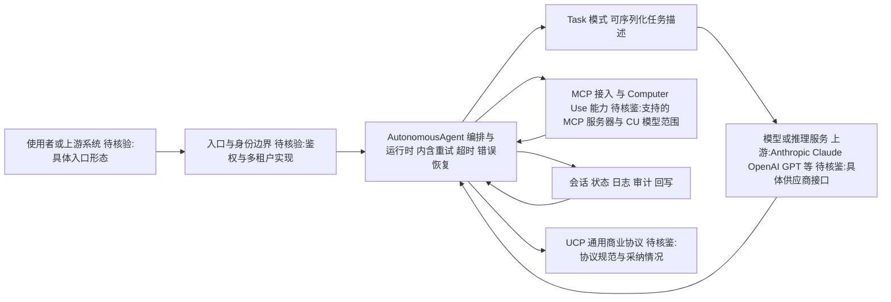

# Upsonic/Upsonic

## 一句话定位
Python 自主 Agent 框架，定位为构建类似 OpenClaw 和 Claude Cowork 风格的自主 Agent 系统的基础设施，强调可靠性（Reliability）和通用商业协议（UCP）。

## 它解决的问题
Agent 框架的可靠性问题：现有 Agent 框架（LangChain、CrewAI 等）在复杂任务中容易失控——工具调用失败、循环不终止、上下文溢出。Upsonic 聚焦"可靠性优先"设计，让 Agent 在生产环境中可预测地运行，而非仅在 Demo 中看起来很酷。

## 为什么值得关注
- **7,932 stars**，Agent 框架赛道中稳步增长的项目
- **自主 Agent 范式**：AutonomousAgent + Task 的简洁抽象，类似 Claude Cowork 的设计理念
- **MCP 集成**：原生支持 Model Context Protocol，可连接 OpenClaw 等生态
- **Computer Use 支持**：支持 Anthropic 的 Computer Use 能力
- **简洁 API**：`agent.print_do(task)` 一行代码执行任务

## 热度来源判断
热度来自 Agent 框架赛道的持续热度，以及"可靠性"这一差异化定位。在 LangChain 因复杂性和不可靠性受到批评的背景下，强调可靠性的新框架获得了关注空间。与 OpenClaw 的生态关联也带来了流量。

## 关键技术亮点亮点
- **AutonomousAgent 抽象**：内置工作空间、模型选择、日志管理的完整 Agent 对象
- **Task 模式**：将任务描述为可序列化对象，支持复杂输入输出
- **可靠性工程**：内置重试、超时、错误恢复机制
- **UCP（通用商业协议）**：探索 Agent 与商业系统的标准化交互协议
- **IDE 集成**：提供文档索引，可集成到 Cursor/VSCode/Windsurf

## 架构师速览

| 决策问题 | 研究判断 | 证据边界 |
|---|---|---|
| 系统边界 | Upsonic 是 Python 编写的 Agent 编排层：AutonomousAgent + Task 双抽象，对外对接模型供应商、工具/MCP 源与 Computer Use 能力，对内负责会话、日志、权限与重试；处于“上游入口—编排—模型/工具—状态回写”链路中段 | 边界由“agent-framework / autonomous-agent / mcp / computer-use / llms”标签与项目分类推断；具体鉴权/租户/部署形态未在档案中给出 |
| 主路径 | `agent.print_do(task)` 触发 Task → AutonomousAgent 运行时调度 → 模型调用与工具/MCP/Computer Use 调用 → 内置重试/超时/错误恢复 → 任务结果与会话/日志/审计回写 | 主路径基于“Task 模式 + AutonomousAgent 抽象 + 可靠性工程”描述；具体协议、序列化格式与持久化方式在档案中未证 |
| 关键权衡 | “简洁双抽象+开箱即用可靠性” 与“生态广度/供应商耦合/可观测深度”之间的取舍；UCP 试图把商业协议标准化，但档案未给出已落地的协议规范 | 取舍描述来自档案的“简洁优于复杂”“定位介于 LangChain 与轻量工具之间”“竞品生态差异”；UCP 与可靠性机制的具体实现、性能数字档案均未提供 |
| 最小 PoC | 单一渠道（如 CLI 或 IDE 插件）+ 最小工具权限 + 可审计日志；选用一个标准 Task 跑通模型调用与一次 MCP/工具调用，验证重试/超时/错误恢复行为，再扩展接入面 | PoC 建议来自“架构师速览—采用建议”行；具体的最小代码样例、SLO 阈值与退出路径档案未给出 |

## 架构启发
Upsonic 的设计哲学是"简洁优于复杂"——`AutonomousAgent` + `Task` 两个核心抽象覆盖大部分用例，避免了 LangChain 式的过度抽象。这反映了 Agent 框架设计的一种回归趋势：从"乐高积木式组合"回到"开箱即用的完整方案"。

## 架构图（MMD）

> 证据边界：此图只采用本档案已有可核验描述；“待核验”节点不应视为项目实现事实。

## 定位判断
**Agent 开发框架**，定位在 LangChain（太重）和单一 Agent 工具（太轻）之间。适合构建需要可靠性保证的生产级自主 Agent。

## 风险 / 局限 / 泡沫点
- **竞争激烈**：Agent 框架赛道极度拥挤（LangChain、CrewAI、AutoGen、LlamaIndex 等）
- **差异化不足**：UCP 和可靠性理念尚未形成公认的技术壁垒
- **文档和生态**：相比 LangChain 的庞大生态，Upsonic 的集成和工具数量有限
- **验证不足**：7k stars 说明有一定关注，但缺乏标志性成功案例

## 与同类项目的关系
- **竞品**：LangChain（生态最大）、CrewAI（多 Agent 协作）、AutoGen（微软背景）
- **生态关联**：与 OpenClaw 在 tags 中互相关联，可能是互补关系
- **上游依赖**：Anthropic Claude、OpenAI GPT 等模型 API

## 是否值得持续跟踪
**值得适度跟踪**。其"可靠性优先"的设计理念值得关注，但需要在更多生产案例中验证其差异化优势。

## 后续观察点
- UCP 通用商业协议是否会获得行业采纳
- 可靠性工程的具体实现细节和效果
- 与 OpenClaw 生态的深度集成程度

---
> 数据来源: GitHub API (2026-08-07) | Stars: 7,932 | Forks: 744 | 语言: Python | License: MIT | 首次发现: 2026-06-17
