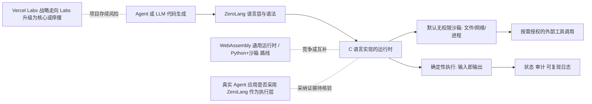

# vercel-labs/zerolang

## 一句话定位
专为 AI Agent 设计的编程语言——Vercel Labs 出品，用 C 语言编写运行时，旨在为 Agent 提供确定、安全、高效的执行环境。

## 它解决的问题
当前 AI Agent 执行代码时通常使用 Python/JavaScript/Shell 等通用语言，但这些语言为人类设计，存在安全风险（文件系统访问、网络调用）、非确定性（随机数、时间依赖）和性能开销。ZeroLang 从底层重新设计——以 Agent 为一等公民，提供确定执行、沙箱安全、最小化运行时等特性，使 AI Agent 的代码执行更安全、更可预测。

## 为什么值得关注
- **Vercel Labs 出品:** 代表了前端基础设施巨头对 Agent 运行时的战略思考
- **全新编程语言:** 2026 年少数从零开始的 Agent 原生语言
- **C 语言实现:** 极致轻量和高性能，嵌入到任何应用
- **Apache 2.0 许可证:** 利于商业采纳
- **5,259 stars:** 新语言项目的良好开局

## 热度来源判断
热度来自"Agent 专用基础设施"叙事和 Vercel 品牌的双重加持。Vercel Labs 的每个项目都会获得开发者社区的关注。ZeroLang 的概念——"为 AI 设计的编程语言"——本身具有强话题性，在 Twitter/X、Hacker News 上引发了大量讨论。与 MCP 协议、Agent OS 等概念形成"Agent 基础设施"的热点集群。

## 关键技术亮点亮点
- 确定性执行：相同输入产生相同输出，利于 Agent 行为可复现和调试
- 沙箱安全：默认无文件系统、网络、进程访问权限，按需授权
- 最小化运行时：C 语言实现，内存占用极低，适合嵌入各种环境
- Agent 友好语法：针对 LLM 代码生成优化，减少语法歧义
- 函数式倾向：不可变数据优先，减少副作用

## 架构师速览

| 决策问题 | 研究判断 | 证据边界 |
|---|---|---|
| 系统边界 | ZeroLang 是一个以 C 编写的 Agent 原生语言运行时，作为 Agent 执行层独立于模型供应商与外部工具；其边界由"确定性执行 + 默认无文件系统/网络/进程权限的沙箱"定义 | 仅基于档案描述的运行时特性与"Agent 一等公民"定位，无源码协议/部署细节 |
| 主路径 | Agent 生成代码 → ZeroLang 语言层/语法（LLM 友好）→ C 实现的运行时（确定性、沙箱授权）→ 可选外部工具调用 | 路径未涉及具体 RPC/IPC、嵌入接口或宿主进程模型，组件形态需源码核验 |
| 关键权衡 | "为 Agent 重新设计的执行层"（确定性、安全、可预测）vs 新语言生态冷启动成本；与 WebAssembly、Python+沙箱路线之争尚未验证 | 权衡判断基于档案风险段与同类对比，未引用性能基准或迁移成本数据 |
| 最小 PoC | 在受控沙箱中以 Apache-2.0 嵌入 ZeroLang 运行时跑一组确定性 Agent 代码样本，比对"无文件/网络权限"默认行为是否符合预期，并预留回退至 Python+沙箱的退出路径 | PoC 验收项（安全、成本、SLO、退出路径）来自档案建议，具体 API、嵌入方式、版本号待核验 |

## 架构启发
ZeroLang 的核心启发是"工具应该为目标用户优化"。传统语言为人类开发者设计——语法表达力、生态系统、人体工程学优先。Agent 执行代码时，优先级完全不同：确定性 > 表达力、安全性 > 灵活性、可预测 > 功能丰富。对架构师的启发是：**AI 时代的工具链应该为 AI 的使用模式重新设计，而非沿用人类工具链**。

## 架构图（MMD）

> 证据边界：此图只采用本档案已有可核验描述；“待核验”节点不应视为项目实现事实。

## 定位判断
**基础设施候选（实验性）。** ZeroLang 是一个大胆的实验——挑战"Agent 应该用人类语言编程"的默认假设。其成败取决于 Agent 生态是否真的需要专用语言层。目前定位为"Vercel Labs 的战略探索项目"。

## 风险/局限/泡沫点
- **新语言采纳悖论:** 语言的成败取决于生态（库、工具、社区），而 ZeroLang 从零开始
- **5k stars ≠ 使用量:** 编程语言项目的 stars 往往反映"好奇"而非"采用"
- **Vercel Labs 项目不确定性:** Labs 项目可能随时停止——不是 Vercel 核心产品
- **概念验证阶段:** 131 open issues 说明仍在快速迭代和发现 bug
- **竞争假设可能不成立:** 也许 Agent 不需要专用语言，Python + 沙箱已够用

## 与同类项目的关系
- 与 **WebAssembly (Wasm)** 在 Agent 安全执行维度竞争——Wasm 更成熟但非 Agent 原生
- 与 **Daytona**（Agent 沙箱）在执行环境维度互补——Daytona 做容器，ZeroLang 做语言
- 与 **Python + e2b/sandboxes** 形成"专用语言 vs 通用语言+沙箱"的路线之争
- 与 **Apple container** 在轻量隔离执行维度有理念共鸣
- 与 MCP 协议在 Agent 工具调用维度可能互补

## 是否值得持续跟踪
**推荐跟踪。** 即使 ZeroLang 最终未获广泛采用，其设计理念——"为 Agent 重新设计执行层"——将影响 Agent 基础设施的演进方向。Vercel Labs 的战略判断值得关注。

## 后续观察点
- 语言特性和标准库的成熟度
- 是否有真实 Agent 应用采用 ZeroLang 作为执行层
- Vercel 是否将其从 Labs 提升为核心项目
- 社区生态发展（第三方库、开发工具、教程）
- 与 WebAssembly 的定位分化

---
> 数据来源: GitHub API (vercel-labs/zerolang) | 星标: 5,259 | 语言: C | 许可证: Apache-2.0
