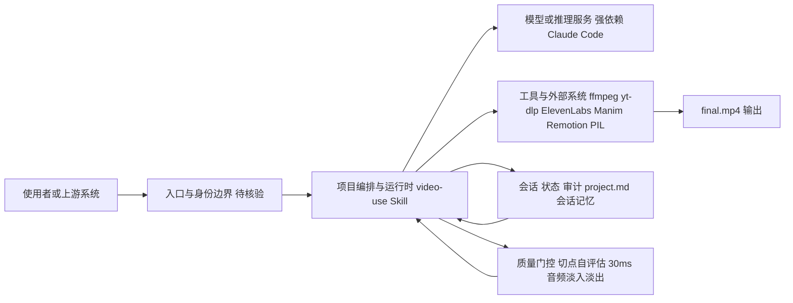

# video-use

## 一句话定位
browser-use 团队出品的 Claude Code Skill，用自然语言指令让 Agent 完成视频编辑——自动剪辑、调色、字幕、动画，输出 final.mp4。

## 它解决的问题
视频编辑门槛高、工具复杂（Premiere/FCP/DaVinci）。非专业用户想做的只是：去填充词、调色、加字幕、生成动画。video-use 让这些通过对话完成。

目标用户：内容创作者、教程制作者、自媒体运营。

## 为什么值得关注（2026-04-18）
browser-use 团队出品（browser-use 本身是知名的 Browser Automation 项目），5天 903 星。代表了 Claude Code Skill 从"开发工具"延伸到"内容生产"的趋势。

## 热度来源判断
- browser-use 团队的品牌效应
- "用 Claude Code 剪视频"的噱头吸引力强
- 功能完整度高，不是 demo
- 视频编辑是真实需求场景

## 关键技术亮点亮点
1. **Agent 自评估**：在每个切点边界自评估渲染结果，质量门控
2. **会话记忆持久化**：project.md 记录编辑历史，下次会话可续接
3. **并行子 Agent 调度**：Manim/Remotion/PIL 动画通过并行子 Agent 生成
4. **30ms 音频淡入淡出**：每个切点自动处理，避免爆音

## 架构师速览

| 决策问题 | 研究判断 | 证据边界 |
|---|---|---|
| 系统边界 | 视频编辑场景下，video-use 是 Claude Code Skill 形态的编排层：Python 实现，依赖 ffmpeg、yt-dlp、ElevenLabs、Manim/Remotion/PIL 等外部工具；与 Claude Code 生态和浏览器(browser-use 同源)耦合。 | 具体协议、入口鉴权、模型供应商未在档案中限定。 |
| 主路径 | 用户自然语言指令 → Claude Code Skill 编排 → 调用 ffmpeg/Manim/Remotion/PIL 等外部工具 → 渲染切点结果 → Agent 自评估(质量门控) → 写回 project.md 会话记忆 → 输出 final.mp4。 | 并行子 Agent 调度与 30ms 音频淡入淡出为档案明确描述；其他执行细节需源码核验。 |
| 关键权衡 | 自动化与可审核性的矛盾：自评估+会话记忆+并行子 Agent 提升质量与续接能力，但同时带来对 Claude Code、多个外部工具与 ElevenLabs API 多重供应商耦合。 | 档案未给出权限模型、可观测性、SLO 数据。 |
| 最小 PoC | 用最小权限的 Claude Code+单一 ffmpeg 流水线完成一段剪集/淡入淡出；审计 project.md 持久化与自评估门控；将 ElevenLabs/Manim/Remotion 作为可选依赖逐步接入。 | 实际编辑质量、专业级能力上限档案未提供量化证据。 |

## 架构启发
多步骤 Skill 的质量管控流程设计值得借鉴：自评估 + 会话记忆 + 并行子 Agent 调度。这不是简单的"调用 ffmpeg"，而是给 Agent 赋予了完整的视频编辑工作流。

## 架构图（MMD）

> 证据边界：此图只采用本档案已有可核验描述；“待核验”节点不应视为项目实现事实。

## 定位判断
垂直内容工具。不具备平台化或基础设施潜力，但作为 Skill 生态的标杆案例值得关注。

## 风险 / 局限 / 泡沫点
1. **依赖链重**：需要 ffmpeg、yt-dlp、ElevenLabs API、Manim/Remotion
2. **视频质量上限**：AI 驱动的自动编辑无法替代专业剪辑师
3. **Claude Code 绑定**：强依赖 Claude Code 生态

## 与同类项目的关系
- **Remotion**：React 视频框架，底层技术
- **MoviePy**：Python 视频编辑库
- **CapCut/剪映**：消费级视频编辑器，AI 辅助但非 Agent 驱动

## 是否值得持续跟踪
短期跟踪。作为 Skill 生态标杆观察。

## 后续观察点
1. browser-use 团队是否会持续投入
2. 用户实际编辑效果的质量
3. 是否出现类似的音频/图片编辑 Skill

---
*首次记录：2026-04-18*
