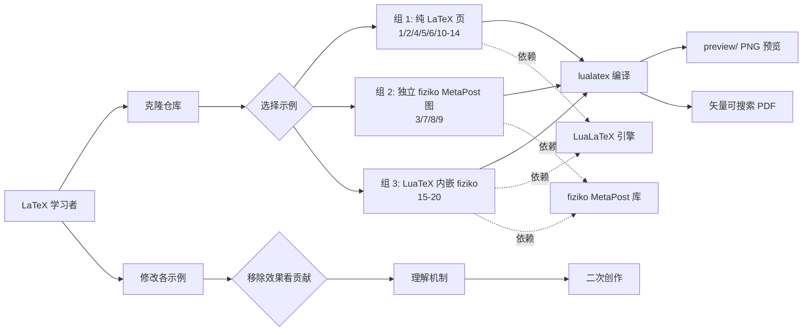

# Foadsf/vintage-latex

## 一句话定位
20 个复古科学论文排版 LuaLaTeX + MetaPost 独立示例——从早期现代页到维多利亚报纸到月相图，覆盖雕版图、星空图、对数表、Hooke 装置、望远镜图等；每个示例独立可编译，机制拆解式教学。

## 它解决的问题
学习如何用 LaTeX / MetaPost 排版出"老科学论文"风格（engraved plates、star charts、computed log tables、knots、telescopes）的开发者面临两个痛点：(1) 找不到"机制"层面的教学——大多数教程只给完整模板，移除效果后无法理解各部分贡献；(2) 例子通常是单个大文件，难以拆解。**vintage-latex 提供 20 个独立可编译的小示例，每个故意保持"单一效果"，让学习者移除各部分看其对整体美学的贡献**。

## 为什么值得关注（2026-09-11）
- **Stars:** 191（截至 2026-09-11），2 天即达 191⭐，单日 +95⭐ 量级
- **Forks:** 14 / 2 天 = 7 forks/日，**7.3% fork/star 略高**，反映 fork 学习/二次创作活跃
- **License:** NOASSERTION（仓库未声明标准 License）
- **语言:** PowerShell（构建脚本）+ LaTeX + MetaPost
- **活跃度:** created 2026-09-09，pushed_at 2026-09-09，2 天内完成发布
- **规模:** 1.2MB

## 热度来源判断
vintage-latex 的热度是 **"复古科学美学刚需 × 机制拆解式教学 × LaTeX 圈高质量作品集"** 的组合。LaTeX 圈长期缺乏"美学机制"层面的教程，多数模板只是"复制可用"。vintage-latex 直接给出 20 个独立示例，覆盖三大类：纯 LaTeX 页（1, 2, 4, 5, 6, 10-14）+ 独立 fiziko MetaPost 图（3, 7, 8, 9）+ LaTeX 页与 fiziko 图结合（15-20）。**14 forks 中可能多为学习者 fork → 修改 → 编译实验**。热度**真实但受众较窄**——主要是 LaTeX 排版爱好者 + 科学插图创作者。

## 关键技术亮点
1. **20 个独立示例**——每个 .tex / .mp 文件可单独编译；移除各效果看贡献
2. **三类示例结构**——纯 LaTeX 页 / 独立 fiziko MetaPost 图 / LuaTeX 内嵌 fiziko 图
3. **题材覆盖**——雕版光学图、Hooke 装置、Victorian 报纸、自然史目录、Atwood 机器、lens rays、shading atlas、冷却曲线、专利图、log 表、circumpolar star chart、snow crystal micrographs、telescope plate、terrestrial globe、mechanics primer、knots plate、月相
4. **fiziko MetaPost 库**——专用科学插图宏包
5. **LuaTeX 内嵌 MetaPost**——通过 LuaTeX 内置 MetaPost 引擎在 LaTeX 中嵌入 fiziko 图
6. **低分辨率预览 + 矢量 PDF**——preview/ 目录有 PNG 预览，编译产物 PDF 是矢量可搜索

## 架构师速览

| 决策问题 | 研究判断 | 证据边界 |
|---|---|---|
| 系统边界 | 20 个独立可编译 LaTeX/MetaPost 示例的集合；不包含运行时 / 服务 / API | 仅基于 README 明示的 20 示例与三类分组；具体 fiziko 库依赖关系、编译环境要求未在档案中给出 |
| 主路径 | 学习者克隆 → 选择示例 → 编译 → 修改 → 移除效果 → 理解机制 → 二次创作 | 主路径为 README "Each file is deliberately standalone" 语义；具体编译命令（lualatex / context / texlive 版本）以仓库说明为准 |
| 关键权衡 | 教学清晰度 vs 示例完整性 vs 编译复杂度 vs fiziko 库学习成本 | 档案明示三类分组的覆盖度；fiziko 库学习曲线未在档案中明示 |
| 最小 PoC | 克隆仓库，对 examples/01-early-modern-page.tex 执行 `lualatex`，对比 preview/01-early-modern-page.png | PoC 范围由 README 语义推导；具体 TeX 发行版（TeX Live 2025 / MacTeX / MiKTeX）需自行验证 |
| 风险 | License 未标准声明（NOASSERTION）、PowerShell 构建脚本跨平台兼容性、fiziko 库依赖 | 档案明示三项风险 |

## 架构启发
vintage-latex 的核心启发是 **"机制拆解式教学比完整模板更有教育价值"**。一般 LaTeX 教程提供"复制可用"的完整模板，学习者拿走却不知道各部分贡献。vintage-latex 反其道：每个示例故意保持"单一效果"，让学习者移除各部分看其对整体美学的贡献。**更深层的启发是：复杂排版技能的学习路径应该是"先拆解、再组合"**——这与 wshobson/agents 的"通用适配层"思路正交，更接近"工艺 / 技能"教学。这种模式可推广到其他工艺类项目（3D 渲染、字体设计、UI 设计）。

## 架构图（MMD）

> 证据边界：此图只采用本档案已有可核验描述；"待核验"节点不应视为项目实现事实。

## 定位判断
**工具型项目（复古科学论文排版教学集）。** vintage-latex 是 LaTeX 圈的"工艺课"——机制拆解式教学，受众主要是排版爱好者 + 科学插图创作者。它的价值与"高质量 LaTeX 内容创作"需求正相关。**值得持续跟踪**工具型定位，但受众较窄。

## 风险 / 局限 / 泡沫点
- **License 未标准声明**——NOASSERTION 意味着使用风险不明确，可能影响商业使用
- **PowerShell 构建脚本**——macOS / Linux 用户需要手动执行 lualatex，跨平台体验不佳
- **fiziko 库依赖**——非 LaTeX 默认安装，用户需要单独安装
- **20 个示例不覆盖所有复古风格**——仅是作者选定的代表性例子
- **1.2MB 仓库体积偏小**——主要是预览 PNG，不是核心资源
- **受众较窄**——主要面向 LaTeX 排版爱好者 + 科学插图创作者

## 与同类项目的关系
- **vs jtydhr88/screenwriting-skills（昨日上榜）：** 编剧 Skill 蒸馏；vintage-latex 是排版工艺教学
- **vs TikZ 官方示例：** TikZ 是绘图库；vintage-latex 是排版工艺课
- **vs fiziko MetaPost 库：** fiziko 是底层库；vintage-latex 是基于 fiziko 的教学示例
- **vs Overleaf 模板：** Overleaf 模板是"复制可用"；vintage-latex 是机制拆解
- **vs "Beautiful LaTeX" 类博客文章：** 文章是单次教程；vintage-latex 是结构化示例集

## 是否值得持续跟踪
**值得轻量跟踪（LaTeX 排版工艺）。** vintage-latex 验证了"机制拆解式教学"的产品形态，但受众较窄。建议关注：(1) 是否扩展更多复古风格示例；(2) License 是否标准化（MIT / CC）；(3) 是否配套视频教程。对 LaTeX 排版爱好者，本仓库直接提供高质量学习材料；对"工艺 / 教学"类项目观察者，它是"先拆解、再组合"模式的代表样本。

## 后续观察点
- License 是否标准化（从 NOASSERTION 到 MIT / CC）
- 是否扩展更多复古风格示例
- PowerShell 构建脚本是否改为跨平台（Makefile / shell）
- 是否配套视频教程
- fiziko 库的安装文档是否完善
- LaTeX 圈的整体采用情况（看 issue / discussion 中的引用）

---
*首次记录：2026-09-11*
> 数据来源: GitHub API (2026-09-11) | Stars: 191 | Forks: 14 | License: NOASSERTION | 语言: PowerShell | 创建: 2026-09-09
