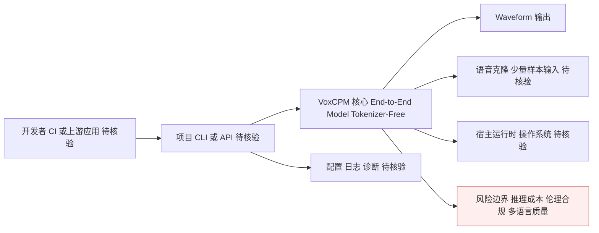

# VoxCPM — Tokenizer-Free 多语言语音生成

## 一句话定位

OpenBMB 出品的 Tokenizer-Free TTS 模型，支持多语言语音生成、创意声音设计和真实语音克隆。

## 它解决的问题

传统 TTS 系统依赖语音 Tokenizer 将语音编码为离散 Token，导致韵律不自然、跨语言迁移困难。VoxCPM 直接跳过 Tokenizer，端到端建模语音生成。

## 为什么值得关注

1. Tokenizer-Free 是 TTS 领域的真实技术创新
2. OpenBMB（清华团队）出品，学术和工程实力有保障
3. 27.7K stars 说明市场需求强劲
4. 多语言支持 + 语音克隆是企业级刚需

## 热度来源判断

- 27.7K stars，周增量 +4.3K，持续高速增长
- OpenBMB 品牌背书
- 语音 AI 是当前热门赛道

## 关键技术亮点亮点

1. **Tokenizer-Free 架构**：直接从文本到语音波形，跳过中间 Token 表示
2. **多语言语音生成**：跨语言迁移更自然
3. **创意声音设计**：不只是 TTS，还能创造性地合成声音特征
4. **真实语音克隆**：少量样本即可复制说话人特征

## 架构师速览

| 决策问题 | 研究判断 | 证据边界 |
|---|---|---|
| 系统边界 | 开发者/上游应用经由 CLI 或 API 触发项目核心，由其生成端到端语音波形；扩展点位于插件/适配器/外部服务 | 边界划分基于"开发者/自动化入口 → CLI/API → 项目核心 → 宿主运行时或外部集成"的档案抽象，未在 README 中指明具体接口协议、SDK 或外部适配器 |
| 主路径 | Text 输入 → End-to-End Model → Waveform 输出，绕过传统 Tokenizer/Acoustic Model/Vocoder 三段式 | "Text → End-to-End Model → Waveform" 与"Tokenizer-Free"在档案中明确给出，但 End-to-End Model 的内部子模块、采样率、波形格式未证 |
| 核心权衡 | 在获得更低误差累积与跨语言迁移收益的同时，承担推理成本、伦理合规与多语言质量的额外代价 | 档案明确点出"大模型推理成本可能较高""语音克隆存在伦理/法律风险""多语言质量"为待观察项，但具体延迟/吞吐/许可条款未证 |
| 最小 PoC | 在沙箱中以离线文本与参考音频验证：(1) 单语言与跨语言合成音质；(2) 少量样本语音克隆一致性；(3) 推理时延/显存基线；(4) 退出路径与依赖锁定 | 上述 PoC 维度来自档案"先做最小 PoC"的建议与"创意声音设计、真实语音克隆、多语言"三项核心能力声明；具体基准阈值未给 |

## 架构启发

传统 TTS 流水线：Text → Tokenizer → Acoustic Model → Vocoder → Waveform

VoxCPM 流水线：Text → End-to-End Model → Waveform

简化的流水线意味着更少的误差累积和更自然的输出。

## 架构图（MMD）

> 证据边界：此图只采用本档案已有可核验描述；“待核验”节点不应视为项目实现事实。

## 定位判断

**生产可用。** 24K stars + OpenBMB 维护，适合实际部署评估。

## 风险/局限/泡沫点

- 大模型推理成本可能较高
- 语音克隆存在伦理/法律风险
- 与其他 TTS 开源模型（Bark、XTTS）的竞争

## 与同类项目的关系

- 与 MOSS-TTS 互补：VoxCPM 偏模型层，MOSS-TTS 覆盖更广场景（环境音效、多角色对话）
- 与 dograh 互补：VoxCPM 是模型，dograh 是平台
- 与 FunASR 不同方向：FunASR 是 ASR（语音识别），VoxCPM 是 TTS（语音合成）

## 是否值得持续跟踪

**是。** Tokenizer-Free 架构如果成功，可能改变 TTS 技术路线。

## 后续观察点

1. 实际部署中的语音质量和自然度评测
2. 多语言支持的具体范围和质量
3. 语音克隆的安全措施
4. 推理性能和部署成本
