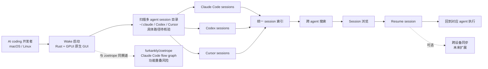

# iAmCorey/Wake

## 一句话定位
**Rust + GPUI 的 AI agent session 管理器**——"All your AI agent sessions in one place — browse, search, resume." 把分散在不同 Coding Agent（Claude Code / Codex / Cursor 等）中的 session 集中管理。

## 它解决的问题
开发者使用 AI Coding Agent（Claude Code / Codex / Cursor / GitHub Copilot 等）时，每个 agent 都有自己的 session 存储位置与格式，导致三个真实痛点：(1) **session 分散**——Claude Code 的 session 在 ~/.claude、Codex 的 session 在 Codex 专属目录、Cursor 的 chat 历史在 Cursor 应用内；(2) **无法跨 agent 搜索 / 浏览**——开发者经常需要在不同 agent 的 session 中检索"之前解决过的类似问题"；(3) **无法 resume 跨设备**——session 数据通常锁定在单设备。Wake 直击这些痛点：使用 Rust + GPUI（Zed 编辑器团队的 Rust UI 框架）构建统一的 session 管理器，把所有 agent 的 session 集中到一个应用内，支持 browse / search / resume。**GPUI 的引入是 Rust 在 TUI 之外的"原生 GUI"路线探索**——比终端 UI 更丰富、比 Web UI 更轻量。

## 为什么值得关注
- **Stars:** 725（截至 2026-09-03），16 天累计 725⭐（未达 1k⭐ 阈值但已进入关注范围）
- **Forks:** 49，6.8% fork/star（典型工具型——真实安装使用）
- **License:** MIT
- **语言:** Rust（1.7MB），GPUI 原生 UI
- **活跃度:** created 2026-08-18，pushed 2026-09-02，16 天内持续高活跃
- **规模:** 1.7MB，含 GUI + session 解析器
- **Topics:** 无 topics（异常信号——可能待项目成熟后补充）

## 热度来源判断
Wake 的热度是 **"AI agent session 分散痛点 × GPUI 原生 GUI 差异化 × MIT 商业友好"** 的组合。AI Coding Agent 数量膨胀后，session 管理成为真实痛点——但 GitHub 上"跨 agent session 管理器"工具极少。Wake 16 天 725⭐ + 6.8% fork/star（典型工具型）+ Rust + GPUI 原生 GUI 路线共同说明这是个真实需求驱动的产品。**GPUI 是 Zed 编辑器团队的 UI 框架，被 Wake 引入 agent session 管理是新方向**——比 TUI 更丰富、比 Web UI 更轻量。热度**真实且具差异化价值**——但需警惕：与 furkankly/zoetrope（同为"agent 可视化"赛道）存在功能重叠风险；个人项目可持续性。

## 关键技术亮点
1. **Rust + GPUI 原生 GUI**——Zed 编辑器团队的 Rust UI 框架，原生渲染比 Web UI 更轻量、比 TUI 更丰富
2. **跨 agent session 管理**——支持 Claude Code / Codex / Cursor 等多个 agent 的 session 集中浏览
3. **Browse / Search / Resume 三件套**——核心功能：浏览所有 session、跨 session 搜索、resume 之前的 session
4. **1.7MB 极小规模**——单 binary 部署，Rust 优势（无 GC、原生性能、单 binary）
5. **MIT License**——商业可用
7. **跨设备 session 同步潜力**——Rust + GPUI 架构便于扩展到本地 + 云端同步

## 架构师速览

| 决策问题 | 研究判断 | 证据边界 |
|---|---|---|
| 系统边界 | Rust + GPUI 原生 GUI 层 + 多 agent session 解析器层（Claude Code / Codex / Cursor ...）+ session 索引 / 搜索层 + resume 协议层 | 五要素是 description 与 topics 明示；具体 GPUI 组件实现、各 agent session 格式解析兼容性、resume 协议细节需 README 核验 |
| 主路径 | Wake 启动 → 扫描多 agent session 目录（~/.claude / Codex / Cursor ...）→ 索引 + 搜索 → 用户浏览 / 搜索 → 选择 session → resume | 主路径为 description 抽象；具体 session 目录扫描、索引算法、resume 协议兼容性边界需 README 核验 |
| 关键权衡 | "GPUI 原生 GUI" 轻量 vs "Web UI" 远程访问；"Rust 单 binary" 部署便利 vs "GPUI 生态成熟度"（Zed 编辑器专属）；"跨多 agent session" 兼容性广 vs 单 agent session 深度；"MIT 商业可用" vs "个人项目可持续性" | 1.7MB 来自 API；MIT License 商业可用；GPUI 生态成熟度、session 兼容性边界需 README 核验 |
| 最小 PoC | 在 macOS / Linux 上 clone 仓库 → cargo build --release → 启动 Wake → 验证自动扫描 Claude Code / Codex session → 验证跨 agent 搜索 → 选择 1 个 session resume → 对比 Web UI / TUI 工具体验差异 | 安装命令需 README 独立核验；具体 GPUI 交互、session 格式兼容性需文档指引 |

## 架构图（MMD）

> 证据边界：此图只采用本档案已有可核验描述；"待核验"节点不应视为项目实现事实。

## 架构启发

`iAmCorey/Wake` 的核心启发是 **"Rust + GPUI 原生 GUI 是 TUI 与 Web UI 之间的中间路线"**。开发者使用 AI Coding Agent（Claude Code / Codex / Cursor）时，每个 agent 有自己的 session 存储格式，导致 session 分散、无法跨 agent 搜索、无法跨设备 resume——Wake 直击这些痛点。更深层的启发是：**GPUI（Zed 编辑器团队的 Rust UI 框架）正在从"Zed 专属"扩展到"非 Zed 应用"**——Wake 是首批采用 GPUI 的非 Zed 项目之一。若 Wake 成功，可能推动 GPUI 成为 Rust GUI 主流框架之一。但 GPUI 生态成熟度、与 furkankly/zoetrope（同为"agent 可视化"赛道）的功能重叠是核心风险。6.8% fork/star（典型工具型）+ 16 天 725⭐（未破 1k⭐ 阈值但已接近）共同说明是真实需求驱动的产品。

## 定位判断
**工具型 / agent session 管理候选。** Wake 不是"又一个 AI agent"，而是"AI agent 的元工具"——专门管理各 agent 的 session 历史。16 天 725⭐ + 6.8% fork/star（典型工具型）+ Rust + GPUI 原生 GUI 路线共同说明这是个真实需求驱动的产品。GPUI 的引入是 Rust 在 TUI 之外的"原生 GUI"探索——若 Wake 成功，可能推动 GPUI 成为 Rust GUI 主流框架之一；若失败，仍是"小众实验"。

## 风险/局限/泡沫点
- **GPUI 生态成熟度风险**——GPUI 是 Zed 编辑器团队的 UI 框架，目前主要用于 Zed，Wake 是首批"非 Zed"采用者之一，长期生态支持需观察
- **与 furkankly/zoetrope 功能重叠**——zoetrope 是"Claude Code live flow graph"，Wake 是"多 agent session 管理"，两者都属"agent 可视化"赛道，存在功能重叠与生态竞争
- **跨 agent session 兼容性边界**——各 agent 的 session 格式持续演进（Claude Code / Codex / Cursor），Wake 需持续适配，维护成本高
- **个人项目属性**——iAmCorey 个人维护，可持续性存疑
- **未达 1k⭐ 阈值**——16 天 725⭐ 接近但未破 1k，需观察"二次增长点"是否出现
- **无 topics（异常信号）**——可能是"项目早期阶段"或"避免过早 SEO"

## 与同类项目的关系
- **vs furkankly/zoetrope：** zoetrope 是"Claude Code live flow graph"（可视化），Wake 是"多 agent session 管理"（browse / search / resume）——一个偏可视化、一个偏管理；存在功能重叠
- **vs Zed Editor（GPUI 出品）：** Zed 是"代码编辑器 + GPUI 出品方"，Wake 是"agent session 管理 + GPUI 早期采用者"——Wake 是 GPUI 在 Zed 之外的首批应用之一
- **vs LangSmith / LangChain 监控：** LangSmith 是"LangChain 生态监控"，Wake 是"多 agent session 通用管理"——Wake 更通用
- **vs Claude Code / Codex 官方 history UI：** 各 agent 官方 history UI 是"单 agent 内置"，Wake 是"跨 agent 统一"——Wake 跨平台差异化
- **vs Loki / Elastic（日志聚合）：** Loki / Elastic 是"通用日志聚合"，Wake 是"agent session 专用聚合"——Wake 更垂直

## 是否值得持续跟踪
**值得跟踪（agent session 管理）。** Wake 代表了 AI agent session 从"分散在各 agent 内"演化为"统一管理"的细分市场探索，对需要跨 agent 检索 / resume session 的开发者有真实价值。建议关注：(a) GPUI 生态成熟度；(b) 跨 agent session 兼容性深度；(c) 与 furkankly/zoetrope 的差异化。

## 后续观察点
- GPUI 生态成熟度（是否有更多项目采用）
- 跨 agent session 兼容性边界（支持的 agent 数量）
- 与 furkankly/zoetrope 的差异化（功能重叠部分如何竞争）
- 是否从 "session 管理" 演化为 "agent 监控 + 可视化" 平台
- 是否被 Zed 编辑器 / Anthropic / OpenAI 官方采用

---
> 数据来源: GitHub API (2026-09-03) | Stars: 725 | Forks: 49 | License: MIT | 语言: Rust | 创建: 2026-08-18