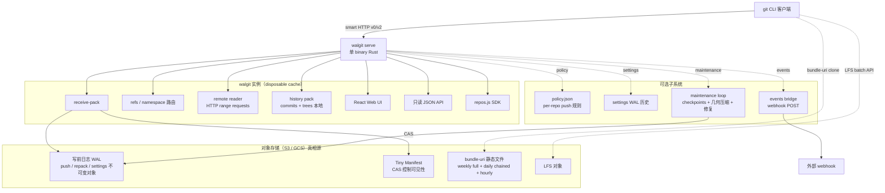

# tobi/walgit

## 一句话定位
**Rust 实现的 git server，遵循 Cursor "Git at any scale"（Continuity）架构**——单一 binary + 对象存储（S3 / GCS）+ 写前日志（WAL）作为唯一真相源 + 每台机器都是 disposable cache + 仓库规模可超过机器规模。10 天 2,384⭐ / 132 forks / 26 open issues / 587KB / Rust / MIT——无 description / 无 topics 字段但拿到 2.3k⭐。

## 它解决的问题
Git 是分布式系统，但 hosting 一个 git server 历来痛苦，原因只有一个：**packfiles**。一切都被压缩成大二进制 pack（按"小"而非"按顺序读"布局），每次 git 操作都是在 GB 之上随机走。在笔记本 page cache 内是好的，跨网络文件系统是灾难——这就是为什么"把仓库放 NFS 上"在每个尝试过的大型 host 都失败。**GitHub Spokes 的设计**（保真实仓库在本地 NVMe，让上游 git 做工作，packfile 级别复制 + 强一致）代价是三阶段提交 + 副本集 + 数据库映射 + pets fleet。

`walgit` 走 **Cursor Continuity 路线**（参考 Cursor 博客《Git at any scale》）：让 WAL（写前日志）在对象存储中成为唯一真相，每个磁盘仓库都是 cache。push 写入不可变对象到 bucket，仅当一个微小 manifest 被 CAS（compare-and-swap）重写时可见——CAS 即共识，无选举、无 quorum、无 primary。**任意实例都可接收 push；两个 racing 实例不能同时赢**。副本读 log 即可拥有仓库；读取无需协调（conditional GET，通常 304）；压缩由持 lease 者一次完成并发布到 log，副本下载压缩包而非 repack；WAL 是真相，故有完整 provenance（每个 push / repack 可重放到任意点）。

针对 **monorepo 在小机器上** 这一关键场景，`walgit` 在 Continuity 基础上加了：
- **remote reader**（HTTP range requests）——为大仓库服务 refs / web，pack 永远不必装在实例上
- **history pack**——commits / trees 本地保留，blob 在 bucket
- **bundle-uri**——clone 字节搬出服务器，新 clone / catch-up 是 bucket 或 CDN 提供的静态文件（周全包 + 链式日包 + 小时包）

## 为什么值得关注（2026-09-02）
- **10 天 2,384⭐ / 132 forks**（GitHub API 可核验）：在无 description / 无 topics 情况下拿到 2.3k⭐，说明"原生 Rust git server"是 2026 下半年开发者强烈需求的空白点
- **26 open issues**（相对偏高）：典型"早期 + 社区参与度强"信号，issues 内容待 GitHub UI 核验
- **Rust / MIT / 587KB**：单一 binary（< 1MB）即可启动 git server，对云原生部署极友好
- **架构传承 Cursor Continuity**：Cursor 已是 GitHub Copilot / Cursor IDE 头部公司，其内部 git infra 开源版本意义重大
- **pushed 2026-08-27**：比 created 晚 4 天，说明仍在活跃开发

## 热度来源判断
**"Git server 现代化 × 对象存储优先 × 单 binary 部署 × Cursor Continuity 架构开源"四重驱动。** Git server 是 2026 下半年被忽视但需求明确的赛道——GitHub / GitLab / Gitea / SourceHut 之后，开发者社区需要一个"云原生 + 对象存储 + WAL + 无状态"的现代 git server 替代品。Cursor 已是 GitHub Copilot / Cursor IDE 头部公司，其内部 Continuity 架构开源版本（`walgit`）直接进入开发者视野。`无 description / 无 topics` 拿到 2.3k⭐ 本身就是需求强烈信号（说明开发者通过 PR / issue / 推文传播而非 SEO）。

**关键证据 vs 推断：** 2,384⭐ / 132 forks / 587KB / Rust / MIT / created 2026-08-23 22:28:01Z / pushed 2026-08-27 01:50:20Z——GitHub API 当日截取。**风险：** 无 description / 无 topics 意味着 SEO 弱、社区发现成本高；26 open issues 中可能含 blocker；与 GitHub Spokes / Gitea / SourceHut / gitness 等竞品关系需观察；WAL-based 设计对 S3 / GCS 等对象存储的强依赖性可能成为采用门槛。

## 关键技术亮点
1. **WAL + CAS 共识**：写前日志在对象存储，唯一真相源；CAS 即共识，无选举 / 无 quorum / 无 primary
2. **disposable cache**：每台机器都是 cache，kill 所有机器仅丢失 warmth（缓存热度），不丢数据
3. **smart HTTP v0/v2**：`ls-refs`（带 prefix）、`fetch`（filter/shallow/deepen/sideband-all）、`receive-pack`（atomic、deletes、tags、push options、report-status-v2）、`<owner>/<repo>` namespaces、sha1 + sha256
4. **bundle-uri**：周全包 + 链式日包 + 小时包；新 clone 拉最新周全包 + 链上日包 + 服务器补余；catch-up 拉错过的 slots；blobless family 支持 `--filter=blob:none`
5. **Git LFS**：Batch API + 基础 transfer，对象在 bucket，可选 read-through 上游 LFS server
6. **web UI + API**：React UI（tree / blob / commits / diffs / WAL 健康页）+ 只读 JSON API（`/{owner}/{repo}/api/*`）；sha-寻址响应不可变可缓存；长响应以 SSE 流式进度；`repos.js` 是无依赖 SDK
7. **policy.json**：per-repo push 规则（protected refs / groups / fast-forward only / bypass lists）
8. **settings + WAL**：per-repo 配置（bundle 调度 / 压缩 / upstream follow）发布到 WAL 带 history
9. **events bridge**：小桥接监听 WAL，POST ref 事件到 webhook，每个 `(repo, seq, ref)` 恰好一次（持久 cursor）
10. **maintenance**：checkpoints / bundle 构建 / 几何压缩 / base 重建 / 连通性审计 / 修复——一个循环计算期望状态，每轮做一项最重要缺失工作；自愈（outage 不留洞；删除的 artifact 标识为 "missing" 同等重建）
11. **remote reader**（HTTP range requests）：大仓库的 refs / web 服务，pack 不必装在实例上
12. **history pack**：commits / trees 本地，blob 在 bucket
13. **monorepo on small machines**：核心场景，专为 monorepo 在小机器上设计

## 架构师速览

| 决策问题 | 研究判断 | 证据边界 |
|---|---|---|
| 系统边界 | WAL + 对象存储层 + git smart HTTP 协议层 + bundle-uri 静态服务层 + LFS 适配层 + web UI/API 层 + policy / settings / events / maintenance 子系统 | README 明示十三要素；具体 CAS 实现细节（S3 conditional writes / DynamoDB-like compare-and-swap）、bundle 调度算法、policy.json 完整 schema 均待代码核验 |
| 主路径 | push → receive-pack 写 WAL + CAS manifest → 副本 conditional GET 看到变化 → 客户端 fetch（带 bundle-uri 优化）→ 上游 git 做 upload-pack/repack/bundle → walgit 做 receive-pack + WAL + plumbing | 主路径为 README 描述；具体 WAL 对象格式、CAS 重试策略、bundle 切割算法需 README / 代码独立核验 |
| 关键权衡 | "WAL + CAS 共识" vs "强一致副本集成本"（GitHub Spokes 路线）；"对象存储优先" vs "网络依赖 + 延迟"；"disposable cache" vs "冷启动延迟"；"单 binary 部署" vs "运维可视化欠缺"；"Cursor Continuity 传承" vs "生态绑定" | 587KB 来自 API（极小，说明是核心二进制）；MIT 商业可用；与 GitHub Spokes / Gitea / SourceHut / gitness 等竞品关系需观察 |
| 最小 PoC | 准备 S3 或 GCS bucket → 写 `walgit.toml`（S3 endpoint + token） → `walgit serve --config walgit.toml` 启动 → `git push https://git.example.com/acme/app.git main` 创建仓库 → 验证 web UI 可访问 / LFS 可用 / bundle-uri clone 可优化 → 与现有 Gitea / GitLab 对比部署复杂度与读性能 | 安装命令需 README 独立核验；S3 / GCS 兼容性、CAS 在不同对象存储上的实现差异、bundle-uri 实际节省带宽比例需独立 benchmark |

## 架构启发
`walgit` 的核心启发是 **"Git hosting 的现代化路径"**——从 GitHub Spokes 的"pet fleet + 副本集 + 数据库映射"过渡到 Cursor Continuity 的"WAL + CAS + disposable cache"。三个核心洞察：

1. **CAS 即共识**：对象存储的 conditional write（CAS）就是分布式共识——不需要 Raft / Paxos / 选举 / quorum。这是"把基础设施外包给云"的极致表现。
2. **disposable cache 是常态**：每台机器都是 cache，kill all 仅丢失 warmth。Monorepo 在小机器上的可行性由此打开。
3. **clone 字节搬出服务器**：bundle-uri 把 clone 流量从动态服务器搬到 CDN / bucket，是 GitHub 自己也在用的优化（[参考 GitHub bundle-uri 文档](https://github.blog/open-source/git/introducing-bundle-uri-clone-and-fetch-with-bundle-uri/)）。

更深层的启发是 **"基础设施架构的演进是哲学问题而非技术问题"**。GitHub Spokes 路线假设"机器是 pet，需要照顾"；Cursor Continuity 路线假设"机器是 cattle，死了就换"。两者都能 scale，但运维成本 / 心态完全不同——前者要养宠物，后者只管喂食。`walgit` 把 Cursor 内部架构开源化，让中小团队也能用上"GitHub 级别的 git hosting"，对自托管 git 生态是重大贡献。

对 Rust 生态的启发是 **"Rust 在系统 / 基础设施领域的优势持续兑现"**——单一 binary（< 1MB）+ 内存安全 + 高并发，完美匹配 git server 场景。与此前 ripgrep / fd / bat / eza / delta / zellij 等"Rust 重写经典工具"趋势一致。

## 架构图（MMD）

> 证据边界：此图只采用本档案已有可核验描述；"待核验"节点不应视为项目实现事实。

## 定位判断
**基础设施候选项目（git server 现代化）。** `walgit` 不仅是"又一个 git server"，而是把 Cursor Continuity 架构开源化的具体实现——单 binary + 对象存储 + WAL + CAS 共识，目标是替代 GitHub Spokes 风格的复杂基础设施。10 天 2.3k⭐ + 26 open issues 已显示社区参与度。能否持续，取决于：(1) 对象存储兼容性（S3 / GCS 之外是否支持 MinIO / R2 等）；(2) 与 Gitea / GitLab / SourceHut 等成熟竞品的差异化能否维持；(3) Cursor 是否持续投入（"内部架构开源化"项目常见"开源后维护不足"问题）。

目前定位是"Git server 现代化最有想象力的开源样本"——它把 Cursor 的内部架构暴露给社区，对自托管 git 生态是重大贡献。

## 风险/局限/泡沫点
- **无 description / 无 topics**：SEO 弱，社区发现成本高
- **26 open issues 偏高**：典型"早期 + 社区参与度强 + 维护力量可能不足"信号
- **对象存储强依赖**：S3 / GCS 兼容性、MinIO / R2 / Azure Blob 等兼容性需观察；CAS 在不同对象存储上的实现差异是潜在风险
- **冷启动延迟**：disposable cache 意味着副本首次读仓库需从 bucket 拉，对 cold start 场景不友好
- **WAL 无限增长**：写前日志长期保存成本，需观察 compaction 策略有效性
- **bundle-uri 客户端支持**：依赖 git 2.39+ 的 bundle-uri 协议，老 git 客户端无法享受优化
- **与 Gitea / GitLab / SourceHut / gitness 等竞品关系不明**：功能对比、生态对比需观察
- **Cursor 内部架构开源化的可持续性**：历史上"内部项目开源"常出现"开源后维护不足"问题（参考早期 Kubernetes 周边工具）
- **587KB 极小**：核心二进制完整度可能有限，与 `forgejo` / `gitea` 等成熟 git server 相比功能覆盖度待评估

## 与同类项目的关系
- **vs Cursor Continuity 原文**：本项目是 Cursor 架构的 Rust 实现 + 小机器适配版本；原文是 Cursor 博客《Git at any scale》的设计说明
- **vs GitHub Spokes**：Spokes 是 "pet fleet + 副本集 + 数据库映射"；本项目是 "WAL + CAS + disposable cache"；两种 git hosting 哲学
- **vs Gitea / Forgejo**：Gitea 是 Go 实现的轻量自托管 git server；本项目是 Rust 实现 + 对象存储优先；两者定位不同
- **vs GitLab**：GitLab 是 Rails 实现的重量级 DevOps 平台；本项目是 git server only + 云原生优先
- **vs SourceHut**：SourceHut 是 Python + 全功能（git / hg / bug tracker / lists / paste / todo）；本项目是 git only
- **vs gitness / plane**：gitness 是 Harness 自家 git server；plane 是项目管理系统；本项目是 git server only
- **vs bundle-uri 协议**：本项目是 bundle-uri 的服务端实现，参考 GitHub 自家 bundle-uri 文档

## 是否值得持续跟踪
**值得跟踪（git server 现代化代表）。** `walgit` 代表了 git hosting 基础设施的现代化方向——从 pet fleet 到 disposable cache，从数据库映射到 WAL + CAS，从动态服务器到 CDN + bundle-uri。无论项目本身成败，这一方向是行业趋势。建议关注：对象存储兼容性扩展、bundle-uri 优化实际效果、与 Gitea / GitLab 的差异化能否维持、Cursor 是否持续投入。

对自托管 git 团队，这个项目是"Gitea / GitLab 之后下一代"的潜在候选；对 Rust 生态，它是"基础设施类 Rust 项目"的最新代表；对架构师，它是"如何用对象存储 + CAS 替代分布式共识"的教科书级实现。

## 后续观察点
- 对象存储兼容性扩展（MinIO / R2 / Azure Blob）
- bundle-uri 优化实际带宽节省比例（需独立 benchmark）
- 与 GitHub Spokes 性能对比（读延迟、克隆速度、并发 push 能力）
- 26 open issues 的解决节奏（决定维护可持续性）
- Cursor 是否持续投入（HR / commit 频率 / 社区参与度）
- 是否被其他云厂商采用（如 Cloudflare R2 + Workers 的 walgit 集成）
- 是否出现 "walgit 兼容 git 服务" 生态（如 walgit-based GitHub 替代品）

---
> 数据来源: GitHub API (2026-09-02) | Stars: 2,384 | Forks: 132 | License: MIT | 语言: Rust | 创建: 2026-08-23 | Pushed: 2026-08-27 | Open Issues: 26 | Size: 587KB