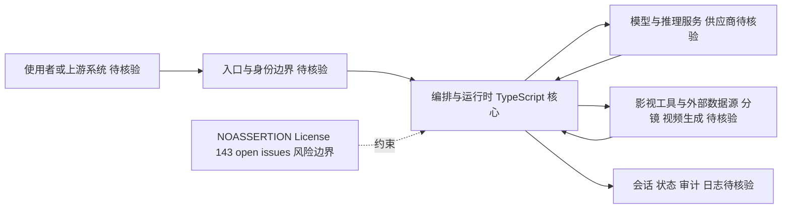

# waooAI/waoowaoo — 首家工业级全流程 AI 影视生产平台。Industry-first professional AI Agent platform for controllabl

## 一句话定位

首家工业级全流程 AI 影视生产平台。Industry-first professional AI Agent platform for controllable film & video production. From shorts to live-action with Hollywood-standard workflows.。主要使用 TypeScript 编写，当前 13,555 stars / 3,007 forks / 86 subscribers。

## 它解决的问题

**目标用户**：使用 typescript 生态的开发者、AI Agent 构建者。

**痛点**：该项目解决的核心问题是 首家工业级全流程 AI 影视生产平台。Industry-first professional AI Agent platform for controllable film & video production. From shorts to live-action with Hollywood-standard workflows.。从 README 来看，项目提供了 。

**场景**：适用于需要 ai-agent, ai-agents, automation 的开发场景。

## 为什么值得关注（2026-05-06）

1. **Stars 增长**：13,555 stars，3,007 forks——fork/star 比为 22.2% （高 fork 比例说明部署/集成意愿强）
2. **活跃度**：创建于 2026-01-22，最后更新 2026-08-11，143 open issues
3. **技术栈**：TypeScript，License: NOASSERTION
4. **生态定位**：Topics: ai-agent, ai-agents, automation, film-production, generative-ai

## 热度来源判断

**真实需求信号**：forks 3007（高部署意愿），subscribers 86（深度关注）。

**品类时机**：从 topics 来看，ai-agent, ai-agents, automation 是当前社区关注的方向。

## 关键技术亮点

1. **首家工业级全流程 AI 影视生产平台。Industry-first professional AI Agent platform for controllable film & video production. From shorts to live-action with Hollywood-standard workflows.**

## 架构师速览

| 决策问题 | 研究判断 | 证据边界 |
|---|---|---|
| 系统边界 | waoowaoo 是 TypeScript 编写的 AI 影视生产 Agent 平台，承担从短剧到真人拍摄、好莱坞级工作流的编排入口职责；系统面向上游使用者，落到模型供应商与影视类外部工具/数据源 | 仅基于档案"一句话定位"、tags（ai-agent, film-production, generative-ai, short-drama, storyboard, video-production）做的抽象，模型/工具具体协议与清单未给出 |
| 主路径 | 使用者/上游系统 → 入口与身份 → 编排与运行时 → 并行调用模型推理与影视工具/外部数据源 → 会话/状态/审计回写 | 节点仅复述档案"架构师速览"中的职责描述；具体协议、持久化、部署形态未在档案中证实 |
| 关键权衡 | 工业级可控影视流程带来的扩展速度，与 NOASSERTION License、143 open issues、供应商耦合、可观测性之间的张力 | License 与 issues 数为档案事实；"工业级、可控、Hollywood-standard"为仓库自述，未见独立基准 |
| 最小 PoC | 在单一入口、最小工具权限与可审计日志下，验证短剧→分镜→视频这一条主路径，再扩大模型/工具接入面 | 档案未给出具体模型、工具或部署方式，PoC 细节均"待核验" |

## 架构启发

从 waooAI/waoowaoo 的设计来看，核心思路是 **"首家工业级全流程 AI 影视生产平台。Industry-first professional AI Agent plat"**。这反映了 TypeScript 生态中 Agent / AI 工具链 的演进方向——降低集成复杂度、提供开箱即用的能力。开源 License (NOASSERTION) 降低了采用门槛。

## 架构图（MMD）

> 证据边界：此图只采用本档案已有可核验描述；“待核验”节点不应视为项目实现事实。

## 定位判断

**平台候选**。在生态中定位为首家工业级全流程 AI 影视生产平台。Industry-first profes方向的工具。Stars 13555 说明已有一定社区基础。

## 风险 / 局限 / 泡沫点

1. **规模风险**：13,555 stars，但 fork 3007 说明有实际部署
2. **维护风险**：最后 push 时间 2026-08-11，活跃维护中
3. **Open Issues**：143 个 open issues，活跃社区反馈
4. **License**：NOASSERTION

## 与同类项目的关系

- 与同 TypeScript 生态的同类工具形成竞争/互补关系。具体竞品对比需参考社区讨论。
- 从 topics (ai-agent, ai-agents, automation) 来看，与关注 ai-agent 的其他项目有交叉。

## 是否值得持续跟踪

**是。** 13555 stars + 活跃更新说明项目有持续价值。建议关注后续版本迭代和社区增长。

## 后续观察点

1. Star 增速是否可持续（当前 13,555）
2. Fork 增长趋势（当前 3,007）
3. 功能迭代频率（最后更新 2026-08-11）
4. 社区活跃度（subscribers 86, open issues 143）

---
> 数据来源: GitHub API (2026-08-11) | Stars: 13,555 | Forks: 3,007 | License: NOASSERTION | 语言: TypeScript | 创建: 2026-01-22
