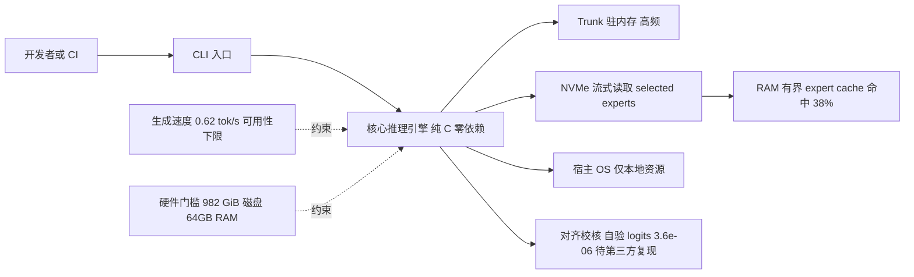

# waste (WASTE) — 纯 C 零依赖跑全量 Kimi K3 2.78T 的推理引擎

## 一句话定位
WASTE（Weight-Aware Streaming Tensor Engine）——纯 C、零运行时依赖、可嵌入的推理引擎，在 64GB MacBook Pro 上跑**全量** Kimi K3（2.78 万亿参数，非蒸馏/非剪枝），把 trunk 驻内存、selected experts 直接从 NVMe 流式读取、剩余 RAM 做有界 expert cache。

## 它解决的问题
目标用户是在消费级硬件上运行超大 MoE 模型的研究者/极客。痛点：Kimi K3 完整权重 1.42 TB（转后 982 GiB），远超主流消费机内存，无法直接加载。waste 要解决的是"让一个 2.78T 模型在一台 64GB 消费机上跑起来"——不是蒸馏/剪枝，而是利用 MoE 每 token 仅激活约 4% 的特性，让 idle weight 不需要在内存、只需要"reachable in time"。

## 为什么值得关注（2026-08-02）
这是本周"超大模型本地推理"命题的**第三个独立实现**。deltafin（Python，589⭐）和此前追踪的 colibri（纯 C，744B，21K⭐）已分别给出 Python 与纯 C 路线；waste 是纯 C 路线里**首个瞄准万亿级 K3 单机消费硬件**的实现。三个独立团队、三种实现，使"推理瓶颈是内存放置策略而非算力"这一命题的验证不再依赖单一项目。

## 热度来源判断
- **真实需求信号**：Apache-2.0、fork 53、README 极其坦诚（明确自述"slow, 0.5 tok/s"、声明"未发现其他万亿级消费机磁盘流式公开演示"为"我们的搜索结果而非调研，无对比表，欢迎反例"）——这是研究性项目的诚实姿态，非营销。
- **话题性成分**："在 Macbook 上跑 2.78 万亿参数"的叙事有极强传播性；652⭐ 来自"把不可能变可能"的话题性。
- **价值定位**：作者明确把价值定位为"**可行性证明**"（万亿级可达单台消费机），而非"实用速度"（0.62 tok/s 是可用性下限）。

## 关键技术亮点亮点

1. **Trunk 驻内存 + expert 磁盘流式 + RAM 有界 cache**：模型 trunk 保持在内存；每 token 需要的 selected experts 从 NVMe 直接读取（一个 expert = 一次读取）；剩余 RAM 全部用作 expert cache（有界）。实测命令显示 "expert cache 17.56 GB"，"experts 9038 hit / 14514 miss = 38%"。
2. **纯 C、零运行时依赖**：可嵌入。对比 deltafin（Python + 依赖），waste 追求极致的依赖控制与可移植性。
3. **作者自验对齐**：每层与 PyTorch 参考对齐，最终 logits 一致到 3.6e-06，vision tower 与自身 oracle 一致到 2.3e-06。**注意这是作者自验，非第三方独立复现。**
4. **多模型支持**：除 K3 2.78T，还跑 Kimi-Linear 48B（19 GiB 容器，1.87 GiB 最小 RAM，10.7 tok/s）。

## 架构师速览

| 决策问题 | 研究判断 | 证据边界 |
|---|---|---|
| 系统边界 | 纯 C 零运行时依赖的可嵌入推理引擎，CLI/API 入口直接调用核心库，宿主仅依赖 OS 与本地 NVMe 文件，无外部服务/网络协议/插件总线 | 基于"dependency-free" 与 C 单语言事实；CLI/插件适配器等具体外延未在档案中描述，标注"待核验" |
| 主路径 | 开发者/CI → CLI(API) → 核心引擎 → 内存 trunk + NVMe expert 流式 + RAM 有界 cache，单机消费硬件闭环 | trunk/expert/cache 三段职责见档案；具体协议、I/O 调度、磁盘格式由"待核验"覆盖 |
| 关键权衡 | 速度 vs 规模：trunk 驻内存 + expert 离线换 2.78T 单机可跑；代价是 0.62 tok/s、982 GiB 磁盘、≈64GB RAM 硬门槛 | 0.62 tok/s、982 GiB、≈64GB、hit 38% 来自作者实测命令；未含第三方复现 |
| 最小 PoC | 在 64GB RAM + ≥1TB NVMe 主机上克隆仓库、以 CLI 加载 K3 容器，先验证 expert cache 命中率与稳态 tok/s，再对照作者自报 logits 偏差 3.6e-06 | 模型容器路径、CLI 调参、cgroup-aware 预算(0.6.2) 等具体接入步骤需读源码核验 |

## 架构启发
核心启发是 **"idle weight 不需要在内存，只需要 reachable in time"**。这与 colibri（VRAM/RAM/NVMe 三级）、esp32-ai（SRAM/PSRAM/FLASH 三级 + Per-Layer Embeddings）是同一原理家族的不同表现——**"推理瓶颈是内存放置策略而非算力"**。waste 的取舍是：trunk（高频访问）驻内存换速度，expert（低频/按需）放磁盘换容量，RAM 做 cache 桥接两者。作者诚实指出"两个看起来最大的杠杆（每 token 读更少字节、RAM 里放更多）都被榨干了，接下来是工程优化而非新原理"。

```
[模型权重 982 GiB]
   ├── trunk → 驻内存（高频）
   └── experts → NVMe 磁盘（按需，一个 expert = 一次读取）
                    ↑
              RAM 有界 expert cache（剩余空间，17.56GB）
              hit 9038 / miss 14514 = 38%
```

## 架构图（MMD）

> 证据边界：此图只采用本档案已有可核验描述；“待核验”节点不应视为项目实现事实。



## 定位判断
在"超大模型本地推理"品类里，waste 与 deltafin（Python）、colibri（C）并立。waste 的差异化是**纯 C 零依赖 + 万亿级单机消费硬件**。定位为观察型——价值在可行性与工程启发，0.62 tok/s 尚不实用。与 colibri（744B 多 GPU、21K⭐）相比，waste 瞄准更大模型（2.78T）但单机，是规模/便携的不同权衡。

## 风险 / 局限 / 泡沫点

1. **0.62 tok/s 是可用性下限**：26 秒答一句话，价值在可行性证明而非日常使用。作者诚实承认，但**容易被读者误读为"K3 可日常本地跑"**——不能。
2. **自验非第三方复现**：logits 一致到 3.6e-06 是作者自报，未经独立团队复现；"未发现其他万亿级消费机磁盘流式公开演示"是作者的搜索结果，**非系统性调研，作者声明无对比表、欢迎反例**。
3. **需要 982 GiB 磁盘 + 64GB RAM**：模型容器 982 GiB，最低 RAM 29.05 GiB——仍是高门槛，非普通消费机。
4. **单点实现早期**：创建于 2026-07-28，5 天 652⭐，生产/长期维护承诺待验证。

## 与同类项目的关系
- **vs deltafin（589⭐，Python）**：同跑全量 K3，deltafin 用 Python + OpenAI 兼容 API server（易用/API 优先），waste 用纯 C 零依赖（极致依赖控制/可嵌入）。语言与策略分化。
- **vs colibri（21K⭐，C）**：同为纯 C 零依赖，但 colibri 跑 GLM-5.2 744B 多 GPU（VRAM/RAM/NVMe 三级），waste 跑 K3 2.78T 单机（trunk/expert 分离）。规模与便携性的不同权衡。
- **vs esp32-ai（2.7K⭐）**：esp32-ai 把 28.9M 跑上 8 美元微控制器（512KB SRAM），waste 把 2.78T 跑上 64GB Mac——同一原理（内存放置策略）的两个极端规模。

## 是否值得持续跟踪
**是，作为"超大模型本地推理三极"之一跟踪。** 关注其 expert cache 命中率优化、是否出现第三方对齐复现、以及能否从 0.62 tok/s 工程优化到"日常可用"速度（如 5+ tok/s）。

## 最近动态（2026-08-03）

- **持续放量**：652 → 1,010（+358），fork 53 → 89（+36）。纯 C 万亿级推理话题持续获得关注。
- **v0.6.2 发布**：cgroup-aware budget——按 cgroup limit 而非 host RAM 自动预算内存（"Size the automatic budget against the cgroup limit, not the host's RAM"）。这是容器化部署的工程改进。
- **K3 本地推理第四极出现**：FareedKhan-dev/kimi-k3-in-c（218⭐）用便携 C99 把 peak RSS 压到 8.24GB（waste 要求 ~64GB）。waste 不再是纯 C K3 推理的唯一实现，但两者在 Pareto 前沿占据不同点——waste 求接近可用速度（0.62 tok/s），kimi-k3-in-c 求内存下限（8.24GB / 32s·token⁻¹）。
- **判断**：score 82 → 83。品类成熟（四极并立）提升整体关注度，waste 作为"接近可用速度"的代表持续受益。

## 后续观察点
1. **expert cache 命中率优化**：当前 38%（9038/14514），命中率提升直接提速；关注作者的工程优化进展。
2. **第三方对齐复现**：logits 3.6e-06 一致性是否被独立团队复现，是验证可行性的关键。
3. **与 kimi-k3-in-c/deltafin/colibri 的 Pareto 前沿竞赛**：四极并立后，速度-内存-易用性前沿被多个实现探索。关注 waste 能否工程优化到 5+ tok/s（跨入实用性）。

## 最近动态（2026-08-04）

- **续涨 +510（1,010→1,520），fork 89→111**：连续三日正增长（+342/+358/+510），增速反而在第三日提升。K3 本地推理品类整体持续放量——与 kimi-k3-in-c（218→1,173）同步爆发，说明"万亿级本地推理"已从个别项目变为**品类级关注**。
- **品类视角**：waste（1,520⭐，64GB/接近可用速度）与 kimi-k3-in-c（1,173⭐，8.24GB/极限慢）构成速度-内存 Pareto 前沿的两个端点，两者同步增长说明社区在同时关注"可用"与"极限"两端。

## 最近动态（2026-08-05）

- **增量骤降 +510→+145（-72%），1,520→1,665**：连续三日增速递增（+342/+358/+510）后第四日骤降。fork 111→130（+19）。这是 K3 本地推理品类**叙事分裂**的直接表现——waste（可用速度端）退潮，kimi-k3-in-c（极限低内存端）持续 +779。
- **叙事分裂 ≠ 品类降温**：kimi-k3-in-c 仍在放量，说明品类整体未降温，而是**社区注意力在品类内部从"可用速度"迁移到"极限低内存"**。waste 的退潮是注意力再分配，不一定是 waste 项目本身的问题（但需观察是否有新版本或社区反馈）。
- **价值定位不变**：waste 0.62 tok/s 仍是 Pareto 前沿的"接近可用速度"端，是真正日常可用的本地推理方案（vs kimi-k3-in-c 32s/token）。热度排序 ≠ 技术选型排序。
- **判断修正**：score 83 → 82。增量骤降是关注度信号，但技术价值（可用速度端代表）不变。

---
*首次记录：2026-08-02* · *最近更新：2026-08-05（1,520→1,665，+145，增量骤降，叙事分裂，score 82）*
