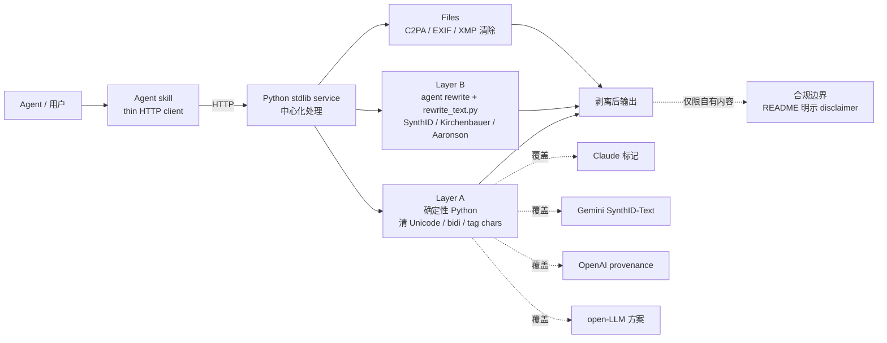

# ShadowAqueduct/watermark-remover

## 一句话定位
**多厂商 AI 来源标记的统一剥离工具**——用三层架构（Layer A 确定性 Python 清 Unicode 隐藏字符 / Layer B agent rewrite 处理 SynthID/Kirchenbauer 等统计 token 签名 / Files 清 C2PA/EXIF/XMP 元数据），覆盖 Claude/Gemini/OpenAI/open-LLM 四大类 AI provenance 标记，以 **agent skill + Python stdlib service** 形态分发，**面向你自己拥有的内容**。

## 它解决的问题
随着 AI 内容标识技术普及（C2PA 标准、Google SynthID-Text、OpenAI provenance 标记、open-LLM 方案 Kirchenbauer green-list / Aaronson EXP 等），AI 生成内容被嵌入多种来源追踪标记——Unicode 隐藏字符、统计 token 分布签名、文件元数据 manifests。用户对自己拥有的内容上的这些标记有合法清除需求（隐私保护 / 内容再利用 / 跨平台迁移），但现有工具分散在各个厂商的生态中：exiftool 清元数据、各 detector 各自为战、缺乏"agent skill 形态"的统一入口。watermark-remover 解决的是：**提供一个统一的、多层的、Agent Skill 格式的 AI provenance 标记管理工具**。

## 为什么值得关注（2026-08-25）
- **2 天 768⭐**（GitHub API 可核验）：内容卫生 / 隐私赛道短期增速突出
- **License: MIT**（依 README CI badge 推断，需源码进一步确认）：开发者友好
- **三层架构清晰**：Layer A（确定性 Python）/ Layer B（agent rewrite + `rewrite_text.py`）/ Files（C2PA / EXIF / XMP）——可针对不同层选择不同处理
- **Agent skill 是 thin HTTP client**：agent host 不需要 Python，所有工作运行在 service——降低集成门槛
- **覆盖文件类型极广**：PNG / JPEG / WebP / AVIF / HEIC / BMP / GIF / TIFF / SVG / PDF / DOCX / XLSX / PPTX / EPUB / ODT / HTML / Markdown / MP4/MOV/M4A/M4V / WAV / MP3 / FLAC / M4A
- **覆盖多厂商标记**：Claude / Gemini-SynthID-Text / OpenAI provenance surfaces / open-LLM schemes (Kirchenbauer / keyed-Gumbel / Aaronson EXP)
- **2 天 73 forks**：相对 stars 的高 fork 数表明社区贡献活跃（开源项目 fork 数通常 < 1% stars）
- **topics 含 claude-code-plugin / codex-skill**：明确支持主流 harness 的 skill 形态

## 热度来源判断
watermark-remover 的热度来自 **"AI 来源标记普及 × 用户反向需求 × agent skill 形态降低门槛"** 的组合：(1) C2PA / SynthID 等来源标记在 2026 年加速普及，用户对自己写过的内容被嵌入隐藏水印的反感情绪强烈；(2) 现有工具分散（exiftool / 各 detector），缺乏统一入口；(3) agent skill 形态让"清除水印"成为一个可被 Claude Code / Codex 直接 install 的 skill，与 8-24 的"skill 单点化 × 完整工作流"趋势一致。三点叠加在 2 天内拿到 768⭐。**主要风险：** "清除来源标记"在某些司法管辖区可能与"内容真实性保护"法规冲突；agent skill 形态降低使用门槛的同时也降低"误用"门槛。

## 关键技术亮点
1. **三层架构**：Layer A（确定性 Python 清 Unicode 隐藏字符 / bidi / tag chars）、Layer B（agent rewrite + `rewrite_text.py` 处理统计 token 签名）、Files（C2PA / EXIF / XMP 清除）——可针对不同层选择不同处理
2. **Agent skill = thin HTTP client**：agent host 不需要 Python，所有工作运行在 stdlib Python service——降低集成门槛
3. **多厂商标记覆盖**：Claude / Gemini-SynthID-Text / OpenAI provenance / open-LLM (Kirchenbauer green-list / Aaronson EXP)——四大类全覆盖
4. **文件类型极广**：图片（PNG/JPEG/WebP/AVIF/HEIC/BMP/GIF/TIFF/SVG）/ 文档（PDF/DOCX/XLSX/PPTX/EPUB/ODT/HTML/Markdown）/ 音视频（MP4/MOV/M4A/M4V/WAV/MP3/FLAC）
5. **CI 完备**：CI badge 显示 GitHub Actions 工作流运行
6. **Disclaimer 清晰**："For privacy and hygiene on content you own"——明示使用边界
7. **与 2026-08-13 `guillaumemeyer/watermarks-remover` 关系待核验**：CI badge 引用前者的 actions，可能存在 fork / 命名继承关系

## 架构师速览

| 决策问题 | 研究判断 | 证据边界 |
|---|---|---|
| 系统边界 | Python stdlib service（中心化）+ agent skill thin HTTP client（agent host 无 Python）；覆盖文本 + 多媒体文件 | 边界由 README "skill is a thin HTTP client — the agent host needs no Python. All work runs in the service." 描述确认；service 的部署形态（单进程？多 worker？）需源码核验 |
| 主路径 | agent 调用 skill → HTTP 请求 → service 处理 → Layer A/B/Files 三层剥离 → 返回结果 | 主路径由 README "skill ships no code — it calls the service over HTTP" 描述确认；Layer B 的 agent rewrite 触发条件 / 准确性评估需源码核验 |
| 关键权衡 | 三层覆盖广度 vs 各层准确率（Layer B 统计水印的 rewrite 语义保持度）；文件格式广度 vs 实现深度（每种格式的解析成熟度）；agent skill 形态降低门槛 vs 误用风险（合规边界） | 取舍由 README 三层架构 + 文件格式表 + "For privacy and hygiene on content you own" 描述确认；具体每层准确率 / 误报率未公开 |
| 最小 PoC | 在本地启动 service → 用 Claude Code 或 Codex install skill → 在一段已知含 Unicode 隐藏字符 / SynthID 标记的文本上调用 skill → 验证 Layer A/B 输出 → 在一个已知含 C2PA 的 PNG 上调用 skill → 验证元数据清除 | PoC 流程由 README "Install" + 三层架构描述推导；具体 install 命令 / skill 配置需 README 进一步核验 |
| 证据边界 | README + 三层架构表 + topics；具体 Layer B 准确率、文件格式解析成熟度、与 guillaumemeyer/watermarks-remover 的关系均需源码核验 | 已核验事实来自 README 与 API；其他来自语义推断 |

## 架构图（MMD）

> 证据边界：此图只采用本档案已有可核验描述；"待核验"节点不应视为项目实现事实。

## 架构启发
watermark-remover 的核心启发是 **"AI 来源标记需要用户可控的反向工具"**——当 C2PA / SynthID 等标记成为内容标配，用户对自己拥有的内容有合法清除需求；缺乏反向工具意味着用户被单向"标记"。更深层的启发：**agent skill 形态把"内容卫生工具"分发到 agent harness 的生态**——这与 8-24 的"skill 单点化 × 完整工作流"趋势一致，且切入"合规 / 隐私"严肃工具类，标志 skill 市场从"创意资产"扩展到"治理工具"。再深一层：**"内容真实性保护"与"用户对自己内容的所有权"之间的张力**——这是 2026 年下半年 AI 治理的核心议题之一，watermark-remover 选择站在"用户所有权"一侧。

## 定位判断
**工具型（agent 时代内容卫生工具）。** watermark-remover 在"AI provenance 标记清除"赛道是当前最完整的开源实现，2 天 768⭐ + 73 forks 显示强烈需求。**与 2026-08-13 的 `guillaumemeyer/watermarks-remover` 关系待核验**：CI badge 引用前者 actions，可能是 fork / 命名继承 / 重启项目；建议使用前确认两者差异。**主要竞争威胁：** 各大厂商（如 Adobe / Microsoft）的"内容真实性"工具可能在合规压力下推出"官方清除工具"或"官方锁定工具"——届时 watermark-remover 的法律边界将更复杂。**值得 6-12 月高频跟踪**，特别是关注合规边界发展。

## 风险 / 局限 / 泡沫点
- **合规边界模糊**：清除 C2PA / SynthID 在某些司法管辖区（特别是欧盟 AI Act、加州 AB-2013 / SB-942 等）可能违反"内容真实性保护"法规——README 的 disclaimer 是必要的，但 distribution 形态容易突破边界
- **Layer B 准确率未公开**：统计 token 签名检测的假阳率、rewrite 后的语义保持度（重要：rewrite 可能改变原文意思）需独立 benchmark
- **文件格式广度 vs 实现深度**：覆盖 20+ 文件类型，每种格式的解析成熟度 / 已知限制未公开
- **与 `guillaumemeyer/watermarks-remover` 关系待核验**：CI badge 引用前者，可能是 fork / 重启项目——使用前需确认两者差异
- **大厂反向整合风险**：Adobe / Microsoft 等可能在合规压力下推出"官方清除工具"或强化"官方锁定"——届时法律边界将更复杂
- **agent skill 形态降低误用门槛**：低门槛意味着更容易被滥用——在企业内采用需配置使用 policy
- **首次发现的边界**：水印检测算法持续进化，本工具可能对新型水印无效

## 与同类项目的关系
- **vs `guillaumemeyer/watermarks-remover`（2026-08-13）**：可能存在 fork / 命名继承关系（CI badge 引用），需源码核验
- **vs exiftool**：exiftool 仅清 EXIF/XMP 元数据，不处理文本水印 / 统计 token 签名
- **vs 各厂商 watermark detector**：各 detector 只检测不剥离，且各自为战
- **vs C2PA 官方工具**：C2PA 官方工具是"添加标记"为主，反向工具稀缺
- **vs agent skill 生态**：与 ip-as-logo-skill / scroll-craft / solo-skills 同代产物（8-23 / 8-24 单点 skill 趋势），切入"合规 / 隐私"严肃工具类

## 是否值得持续跟踪
**值得高频跟踪（agent 时代内容卫生工具）。** 对所有关注 AI 内容合规的团队：**建议立即在本地测试 service + skill 集成，观察三层剥离的准确率**；对做内容平台的团队：**这是判断"AI 来源标记"合规边界发展的早期信号**；对个人开发者：**强烈建议了解工具的能力边界，但需严格在"自有内容"范围内使用**。

## 后续观察点
- 与 `guillaumemeyer/watermarks-remover` 的关系（fork / 重启 / 独立项目）
- Layer B 准确率 benchmark 公开化（统计 token 签名检测假阳率、rewrite 语义保持度）
- 文件格式解析成熟度（每种格式的已知限制 / 测试覆盖）
- 合规法规发展（欧盟 AI Act / 美国 AB-2013 / SB-942）对反向工具的态度
- 是否被主流 agent harness 官方收录（Claude Code skill marketplace / Codex skill registry）
- 大厂（Adobe / Microsoft）是否推出官方清除 / 锁定工具

---
> 数据来源: GitHub API (2026-08-25) | Stars: 768 | Forks: 73 | 语言: Python | 创建: 2026-08-23
