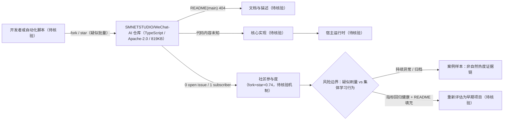

# SMNETSTUDIO/WeChat-AI — 疑似刷量对照样本

## 一句话定位
一个 2 天内获得 1,406⭐ 但呈现零参与度（1 subscriber / 0 issue / 无 description / README 404）的仓库，fork≈star（0.74）的指标结构高度疑似自动化批量部署或刷量，作为"热度≠价值"方法论的教学样本入库。

## 它解决的问题
本档案解决的是**研究者的问题**，而非终端用户的问题：如何在不依赖外部信息的情况下，仅凭 GitHub API 可核验字段，区分真实需求与自动化热度？WeChat-AI 提供了一个指标异常鲜明的对照样本。

## 为什么值得关注（2026-08-12）

并非因为该项目有技术价值，而是因为它**与 open-kimi-ppt-skill（归档后 fork 异常增长）同构**，且与 anydoc（真实需求）形成极端对照。三者并列入库，构成"热度≠价值"判断的证据链：
- anydoc：star/fork 同步健康增长，subscribers 35，fork/star=0.05 → **真实需求**
- open-kimi-ppt-skill：归档后 star 停滞（+1/-4），fork 持续异常增长（+30/+12），subscribers 2 → **归档后异常**
- WeChat-AI：创建即异常，fork≈star（0.74），subscribers 1，0 issue → **疑似刷量**

## 热度来源判断
**高度疑似非自然增长。** 依据（全部 GitHub API 可核验）：
1. **fork/star=0.74**：正常项目中 fork 远少于 star（anydoc 0.05、qm 0.12、crm 0.11）。fork≈star 通常意味着"fork 动作被自动化执行"——真实用户 star 多、fork 少；批量脚本则可能同时 fork+star。
2. **1 subscriber**：1,406⭐ 的项目仅 1 个 subscriber，严重背离。对比 anydoc（14,356⭐ / 35 subscribers）、phone-harness（1,488⭐ / 7 subscribers）。
3. **0 open issue**：零 issue 意味着零用户反馈，与 1.4K⭐ 项目的预期不符。
4. **description=null**：作者未填写任何描述。
5. **README(main) 404**：`raw.githubusercontent.com/SMNETSTUDIO/WeChat-AI/main/README.md` 返回 404，主分支无 README。
6. **2 天 1.4K⭐**：增速与 phone-harness（5 天 1.5K⭐，真实）相当，但参与度结构完全不同。

**无法从 API 确证"刷量"行为本身**——只能记录指标异常。结论标记为"疑似"，而非"确证"。

## 关键技术亮点
无技术亮点可评估——README 缺失，description 为空，无法核验任何技术声明。size=819KB，TypeScript，Apache-2.0。

## 架构师速览

| 决策问题 | 研究判断 | 证据边界 |
|---|---|---|
| 系统边界 | 无可核验技术边界；仅可观察到 Apache-2.0 / TypeScript / size=819KB 的仓库外壳，与 fork≈star 的异常参与度结构 | description=null、README(main) 404、零 issue，无法从档案核验任何运行组件或接口 |
| 主路径 | 不可建立主路径；缺乏 README/源码支持，只能以"开发者/CI → 仓库"作为最弱假设 | 档案未声明任何 CLI、API、引擎或外部集成；只能写"待核验" |
| 关键权衡 | 不是技术权衡，而是指标异常下的研究判断权衡：在 fork/star=0.74、subscribers=1、issues=0 的情况下，把该仓库存为"疑似刷量"对照样本而非技术候选 | 异常比例来自 GitHub API 可核验字段；"刷量"本身无法被 API 确证 |
| 最小 PoC | 不建议做技术 PoC；建议做指标观察 PoC——监测 fork/star、subscribers、issues 演变与是否被归档/改名 | 观测点（存活状态、指标结构、README 是否填充）已在档案后续观察点列出；具体实现脚本未在档案中给出 |

## 架构启发
**方法论启发大于技术启发。** WeChat-AI 的价值在于它让"热度≠价值"的判断变得可量化。关键比例是 **fork/star**：
- **<0.15**：健康（用户多、贡献者少，符合幂律）——anydoc 0.05、qm 0.12
- **0.15-0.4**：需关注（可能处于早期或特定社区）——crm 0.11、kimi-k3-in-c 0.16
- **>0.6**：高度异常（fork 动作被自动化执行的可能性高）——WeChat-AI 0.74、open-kimi-ppt-skill 0.74

**结合 subscribers 和 open_issues 交叉验证**：若 fork/star>0.6 且 subscribers<5 且 issues<3，则"疑似刷量"判断的置信度显著提升。

## 架构图（MMD）

> 证据边界：此图只采用本档案已有可核验描述；“待核验”节点不应视为项目实现事实。

## 定位判断
**观察型——案例库样本。** WeChat-AI 不作为可采用的技术项目跟踪，而是作为"指标异常检测"方法论的教学样本。与 open-kimi-ppt-skill 共同构成"生态中的非自然热度"证据链。

## 风险 / 局限 / 泡沫点
1. **"刷量"判断无法从 API 确证**：只能记录 fork≈star + 零参与度的指标异常，不能断言具体刷量机制（付费刷量/自动化部署/教程引导批量 fork 等）。
2. **可能是新兴社区行为**：不排除某些中文社区/课程存在"集体 fork+star"的协作学习行为（非恶意刷量），但这同样意味着 star 数不反映独立采用度。
3. **项目内容未知**：README 404、description 为空，无法评估是否有实际代码价值。

## 与同类项目的关系
- **vs Binaryify/open-kimi-ppt-skill**：同构——fork/star=0.74、subscribers 极低。open-kimi-ppt-skill 归档后 fork 持续异常增长；WeChat-AI 创建即异常。两者是"非自然热度"的不同阶段。
- **vs firecrawl/anydoc**：对照——anydoc fork/star=0.05、subscribers 35、issues 52，是真实需求的标杆。
- **vs ShawnPana/phone-harness**：对照——相近 star 量级（1,488 vs 1,406）、相近创建时间（08-07 vs 08-10），但 phone-harness subscribers 7、fork/star=0.09，结构健康。

## 是否值得持续跟踪
**作为案例样本跟踪，不作为技术项目跟踪。** 关注点：是否被删除/归档（如 claude-red 404 模式）、fork/star 比例是否进一步恶化、是否出现 description/README 填充（可能意味着从"刷量"转向"真实维护"）。

## 后续观察点
1. **存活状态**：是否被删除/归档/改名（与 claude-red 404 模式对照）。
2. **指标结构演变**：fork/star 比例、subscribers、issues 是否改善（从异常回归健康），还是持续恶化。
3. **README/description 是否填充**：若作者补充描述和文档，可能从"疑似刷量"转向"早期项目"，需重新评估。

---
*首次记录：2026-08-12* · *数据来源：GitHub API（2026-08-12）。star/fork/subscribers/issues/description/created_at 均为可核验事实。"疑似刷量"为基于指标异常的推断，无法从 API 确证刷量行为本身。*
