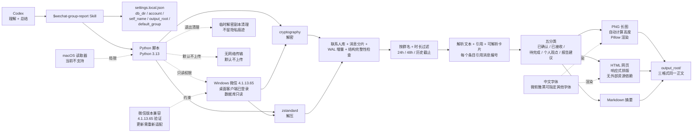

# Tina2088/wechat-group-report

## 一句话定位
Windows 微信群聊总结 Codex Skill——读取 Windows 微信桌面客户端本地已同步记录，按群名精确匹配 + 默认 24h 可指定时长/历史截止时间/已确认群 ID，整理主要话题/结论/待办，一次生成 PNG 长图 + HTML 网页 + Markdown 摘要三种格式；微信 4.1.13.65 验证；cryptography + zstandard + Pillow + Python 3.13；密钥临时解密副本正常退出清理 + 原微信数据库保持只读 + 默认不上传原始记录/数据库/个人配置。

## 它解决的问题
当前 Codex Skill 生态在中文本地应用层是空白——Skill 主流是英文 + SaaS API（Slack / GitHub / Jira 等），而中国开发者日常用的微信、钉钉、飞书等本地 IM 软件需要专门的 Skill 才能让 Codex 调用。**wechat-group-report 是「Windows 微信本地数据库 + Codex Skill 编排」的具体实现**——解决的是「把微信群聊转成可搜索可归档可总结的内容资产」。**关键工程点是「原微信数据库保持只读」+「临时解密副本正常退出清理」**——微信消息是加密存储（cryptography），Skill 不修改原库只读 + 临时副本退出清理 = 不破坏原数据 + 不留隐私痕迹的安全底线。**对个人**：可直接 `$skill-installer` 安装 + 设置 `db_dir` + 在 Codex 中调用；**对企业**：微信群工作沟通在中国企业是默认渠道，Codex 能直接总结群聊是「会议纪要自动生成」的具体路径。

## 为什么值得关注（2026-09-16）
- **Stars:** 10（截至 2026-09-16），1 天 10⭐
- **Forks:** 0
- **Watchers/Subscribers:** 0
- **Open Issues:** 0
- **License:** Apache-2.0（极宽松，企业友好）
- **语言:** Python
- **活跃度:** created 2026-09-15，pushed_at 2026-09-15
- **规模:** 802 KB
- **微信验证版本:** 4.1.13.65
- **依赖:** cryptography + zstandard + Pillow + Python 3.10+ 语法（Python 3.13 验证）
- **中文字体:** 默认微软雅黑，可指定其他字体
- **平台:** Windows + 微信桌面客户端已登录（macOS 读取器当前不支持）

## 热度来源判断
wechat-group-report 的热度是 **「Windows 微信本地数据库 + Codex Skill 编排 + 安全底线（密钥临时解密副本正常退出清理 + 原数据库保持只读 + 默认不上传）+ Apache-2.0 + 三格式输出」** 的组合。**Codex Skill 生态在中文本地应用层是空白**——主流 Skill 仓库以英文 + SaaS API 为主，中国开发者日常用的本地 IM 软件需要专门 Skill；wechat-group-report 是「微信群总结」的具体实现，击中中国开发者的真需求。**三个安全底线**——密钥不主动写入文件 + 临时副本退出清理 + 原数据库只读 + 默认不上传 = 「数据隐私 + 系统安全 + 网络传输安全」三重保护，符合中国用户合规与隐私要求。**Apache-2.0 + 802 KB + 三格式输出**是「可被 Codex `$skill-installer` 直接安装」的严肃形态。热度 **真实且有中国市场刚需**——但 fork=0 / 1 天反映项目刚发布，企业 fork 信号尚未出现；**真正决定长期价值的是微信版本兼容性**——README 明示「微信更新可能导致内存结构变化，需要重新适配」。

## 关键技术亮点
1. **Codex 会话协调的工作流**——Codex 不是直接读 SQLite 而是调度 Python 脚本（读取 / 渲染）+ 自己理解与总结消息；这是「Codex Skill 不内置模型 API 调用」的工程化形式（避免「Skill 偷偷调用 LLM API 把数据传到第三方」）
2. **按群名精确匹配 + 默认 24 小时**——可指定时长（24h / 48h 等）/ 历史截止时间 / 已确认的群 ID；避免「总结错群」/「总结时间错」类常见错误
3. **联系人库 + 消息分片 + WAL 增量**——微信本地数据库是分片存储 + WAL（Write-Ahead Log）增量；Skill 完整读取而不是只读主表
4. **结构完整性 + 时间窗口 + 发送者映射 + 重复记录检查**——四点完整性检查保证数据可靠
5. **每个报告条目引用本次真实消息编号**——可追溯到具体消息 ID；这是「总结可验证」的工程化形式
6. **已确认 / 已接收 / 待完成 / 个人观点 / 报告建议五分类**——群聊总结的内容分类标准
7. **三格式输出同一正文**——PNG 自动计算高度（朋友圈分享）+ HTML 响应式排版无外部资源依赖（浏览器打开）+ Markdown 摘要（文档归档）；覆盖三种使用场景
8. **cryptography + zstandard + Pillow**——微信消息是加密存储（cryptography 解密）+ 压缩（zstandard 解压）+ 渲染（Pillow 出图）；Python 3.13 验证
9. **中文字体微软雅黑可指定其他字体**——Windows 默认中文字体；可指定其他字体
10. **macOS 读取器当前不支持**——明确标注局限；不假装跨平台
11. **密钥不主动写入文件**——避免「密钥泄漏到本地文件」类常见错误
12. **临时解密副本正常退出清理**——Skill 退出时清理临时副本，不留隐私痕迹
13. **原微信数据库保持只读**——不破坏原数据；只读权限
14. **默认不上传原始记录 / 数据库 / 个人配置**——隐私保护明确表态
15. **微信 4.1.13.65 实际验证**——明示具体验证版本；README 警告「微信更新可能导致内存结构变化，需要重新适配」
16. **配置驱动**——`settings.local.json` 含 `db_dir` / `account` / `self_name` / `output_root` / `default_group`；`db_dir` 是包含账号目录的父目录；`account` 是该目录下、包含 `db_storage` 的账号文件夹名

## 架构师速览

| 决策问题 | 研究判断 | 证据边界 |
|---|---|---|
| 系统边界 | Windows 微信群聊总结 Codex Skill；输入 Codex 调用 + 群名 + 时长；输出 PNG 长图 + HTML 网页 + Markdown 摘要；微信 4.1.13.65 实际验证 + cryptography + zstandard + Pillow + Python 3.13；macOS 读取器当前不支持；密钥临时解密副本正常退出清理 + 原数据库保持只读 + 默认不上传 | 来自 README 关于「Codex 会话协调的工作流」「按群名精确匹配 + 默认 24h」「联系人库 + 消息分片 + WAL 增量 + 结构完整性 + 时间窗口 + 发送者映射 + 重复记录检查」「每个报告条目引用本次真实消息编号」「已确认/已接收/待完成/个人观点/报告建议五分类」「PNG + HTML + Markdown 三格式同一正文」「cryptography + zstandard + Pillow + Python 3.13」「中文字体微软雅黑」「macOS 读取器当前不支持」「密钥不主动写入文件 + 临时解密副本正常退出清理 + 原微信数据库保持只读 + 默认不上传」「微信 4.1.13.65 实际验证」的明示；具体微信 SQLite 数据库 schema、cryptography 解密细节、Codex Skill 调用流程在 README 中未完全展开 |
| 主路径 | Codex 调用 `$wechat-group-report` → 读取 `~/.agents/skills/wechat-group-report/settings.local.json`（含 `db_dir` / `account` / `self_name` / `output_root` / `default_group`）→ Python 脚本解密微信 SQLite（cryptography + zstandard）→ 读取联系人库 + 消息分片 + WAL 增量 → 按群名 + 时长过滤 → 渲染 PNG + HTML + Markdown 三格式 → 清理临时副本退出 | 主路径来自 README 描述的「Codex 会话协调的工作流 + Python 读取渲染 + Codex 理解总结 + 三格式输出同一正文」；具体微信 SQLite schema 字段、cryptography 解密算法、Codex Skill 调用流程细节待核验 |
| 关键权衡 | Codex Skill 形式（可被 Codex `$skill-installer` 直接安装 vs 不能脱离 Codex 单独用）/ 本地数据库读取（隐私可控 vs 微信版本更新需适配）/ cryptography + zstandard + Pillow 三个依赖（功能完整 vs 依赖较多）/ macOS 不支持（聚焦 Windows vs 不跨平台）/ 默认不上传（隐私优先 vs 不能云同步）/ Codex 会话协调（Codex 理解 + 总结 vs 不能脱离 Codex）/ 每个报告条目引用消息编号（可追溯 vs 报告变长） | 权衡八因素均从 README + repo 元数据推导；具体微信 SQLite schema 兼容性、Codex Skill 调用兼容性、cryptography 性能、报告长度控制待核验 |
| 最小 PoC | Windows 10/11 + 微信 4.1.13.65 桌面客户端已登录 + Codex 已安装 + Python 3.13 + `git clone` 到 `~/.agents/skills/wechat-group-report/` + `python -m venv .venv` + `pip install -r scripts/requirements.txt` + 复制 `settings.example.json` 到 `settings.local.json` 填入 `db_dir` / `account` / `self_name` / `output_root` / `default_group` + 在 Codex 中调用 `$wechat-group-report，总结"我的项目群"最近 24 小时，生成 PNG 和网页`；观察 PNG + HTML + Markdown 三格式 + 默认不上传行为 + 临时副本清理 | PoC 由「Windows + 微信 4.1.13.65 + Codex + Python 3.13 + cryptography + zstandard + Pillow + 三格式 + 默认不上传 + 临时副本清理」路径推导；具体微信 SQLite schema 字段、Codex Skill 调用兼容性待核验 |

## 架构启发
wechat-group-report 的核心启发是 **「Codex Skill 形式 + 本地数据库 + 安全底线」**。**「Codex Skill 形式」**——可被 Codex `$skill-installer` 直接安装，是 Codex Skill 生态的标准集成方式；**「本地数据库」**——直接读 SQLite 而不通过微信官方 API，避免「API 限流 / API 变更 / 账号封禁」等风险；**「安全底线」**——密钥不主动写入文件 + 临时副本退出清理 + 原数据库只读 + 默认不上传 = 「数据隐私 + 系统安全 + 网络传输安全」三重保护。**更深层的启发是「Codex Skill 不内置模型 API 调用」**——README 明示「项目没有内置模型 API 调用、无人值守调度或自动发消息功能」，这是避免「Skill 偷偷调用 LLM API 把数据传到第三方」的合规表态；Codex Skill 应是「数据访问 + 渲染」的工作流而不是「内置 AI 能力的 SaaS」。这与昨日 TopVitamin/agent-skills（中文 Skill 标准）+ Tina2088/wechat-group-report（本地数据库 Skill）同构「本地 + Skill 标准」反 SaaS 范式。

## 架构图（MMD）

> 证据边界：此图只采用本档案已有可核验描述；"待核验"节点不应视为项目实现事实。

## 定位判断
**工具型项目（中文 Windows 微信本地数据库 Codex Skill）。** wechat-group-report 不是又一个 ChatGPT 摘要工具（那是 LangChain summarize / ChatGPT 摘要），而是 **「Windows 微信本地数据库 + Codex Skill 编排 + 三格式输出」** 的最小可行本地 IM 总结 Skill。**Apache-2.0 + 802 KB + Windows 微信 4.1.13.65 验证 + cryptography + zstandard + Pillow + Python 3.13**是「可被 Codex `$skill-installer` 直接安装」的严肃形态；**三重安全保护**（密钥不写文件 + 临时副本退出清理 + 原数据库只读 + 默认不上传）符合中国用户合规与隐私要求。**目前定位是「中国开发者用 Codex 处理本地微信群聊」的最简 Skill** —— 向上是 Codex Skill 生态标准，向下是 Windows 微信本地数据库 + cryptography 解密；本仓库在中间扮演「Codex Skill 推到中文本地应用」的清晰样本。

## 风险/局限/泡沫点
- **微信版本兼容性是最大风险**——README 明示「微信更新可能导致内存结构变化，需要重新适配」；微信每次更新都需要 Skill 维护者适配
- **微信 TOS 限制第三方读取本地数据库**——微信服务条款可能限制第三方工具读取本地数据库；wechat-group-report 的合规性需要用户评估
- **macOS 读取器当前不支持**是企业 macOS 用户的局限
- **Cryptography + zstandard + Pillow 三个依赖 + Python 3.13**对老 Python 环境不友好
- **每个报告条目引用消息编号让报告变长**——长群聊的报告可能非常长；用户需考虑报告长度控制
- **10⭐ / fork 0 / 1 天**反映早期信号，企业 fork 信号尚未出现
- **微信本地数据库 schema 变化快**——2024-2026 微信已多次更新本地数据库结构；维护成本高

## 与同类项目的关系
- **vs TopVitamin/agent-skills（今日另一项目）**：两者都是 Codex Skill，但一个聚焦「Windows 微信群聊总结」一个聚焦「中文 Skill 标准集合」；都遵守 SKILL.md 标准目录
- **vs ChatGPT 摘要 / LangChain summarize**：这些是「SaaS 摘要工具」；wechat-group-report 是「本地数据库 + Codex Skill 编排」——不依赖第三方 SaaS API
- **vs 微信官方群聊总结功能**：微信官方没有「自动群聊总结」功能；wechat-group-report 是第三方填补空白
- **vs 微信机器人 / 微信 Hook 工具**：这些是「自动发消息 / 监听消息」类工具；wechat-group-report 是「只读 + 总结」类工具——合规风险更低

## 是否值得持续跟踪
**值得跟踪（中文 Windows 微信本地数据库 Codex Skill）。** wechat-group-report 代表了 Codex Skill 生态的 **「中文 + 本地数据库 + 反 SaaS」** 方向——无论 Codex 官方是否推出中文 Skill 标准，本仓库击中中国开发者的真需求。建议关注：**(a) 微信版本兼容性**（决定能否长期运行）；**(b) macOS 读取器是否支持**（决定能否跨平台）；**(c) 微信 TOS 合规性**（决定能否被企业采用）；**(d) 是否扩展到钉钉/飞书等本地 IM**（决定是否能成为本地 IM Skill 标准）。**对个人**：可直接 `$skill-installer` 安装 + 设置 `db_dir` + 在 Codex 中调用；**对企业**：微信群工作沟通在中国企业是默认渠道，Codex 能直接总结群聊是「会议纪要自动生成」的具体路径；**对 Codex Skill 生态观察者**：这是「本地 + Skill 标准 + 中文场景」赛道的清晰样本。

## 后续观察点
- 是否扩展到 macOS 读取器（提升跨平台覆盖）
- 是否扩展到钉钉 / 飞书等本地 IM（成为本地 IM Skill 标准）
- 微信版本兼容性策略（每次更新后多快适配）
- 是否被微信官方认可（合规性提升）
- 企业采用（团队是否将此作为微信群总结标准方案）

---
> 数据来源: GitHub API (2026-09-16) | Stars: 10 | Forks: 0 | License: Apache-2.0 | 语言: Python | 创建: 2026-09-15 | 微信验证版本: 4.1.13.65