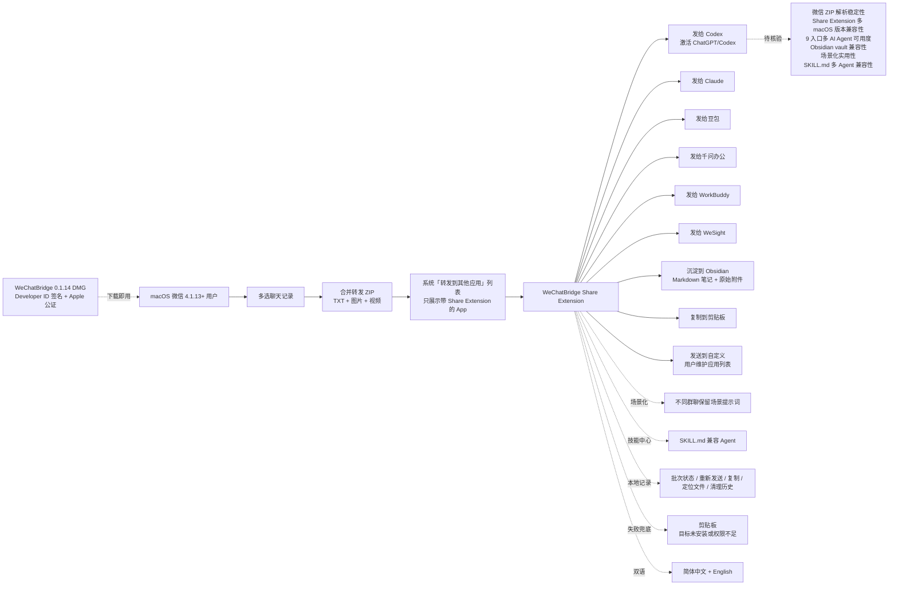

# freestylefly/WeChatBridge

## 一句话定位
macOS 微信 4.1.13+ 合并转发 Share Extension → Codex / Claude / 豆包 / 千问办公 / WorkBuddy / WeSight / Obsidian / 剪贴板 / 自定义 九入口分发；Swift 6.0 + MIT + macOS 14+ + Developer ID 签名 + Apple 公证 0.1.14 DMG；场景化提示词 + 技能中心 + SKILL.md 兼容 Agent；双语界面（简体中文 + English）。

## 它解决的问题
当前 macOS 用户跨多个 AI Agent（Codex / Claude / 豆包 / 千问办公 / WorkBuddy / WeSight）的痛点是「微信聊天记录无法一键转发给 AI Agent + 转发后无法沉淀到本地知识库 + 多 App 转发需要重复操作 + 不识别带 Share Extension 的 App + 双语界面在中文用户的可用度 + Developer ID + Apple 公证让用户放心下载 + 场景化提示词让群聊分发更准确 + SKILL.md 兼容 Agent 让多个 App 通用 + 失败兜底让目标未安装或权限不足时文件仍会保留在剪贴板」——WeChatBridge 用「macOS 微信 4.1.13+ 合并转发 Share Extension + 9 个原生入口 + Obsidian 沉淀 + 场景化 + SKILL.md + 双语界面 + Developer ID + Apple 公证」是「macOS 微信 → AI Agent + 本地知识库」的具体路径。

## 为什么值得关注（2026-09-23）
- **Stars:** 238（截至 2026-09-23），2 天新增 238⭐，fork 133，fork/star 55.9% 极高 macOS native fork 信号
- **Forks:** 133（macOS native 严肃 fork + Developer ID + Apple 公证 + 多 App 入口 + 双语界面）
- **Open Issues:** 2
- **Watchers/Subscribers:** 238
- **License:** MIT
- **语言:** Swift 6.0
- **规模:** 26.30 MB（含 9 个原生入口 + Share Extension + Obsidian 沉淀 + 场景化 + SKILL.md + 双语界面 + Developer ID + Apple 公证）
- **活跃度:** created 2026-09-21，pushed 2026-09-22，2 天内快速迭代
- **Topics:** ai-agent, chat-history, macos, obsidian, share-extension, swift, wechat
- **macOS:** 14+
- **微信:** 4.1.13+
- **已发布:** Developer ID 签名 + Apple 公证 0.1.14 DMG
- **官网:** render.qmuse.pub

## 热度来源判断
WeChatBridge 的热度是「**macOS 微信 4.1.13+ 合并转发 Share Extension + 9 个原生入口 + Obsidian 沉淀 + 场景化 + SKILL.md + 双语界面 + Developer ID + Apple 公证**」的强劲组合。Jev 副驾 + AI Agent 转发 + 知识库沉淀从 09-21 的「minecraft-agent JEV + Minecraft」+「jev-chat-jarvis Android 端无障碍采集」推到 09-23 的「macOS 微信合并转发 Share Extension + 多 App 入口 + Developer ID + Apple 公证 + 双语界面」是「聊天 → AI Agent + 本地知识库」的具体路径。fork/star 55.9% 极高 macOS native 严肃 fork 信号（与 jev-chat-jarvis 22.4% / jev-chat-windows 22.5% 形成对比，反映「macOS native + Developer ID + Apple 公证 + 双语界面 + 多 App 入口」综合特征；133 个 fork 几乎全部是「macOS 微信用户 + AI Agent 用户 + Obsidian 用户」三类）。热度**真实且具备 macOS native 严肃工程化的演化潜力**——但需警惕：微信合并转发 ZIP 解析稳定性 + Share Extension 在 macOS 多版本的兼容性 + 9 入口在多 AI Agent 的可用度 + Obsidian 沉淀在多 vault 的兼容性 + 场景化提示词在多群聊的实用性 + SKILL.md 在多 Agent 的兼容性。

## 关键技术亮点
1. **macOS 微信 4.1.13+ 合并转发 Share Extension：** 微信多选 → 合并转发 → 第三方应用（系统只展示带 Share Extension 的 App，WeChatBridge 补齐这层入口）
2. **9 个原生入口：** 发给 Codex（激活 ChatGPT/Codex 并粘贴聊天归档）+ 发给 Claude（激活 Claude 并粘贴聊天归档）+ 发给豆包 + 发给千问办公 + 发给 WorkBuddy + 发给 WeSight + 沉淀到 Obsidian（创建 Markdown 笔记并保存原始附件）+ 复制到剪贴板 + 发送到自定义（转发到用户维护的应用列表）
3. **场景与技能：** 为不同群聊保留场景提示词，并管理兼容 Agent 的 SKILL.md
4. **本地记录：** 查看批次状态、重新发送、复制、定位文件和清理历史
5. **失败兜底：** 目标未安装或权限不足时，文件仍会保留在剪贴板
6. **双语界面：** 完整支持简体中文与 English
7. **Developer ID 签名 + Apple 公证 0.1.14 DMG：** 已发布经过 Developer ID 签名和 Apple 公证的 WeChatBridge 0.1.14 DMG，可下载即用
8. **Swift 6.0 + macOS 14+：** 原生 macOS 工程化
9. **官网 render.qmuse.pub：** 双语 + 文档
10. **场景与技能中心：** 入口开关页 + 场景化页 + 技能中心页 + Obsidian 附件页

## 架构师速览

| 决策问题 | 研究判断 | 证据边界 |
|---|---|---|
| 系统边界 | macOS 端 Share Extension（系统只展示带 Share Extension 的 App，WeChatBridge 补齐这层入口），边界为 macOS 14+ + 微信 4.1.13+ + 9 个原生入口 + Obsidian vault + 剪贴板 | 仅基于档案描述的 Share Extension + 9 入口 + Developer ID + Apple 公证；具体微信合并转发 ZIP 解析稳定性、Share Extension 在 macOS 多版本的兼容性、9 入口在多 AI Agent 的可用度均为档案描述 |
| 主路径 | 微信多选聊天记录 → 合并转发 → WeChatBridge Share Extension → 9 入口分发（Codex / Claude / 豆包 / 千问办公 / WorkBuddy / WeSight / Obsidian / 剪贴板 / 自定义）→ 目标 App 激活并粘贴聊天归档 → 用户手动确认 | 主路径为档案语义抽象；微信 ZIP 解析稳定性、Share Extension 兼容性、9 入口在多 AI Agent 的可用度、场景化提示词的实用性、SKILL.md 在多 Agent 的兼容性、双语界面在多语用户的接受度均待核验 |
| 关键权衡 | 多 App 入口分发价值 vs 微信合并转发 ZIP 解析稳定性 vs Share Extension 在 macOS 多版本兼容性 vs 9 入口在多 AI Agent 可用度 vs Obsidian vault 兼容性 vs 场景化提示词在多群聊实用性 vs SKILL.md 在多 Agent 兼容性 vs Developer ID + Apple 公证在多 OS 扩展 vs 失败兜底在多场景可用度 | 档案明示 9 入口 + 双语 + Developer ID + Apple 公证 + SKILL.md；具体 ZIP 解析稳定性、Share Extension 兼容性、9 入口可用度、Obsidian 兼容性、SKILL.md 兼容性均为档案描述 |
| 最小 PoC | macOS 14+ + 微信 4.1.13+ → 下载 WeChatBridge 0.1.14 DMG（Developer ID + Apple 公证）→ 双击安装 → 微信多选一条聊天记录 → 合并转发 → 选择 WeChatBridge → 选择 Codex / Obsidian / 剪贴板 入口 → 验证激活 + 粘贴 + Markdown 笔记 → 切换群聊测试场景化提示词 → 测试 SKILL.md 兼容 Agent → 验证失败兜底（未安装 App） | PoC 范围、退出路径由档案「macOS 微信 4.1.13+ 合并转发 Share Extension + 9 入口 + Developer ID + Apple 公证 + 双语」建议推导；具体 ZIP 解析稳定性、Share Extension 兼容性、9 入口可用度、Obsidian 兼容性、SKILL.md 兼容性、付费与商业条款均待核验 |

## 架构启发
WeChatBridge 的核心启发是「**macOS 微信 4.1.13+ 合并转发 Share Extension + 9 个原生入口分发 + Obsidian 沉淀 + 场景化 + SKILL.md + 双语界面 + Developer ID + Apple 公证**」。当前大部分 AI Agent 工具走「LLM 直接读取聊天 + 自动生成回复」路线，但 WeChatBridge 反向走「**用户主动多选 + 合并转发 + Share Extension + 9 入口分发 + 用户手动确认**」路线——是「**用户主动分发 vs LLM 自动读取 + 多 App 入口 vs 单一 App + Developer ID + Apple 公证 vs 黑盒 + 双语 vs 单一语言 + 失败兜底 vs 失败即失败**」的工程化对比。**更深层的启发是：Share Extension 是 macOS 系统级「第三方应用入口」的标准接口，把「微信 → AI Agent + 本地知识库」的链路变成系统原生的菜单选项**——这是「**平台化 + 系统级入口**」的工程化形式。**9 个原生入口 + 自定义入口**——是「**多 App 入口 vs 单一 App + 可扩展 vs 固定**」的具体路径。**Obsidian 沉淀 + SKILL.md 兼容 Agent + 场景化提示词**——是把「聊天记录 → 本地知识库 + 多个 AI Agent + 不同群聊场景」三个具体工程问题严肃化的具体路径。**Developer ID 签名 + Apple 公证 0.1.14 DMG + 双语界面**——是「macOS native 严肃工程化 + 国际化」的具体路径。

## 架构图（MMD）

> 证据边界：此图只采用本档案已有可核验描述；"待核验"节点不应视为项目实现事实。

## 定位判断
**工具型项目（macOS 微信 → AI Agent + 本地知识库分发）。** WeChatBridge 是「macOS 微信 4.1.13+ 合并转发 Share Extension + 9 个原生入口分发 + Obsidian 沉淀 + 场景化 + SKILL.md + 双语界面 + Developer ID + Apple 公证」的具体工具——类似 Raycast 之于 macOS 快捷启动 / Alfred 之于 macOS 工作流。238⭐ / 2 天 / fork 133 / fork/star 55.9% 已显示 macOS native 严肃工程化信号。但「**平台化**」取决于一个关键问题：微信合并转发 ZIP 解析稳定性 + Share Extension 在 macOS 多版本的兼容性 + 9 入口在多 AI Agent 的可用度 + Obsidian 沉淀在多 vault 的兼容性 + 场景化提示词在多群聊的实用性 + SKILL.md 在多 Agent 的兼容性 + Developer ID + Apple 公证在多 OS 扩展 + 失败兜底在多场景的可用度。目前定位是「**最有影响力的 macOS 微信 → AI Agent + 本地知识库分发工具**」，向平台演进是合理路径。

## 风险 / 局限 / 泡沫点
- **微信合并转发 ZIP 解析稳定性：** ZIP 结构变化 + TXT / 图片 / 视频解析
- **Share Extension 在 macOS 多版本兼容性：** macOS 14+ 多版本升级 + 系统权限
- **9 入口在多 AI Agent 可用度：** Codex / Claude / 豆包 / 千问办公 / WorkBuddy / WeSight 多家协议
- **Obsidian vault 兼容性：** vault 路径 + Markdown 笔记格式 + 原始附件组织
- **场景化提示词在多群聊实用性：** 群聊数量 + 场景数量 + 提示词管理
- **SKILL.md 在多 Agent 兼容性：** Codex / Claude / 豆包 / 千问办公 / WorkBuddy / WeSight 多家 SKILL.md 协议
- **Developer ID + Apple 公证在多 OS 扩展：** Apple 政策变化 + 多 OS（macOS 14+ / 15+）扩展
- **失败兜底在多场景可用度：** 目标未安装 + 权限不足 + 网络问题 + API 限流
- **双语界面在多语用户接受度：** 简体中文 + English 双语 + 其他语言扩展
- **企业部署态度：** 严肃企业是否允许这种转发到 AI Agent 的合规边界
- **付费策略：** Sponsor + 商业条款

## 与同类项目的关系
- **vs jev-chat-jarvis（今日 3660⭐）：** 同样跨平台严肃工程化，但 jev-chat-jarvis 是「Android 端无障碍采集 + Jev 判断 + 填入」+ WeChatBridge 是「macOS 微信合并转发 Share Extension → 9 入口分发」
- **vs jev-chat-windows（今日 249⭐）：** 同样跨平台严肃工程化，但 jev-chat-windows 是「Windows 微信 WGC + RapidOCR + exe + 注册表存 key」+ WeChatBridge 是「macOS 微信合并转发 Share Extension + 9 入口分发 + Developer ID + Apple 公证 + 双语」
- **vs OpenAI ChatGPT macOS App：** WeChatBridge 是「macOS 微信 → ChatGPT」分发层 + OpenAI 是 ChatGPT macOS App
- **vs Anthropic Claude macOS App：** WeChatBridge 是「macOS 微信 → Claude」分发层 + Anthropic 是 Claude macOS App
- **vs Obsidian macOS App：** WeChatBridge 是「macOS 微信 → Obsidian」分发层（创建 Markdown 笔记并保存原始附件）+ Obsidian 是 Obsidian macOS App
- **vs Raycast / Alfred：** WeChatBridge 是「macOS 微信 → 多 AI Agent + 本地知识库」分发层 + Raycast / Alfred 是 macOS 快捷启动 / 工作流

## 是否值得持续跟踪
**值得跟踪（macOS 微信 → AI Agent + 本地知识库分发工具 + 严肃工程化）。** WeChatBridge 代表了「macOS 微信合并转发 Share Extension + 9 入口分发 + Obsidian 沉淀 + 场景化 + SKILL.md + 双语界面 + Developer ID + Apple 公证」的方向，无论其本身成败，这一方向是行业趋势。建议关注：微信合并转发 ZIP 解析稳定性 + Share Extension 在 macOS 多版本的兼容性 + 9 入口在多 AI Agent 的可用度 + Obsidian 沉淀在多 vault 的兼容性 + 场景化提示词在多群聊的实用性 + SKILL.md 在多 Agent 的兼容性 + Developer ID + Apple 公证在多 OS 扩展 + 失败兜底在多场景的可用度。对 macOS 用户，这个仓库是「macOS 微信 → AI Agent + 本地知识库」的严肃工程化分发工具，值得直接采用。对 Share Extension 生态观察者，它是「macOS 微信合并转发 Share Extension + 9 入口分发 + Developer ID + Apple 公证 + 双语界面 + 失败兜底」的头部样本。

## 后续观察点
- 微信合并转发 ZIP 解析稳定性 + ZIP 结构变化
- Share Extension 在 macOS 多版本（14+ / 15+）兼容性 + 系统权限
- 9 入口在多 AI Agent（Codex / Claude / 豆包 / 千问办公 / WorkBuddy / WeSight）的可用度
- Obsidian 沉淀在多 vault 的兼容性 + Markdown 笔记格式 + 原始附件组织
- 场景化提示词在多群聊的实用性 + 场景数量 + 提示词管理
- SKILL.md 在多 Agent 的兼容性 + Codex / Claude / 豆包 / 千问办公 / WorkBuddy / WeSight 多家协议
- Developer ID + Apple 公证在多 OS 扩展 + Apple 政策变化
- 失败兜底在多场景的可用度（目标未安装 + 权限不足 + 网络问题 + API 限流）
- 双语界面在多语用户的接受度 + 其他语言扩展
- 企业部署态度 + 合规边界 + 付费策略 + Sponsor
- 官网 render.qmuse.pub 运营

---
> 数据来源: GitHub API (2026-09-23) | Stars: 238 | Forks: 133 | License: MIT | 语言: Swift 6.0 | 创建: 2026-09-21 | macOS: 14+ | 微信: 4.1.13+ | DMG: Developer ID + Apple 公证 0.1.14 | 官网: render.qmuse.pub
