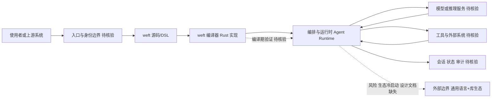

# weft — AI 系统编程语言

## 一句话定位

专为 AI 系统设计的编程语言，Rust 实现，探索 Agent 系统的编译层抽象。

## 它解决的问题

现有的 AI Agent 系统主要用 Python/TypeScript 构建，这些通用语言在 Agent 系统的并发控制、类型安全、形式化验证方面存在天然不足。weft 试图从语言层面解决这些问题。

## 为什么值得关注

1. **基础设施级创新**：编程语言是最底层的基础设施，如果方向正确，影响深远
2. **Rust 实现**：性能和安全性的基础保障
3. **AI 原生**：不是通用语言的 AI 封装，而是为 AI 系统设计的原生抽象

## 热度来源判断

638 stars，增速温和。来自编译器/AI 基础设施社区的关注，非大众热点。

## 关键技术亮点亮点

- Rust 实现，兼顾性能和安全性
- 面向 AI 系统的类型系统和并发模型（具体设计文档待补充）
- 编译层优化能力

## 架构师速览

| 决策问题 | 研究判断 | 证据边界 |
|---|---|---|
| 系统边界 | weft 定位为 Agent 系统的编译层抽象，处于入口渠道、模型供应商、工具/数据源之间的编排层 | 依据项目自述定位"AI 系统编程语言""Agent 系统的编译层抽象"；具体入口协议、模型适配器、工具调用协议未在档案中给出 |
| 主路径 | 源码/DSL → weft 编译器（Rust 实现）→ 编排与运行时 → Agent 行为 → 模型/工具调用与状态回写 | 标签含 Rust、AI Language、Agent Runtime、Compiler；档案未提供具体 IR、调度模型、并发原语与持久化方案的细节 |
| 关键权衡 | 编译期可验证性/类型安全 vs 生态冷启动；原生并发抽象 vs 通用语言+库的成熟生态；面向 Agent 的 DSL vs 现有 Python/TS 体系的迁移成本 | 档案明确点出"生态冷启动""AI 语言历史教训"两类风险；未给出性能基准、形式化验证范围、供应商耦合度等可量化证据 |
| 最小 PoC | 不建议企业 PoC；如需个人验证，先用一个最小 Agent 场景跑通"用 weft 描述→编译→调用单一模型+单一工具"全链路 | 档案明示"❌ 太早，至少需要等待语言规范和实际用例"；最小 PoC 须以"等待 spec + 非 trivial 示例"为前提 |

## 架构启发

当 Agent 系统复杂度持续增长（多 Agent 编排、长时运行任务、复杂状态管理），通用语言的抽象能力可能不够。一个面向 Agent 的编译层可以提供：
- 编译时的 Agent 行为验证
- 原生的并发和状态管理抽象
- 针对 AI 推理的优化

## 架构图（MMD）

> 证据边界：此图只采用本档案已有可核验描述；“待核验”节点不应视为项目实现事实。

## 定位判断

**基础设施候选**（极早期）。如果成功，将是 AI 系统的基础编程工具。

## 风险/局限/泡沫点

1. **极早期**：缺乏语言设计文档、示例和基准测试
2. **AI 语言的历史教训**：多个领域特定语言最终都败给了通用语言 + 专用库的模式
3. **生态冷启动问题**：新语言最大的挑战不是技术，而是生态
4. **可能只是概念验证**：当前信息不足以判断项目的工程深度

## 与同类项目的关系

- **vs Mojo**：Mojo 为 AI/ML 计算，weft 为 AI Agent 系统，定位不同
- **vs Lisp/Scheme 在 AI 的历史**：历史上 AI 与 Lisp 紧密关联，weft 试图重演"AI 原生语言"的故事

## 是否值得持续跟踪

**长期观察。** 方向值得关注，但需要等待更多技术细节。

## 是否值得企业 PoC

**❌ 太早。** 至少需要等待有清晰的语言规范和实际用例。

## 后续观察点

1. 是否发布语言设计文档（spec）
2. 是否有非 trivial 的示例程序
3. 社区是否有编译器/PL 背景的贡献者
4. 是否有实际的 Agent 系统用 weft 重写的案例

---
*最近更新：2026-04-18 | 769★ (+131)，保持活跃迭代（最新推送 4/17）*
