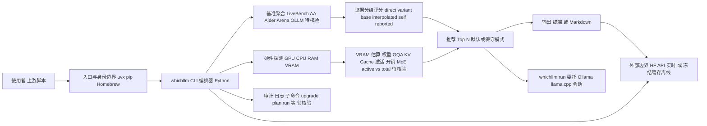

# Andyyyy64/whichllm — 证据驱动的本地 LLM 硬件匹配工具

## 一句话定位
一条命令自动检测你的 GPU/CPU/RAM，基于真实基准数据（非参数量）排名最适合你硬件的本地 LLM，并支持买卡前模拟、模型对比、一键启动聊天——本地 LLM 选型的"入口级"工具。

## 它解决的问题
本地 LLM 生态在 2026 年迎来爆发：HuggingFace 上有数万个 GGUF 模型，Ollama 模型库也在快速扩张。但用户面临严重的信息不对称——**"哪个模型能在我的硬件上跑且效果最好"** 这个问题极难回答。现有工具各有缺陷：Ollama 只告诉你能不能装下，不告诉你效果排名；在线排行榜（Artificial Analysis、Chatbot Arena）只评模型质量，不做硬件匹配；LM Studio 有硬件检测但无智能排名。更糟的是，基准数据常过时或不可靠，VRAM 估算精度差（尤其 MoE 模型的 active/total 参数区分）。whichllm 解决的是 **"硬件适配 × 质量排名 × 数据可信度"** 三维交叉的选型难题，且通过一条 `uvx whichllm@latest` 命令实现零安装即用。

## 为什么值得关注（2026-08-11）
- **Stars:** 6,206（从 6 月的 4,747 增长 30%+），持续上升
- **Forks:** 328，社区贡献活跃
- **Watchers:** 24，本地 LLM 用户深度关注
- **License:** MIT
- **活跃度:** created 2026-03-04，pushed 2026-08-05，持续高活跃
- **分发:** PyPI 发布、Homebrew 支持、uvx 一键运行，分发渠道完善
- **Trendshift 上榜:** 获 Trendshift 推荐徽章
- **Topics:** 覆盖 apple-silicon, benchmarks, gguf, gpu, huggingface, vram 等 15 个标签

## 热度来源判断
热度来自 **"本地 LLM 刚需爆发 × 证据驱动差异化 × 极致易用性"** 的组合。2025-2026 年本地 LLM 用户基数激增（隐私、成本、离线需求驱动），但选型工具严重缺位。whichllm 用"一条命令出结果"的极致体验切入，且其"证据分级"机制（标记 direct/variant/base/interpolated/self-reported 分数，拒绝伪造数据）建立了可信度差异。GPU 模拟功能（`--gpu "RTX 4090"`）直击买卡决策痛点，极具实用价值。热度**真实且具可持续性**——只要本地 LLM 生态持续扩张，选型需求就持续存在。风险在于壁垒不高，可能被 Ollama/LM Studio 内建功能吸收。

## 关键技术亮点
1. **多源基准融合:** 聚合 LiveBench + Artificial Analysis + Aider + Chatbot Arena ELO + Open LLM Leaderboard 五大来源
2. **时效性感知:** 过时基准分数自动降权，按模型 lineage（继承关系）跟踪知识时效
3. **证据分级体系:** 每个分数标记 direct/variant/base/interpolated/self-reported，伪造分数被主动拒绝——这是核心差异化
4. **架构感知 VRAM 估算:** 权重 + GQA KV Cache + 激活 + 开销四层估算，MoE 模型区分 active/total 参数
5. **GPU 模拟:** `whichllm --gpu "RTX 4090"` 或 `--gpu "2x RTX 4090"` 买卡前测试，支持多 GPU 工作站
6. **多模式推荐:** 默认激进（含 partial RAM offload），`--gpu-only --speed usable --vram-headroom 1GB` 保守模式
7. **丰富工作流:** `whichllm upgrade` 对比升级候选、`whichllm plan` 查找所需 GPU、`whichllm run` 一键启动聊天、`--markdown` 输出可粘贴格式

## 架构师速览

| 决策问题 | 研究判断 | 证据边界 |
|---|---|---|
| 系统边界 | whichllm 是位于 HuggingFace / Ollama / lm-studio 等模型与运行时之上的 Python 编排层，自身不实现推理，只做硬件探测 + 基准聚合 + 选型推荐，并通过 `whichllm run` 委托给 Ollama/lm.cpp 等运行时 | 档案未给出 CLI 子命令到进程间调用的具体协议；入口边界仅来自 `uvx`、`pip`、`Homebrew` 三种分发方式的描述 |
| 主路径 | 硬件探测（GPU/CPU/RAM/VRAM）→ 五源基准融合（LiveBench/Artificial Analysis/Aider/Chatbot Arena/Open LLM Leaderboard）→ 架构感知 VRAM 估算（权重 + GQA KV Cache + 激活 + 开销，区分 MoE active/total）→ 证据分级排序 → 选型输出或 `run` 启动会话 | 排序权重、超时降权算法、KV Cache 系数与 MoE 估算公式均未在档案中给出具体数值或伪代码 |
| 关键权衡 | 数据时效性与覆盖广度的权衡：聚合多源可缓解单源偏差但放大系统基准偏差，且 HuggingFace API 实时依赖与冻结缓存离线模式构成可靠 / 时效取舍；MoE 的 active vs total 参数区分是另一条质量/精度张力 | 档案承认"多源融合不能完全消除系统性偏差"，未披露对各基准权重设置或对 MoE 模型是否做过实测校验 |
| 最小 PoC | 在一台已知配置的开发机上，分别用默认模式与 `--gpu-only --speed usable --vram-headroom 1GB` 保守模式运行一次 `--markdown` 导出，比对推荐 Top-N 的 VRAM 占用；再用 `--gpu "RTX 4090"` 模拟一张未持有的卡，确认"买卡前模拟"流程闭环 | 何时触发现实设备 vs 模拟设备的逻辑、`upgrade`/`plan` 子命令的输入输出契约档案未提供，须以源码核验 |

## 架构启发
whichllm 的核心启发是 **"不信任数据，但利用数据"** 的工程哲学。在 AI 工具生态中，数据来源（基准分数、模型信息）常不可靠或有意操纵。whichllm 不回避这一问题，而是建立一套**置信度评估体系**——给每个数据点打标签，让用户自行判断。这种思路适用于更广泛场景：任何依赖外部数据的 AI 工具（模型评测、Agent 评估、推荐系统）都应考虑引入类似的证据分级机制。另一个启发是 **CLI 工具的极致易用性范式**：`uvx` 零安装 + Homebrew + pip 多渠道分发，让"一条命令解决复杂问题"成为标准。

## 架构图（MMD）

> 证据边界：此图只采用本档案已有可核验描述；“待核验”节点不应视为项目实现事实。

## 定位判断
**工具型（入口级）。** whichllm 是本地 LLM 工具链的"入口"——用户决策链的起点。与 Ollama（运行时）、llama.cpp（推理引擎）、LM Studio（GUI）互补而非竞争。定位精准但壁垒不高：核心逻辑（硬件检测 + VRAM 估算 + 基准排名）可被现有平台内建。关键问题是被吸收还是保持独立——若保持独立，它可能成为本地 LLM 领域的"GPU Benchmark"式标准工具。

## 风险 / 局限 / 泡沫点
- **竞争壁垒低:** 核心逻辑可被 Ollama/LM Studio 在 1-2 个版本内内建替代
- **基准测试偏差:** 多源融合不能完全消除系统性偏差（某些基准本身就有问题）
- **HuggingFace API 依赖:** 实时数据依赖 HF API，离线模式使用冻结缓存
- **功能边界有限:** 不做推理、不做服务，只是选型工具——用户用完就走
- **Apple Silicon 优先:** 虽支持多平台但 Apple Silicon 用户场景最完善，Windows/Linux GPU 覆盖待加强
- **个人项目属性:** 单人维护，可持续性取决于作者投入

## 与同类项目的关系
- **vs Ollama:** 运行时引擎，有 list/show 但无智能排名——互补关系，whichllm 推荐后用 Ollama 运行
- **vs LM Studio:** GUI 工具，有硬件检测但无基准排名——潜在竞争者，可能内建类似功能
- **vs Artificial Analysis:** 在线排行榜，模型质量评估权威但无硬件匹配
- **vs Chatbot Arena:** 众包评测，质量信号源之一，不做硬件适配
- **vs llama.cpp:** 推理引擎，whichllm 可通过 `whichllm run` 调用

## 是否值得持续跟踪
**值得跟踪（中高优先级）。** 本地 LLM 是确定性增长赛道，选型工具是刚需。关注 whether it gets absorbed（被平台吸收意味着方向被验证）还是 stays independent（保持独立则可能成为标准工具）。对本地 LLM 用户，这是当前最好用的选型工具，值得直接采用。

## 后续观察点
1. 是否被 Ollama / LM Studio / llama.cpp 内建为推荐引擎（被吸收的信号）
2. 基准数据源的扩展和更新频率（是否支持 MMLU-Pro、GPQA 等新基准）
3. 多模态模型（视觉、音频）的支持进度
4. 是否推出 Web UI 或 API 服务（从 CLI 向平台演进）
5. 社区贡献的基准数据补充机制（众包数据源）

---
> 数据来源: GitHub API (2026-08-11) | Stars: 6,206 | Forks: 328 | License: MIT | 语言: Python | 创建: 2026-03-04
