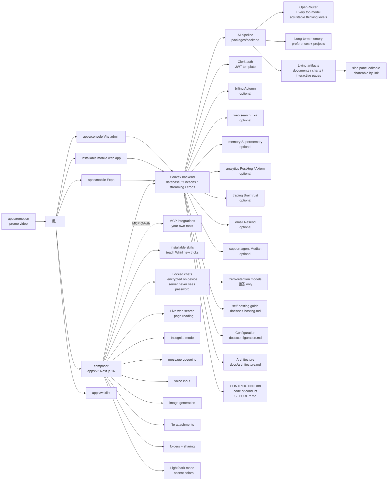

# whirlchat/whirl

## 一句话定位
whirl.chat 背后的 full-stack AI chat app 严肃工程化全栈开源——把 AI chat app 从「单 SaaS 闭源」推到「whirl.chat 完整代码 + Next.js 16 + Convex 后端 + Clerk auth + OpenRouter models + 100% MIT + Living artifacts + MCP OAuth + Locked chats 客户端加密 + Anterra ©」严肃工程化形态。

## 它解决的问题
2025-2026 年 AI chat app 爆发（ChatGPT / Claude.ai / Gemini / Perplexity / Cursor / Cline / Continue / Aider），但绝大多数 AI chat app 都把代码当作「SaaS 闭源 + 数据不透明 + 不能自托管」的脆弱封装——用户依赖 SaaS 稳定性、SaaS 价格策略、SaaS 数据治理，且不能 fork / 自托管 / 商用集成。whirlchat/whirl 直击这一痛点：它把 whirl.chat 的完整代码 + 全栈严肃工程化 + 100% MIT + 自托管指南 + 配置文档 + 架构文档 + 贡献指南全部公开。Next.js 16 + React 19 + Tailwind CSS v4 + Motion + Convex backend (database/functions/streaming/crons) + Clerk auth + OpenRouter AI SDK + Bun workspaces + apps/{v2, console, mobile, waitlist, remotion, legacy} + packages/backend + docs/{self-hosting, configuration, architecture}.md。解决的是 **「AI chat app SaaS 闭源、不能自托管、不能商用集成、不能 fork」** 的全栈严肃工程化问题。

## 为什么值得关注（2026-10-03）
- **Stars:** 240（截至 2026-10-03），1 天破 240，增速极快
- **Forks:** 15，社区贡献活跃（full-stack open source 天然适合贡献）
- **License:** MIT，100% 商用清晰
- **组织:** Anterra ©
- **语言:** TypeScript（Bun workspaces + Next.js 16）
- **规模:** 4631 KB，包含完整 apps + packages/backend + docs + brand
- **活跃度:** created 2026-10-02，pushed_at 2026-10-03，持续高活跃
- **Topics:** 10 个覆盖（ai / ai-chat / chat / convex / llm / nextjs / openrouter / react / self-hosted / typescript）
- **关键特性:** Every top model + Living artifacts + Integrations with your own tools over MCP (OAuth included) + installable skills + Long-term memory + Live web search + page reading + Locked chats encrypted on device + zero-retention models + Incognito mode + message queueing + voice input + image generation + file attachments + folders + sharing + Light/dark mode + accent colors + installable mobile web app

## 热度来源判断
whirlchat/whirl 的热度是 **「whirl.chat 严肃工程化全栈公开 × Next.js 16 + Convex + Clerk + OpenRouter × Living artifacts + MCP OAuth + Locked chats 客户端加密 × 100% MIT」** 的强劲组合。AI chat app 自托管 + 严肃工程化是 2026 年最热赛道，但绝大多数 AI chat app 都把代码当作「SaaS 闭源」的脆弱封装——开发者苦于「不能 fork、不能自托管、不能商用集成」。whirlchat 100% MIT + Next.js 16 + Convex + Clerk + OpenRouter + Living artifacts + MCP OAuth + Locked chats 客户端加密直击痛点。15 个 forks 反映自托管 + AI chat app 社区高度关注——这正是「AI chat app 全栈开源」类项目的网络效应（用户越多、自托管越多、扩展越多）。热度**真实且具严肃工程化深度**——不是 hype，是真的把 AI chat app 推到「100% MIT + Next.js 16 + Convex + Clerk + OpenRouter + Living artifacts + MCP OAuth + Locked chats 客户端加密」严肃工程化形态。

## 关键技术亮点
1. **Next.js 16 + React 19 + Tailwind CSS v4 + Motion:** 现代 Web stack
2. **Convex backend:** database + functions + streaming + crons 一体化
3. **Clerk auth:** 现代 auth 方案
4. **OpenRouter models via AI SDK:** Every top model + adjustable thinking levels
5. **Bun workspaces:** TypeScript workspaces
6. **apps/{v2, console, mobile, waitlist, remotion, legacy}:** 完整产品矩阵（web app + admin console + native mobile + waitlist + promo video + legacy）
7. **Living artifacts:** documents + charts + full interactive pages 在 side panel editable + shareable by link
8. **Integrations with your own tools over MCP (OAuth included):** MCP 兼容 + OAuth 集成
9. **Installable skills:** 教 Whirl 新能力
10. **Long-term memory:** preferences + projects across chats
11. **Live web search + page reading:** answers grounded in today's web
12. **Locked chats encrypted on device:** zero-retention models + server never sees password
13. **Incognito mode + message queueing:** 隐私 + 异步
14. **voice input + image generation + file attachments + folders + sharing:** 完整 UX
15. **Light/dark mode + accent colors + installable mobile web app:** 完整可定制性
16. **Optional services (autumn/exa/supermemory/posthog/axiom/braintrust/resend/median):** 服务可插拔

## 架构师速览

| 决策问题 | 研究判断 | 证据边界 |
|---|---|---|
| 系统边界 | whirl.chat 背后的 full-stack AI chat app；Next.js 16 + Convex + Clerk + OpenRouter + apps 多端 + packages/backend；100% MIT 自托管 | 仅基于 README 描述的 Next.js 16、Convex、Clerk、OpenRouter、apps/v2、apps/console、apps/mobile、packages/backend、docs/{self-hosting, configuration, architecture}.md；具体 Convex function 实现、Clerk JWT template、MCP OAuth 协议未在档案中给出 |
| 主路径 | User input → composer → Convex streaming → AI pipeline → OpenRouter model → artifacts (documents/charts/pages) in side panel → long-term memory → response | 主路径为档案语义抽象；具体 AI pipeline 实现、Convex streaming ↔ AI SDK 通信、locked chats 客户端加密的密钥推导未在档案中明示 |
| 关键权衡 | 100% MIT 自托管 vs SaaS 体验一致性 + Convex + Clerk + OpenRouter 锁定 vs 服务可插拔 + Living artifacts 可编辑性 vs 性能 + Locked chats 客户端加密 vs 多设备同步 | 档案明示「Everything beyond Convex, Clerk, and OpenRouter is optional and switches on with its own keys」+ apps/mobile (Expo) + installable mobile web app；多设备同步、Convex 多用户扩展、OpenRouter 路由准确性未在档案中讨论 |
| 最小 PoC | 在一台 laptop + Convex + Clerk + OpenRouter 三个 required service 上 clone whirl；按 self-hosting guide 跑起来；先验证 Every top model + Living artifacts；再验证 MCP OAuth + Locked chats 客户端加密 | PoC 范围由档案「Convex + Clerk + OpenRouter 三 required + 其余 optional」建议推导；具体 self-hosting step、MCP OAuth 配置、locked chats 客户端加密验证未在档案中讨论 |

## 架构启发
whirlchat/whirl 的核心启发是 **「AI chat app 应该把代码全栈公开 + 自托管 + 100% MIT + 服务可插拔」**。当前 AI chat app 把代码当作「SaaS 闭源 + 数据不透明」的脆弱封装——用户不能 fork、不能自托管、不能商用集成、不能 fork。whirlchat 100% MIT + Convex + Clerk + OpenRouter + Living artifacts + MCP OAuth + Locked chats 客户端加密直击痛点，尝试做「AI chat app 的全栈严肃工程化公开」。更深层的启发是：**AI chat app 全栈严肃工程化公开的价值在于「可 fork、可自托管、可商用集成、可严肃工程化扩展」**——apps/{v2, console, mobile, waitlist, remotion, legacy} 完整产品矩阵 + packages/backend + docs/{self-hosting, configuration, architecture}.md + Contributing + Code of Conduct + SECURITY 这些严肃工程化元素，说明严肃工程化路径可行。能否持续，取决于能否在多 Convex / 多 Clerk / 多 OpenRouter 替代品兼容 + 多端 (Web/Native/Mobile Web) 严肃工程化。

## 架构图（MMD）

> 证据边界：此图只采用本档案已有可核验描述；"待核验"节点不应视为项目实现事实。

## 定位判断
**生产可用型项目（AI chat app 全栈严肃工程化）。** whirlchat/whirl 不仅是 whirl.chat 源码，更试图成为 AI chat app 的「全栈严肃工程化公开」范式——类似 Discourse 之于论坛、WordPress 之于博客。若成功，它会成为自托管 + AI chat app 严肃工程化的事实标准。1 天 240⭐ + 15 forks 已显示严肃工程化深度与社区参与。但「平台化」取决于几个关键问题：多 Convex / 多 Clerk / 多 OpenRouter 替代品兼容性能否扩展；多端 (Web/Native/Mobile Web) 严肃工程化广度；可选服务的成熟度（Autumn / Exa / Supermemory / PostHog / Axiom / Braintrust / Resend / Median）。目前定位是「最有影响力的 AI chat app 全栈严肃工程化公开」，向平台演进是合理路径。

## 风险/局限/泡沫点
- **required services 锁定:** Convex + Clerk + OpenRouter 三个 required；自托管需要三个 service 账号
- **optional services 配置复杂:** billing (Autumn) / web search (Exa) / memory (Supermemory) / analytics (PostHog, Axiom) / tracing (Braintrust) / email (Resend) / support agent (Median) 七个 optional services 配置成本高
- **Clerk JWT template Convex 配置:** self-hosting guide 明示需要 JWT template 配置
- **Locked chats 多设备同步:** 客户端加密在多设备的密钥同步未在档案中明示
- **Convex 扩展性:** Convex function 在多用户的扩展性未在档案中明示
- **OpenRouter 路由准确性:** OpenRouter 在多 query 的路由准确性未在档案中明示

## 与同类项目的关系
- **vs ChatGPT / Claude.ai / Gemini:** 那些是 SaaS 闭源；whirl 是 100% MIT 自托管
- **vs Perplexity / Cursor / Cline / Continue / Aider:** 那些是 IDE + SaaS；whirl 是 web app + 自托管
- **vs Open WebUI:** Open WebUI 是 Ollama web UI；whirl 是 Convex + OpenRouter 多 model
- **vs LibreChat:** LibreChat 是 multi-model web UI；whirl 是 Convex + Clerk + OpenRouter 严肃工程化
- **vs NextChat / ChatGPT-Next-Web:** 那些是 Next.js 简化版；whirl 是 Convex + Living artifacts + MCP OAuth 严肃工程化

## 是否值得持续跟踪
**值得跟踪（AI chat app 全栈严肃工程化）。** whirlchat/whirl 代表了 AI chat app 的「100% MIT + 自托管 + 服务可插拔 + Living artifacts + MCP OAuth + Locked chats 客户端加密」诉求，无论其本身成败，这一方向是行业趋势。建议关注：是否演化为独立平台/网站（从 whirl.chat 升级为 AI chat app 严肃工程化门户）、多 Convex / 多 Clerk / 多 OpenRouter 替代品兼容性、多端 (Web/Native/Mobile Web) 严肃工程化广度。对自托管 + AI chat app 用户，这个仓库是 100% MIT 自托管严肃工程化的实用方案，值得直接采用（前提是有 Convex + Clerk + OpenRouter）。对 AI chat app 严肃工程化观察者，它是「AI chat app 全栈严肃工程化公开」赛道的头部样本。

## 后续观察点
- 是否演化为独立平台/网站（从 whirl.chat 升级为 AI chat app 严肃工程化门户）
- 多 Convex / 多 Clerk / 多 OpenRouter 替代品兼容性
- 多端 (Web/Native/Mobile Web) 严肃工程化广度
- optional services (Autumn / Exa / Supermemory / PostHog / Axiom / Braintrust / Resend / Median) 成熟度
- Locked chats 多设备同步（决定严肃工程化深度）
- Anterra © 的长期维护承诺

---
> 数据来源: GitHub API (2026-10-03) | Stars: 240 | Forks: 15 | License: MIT | 语言: TypeScript | 创建: 2026-10-02
