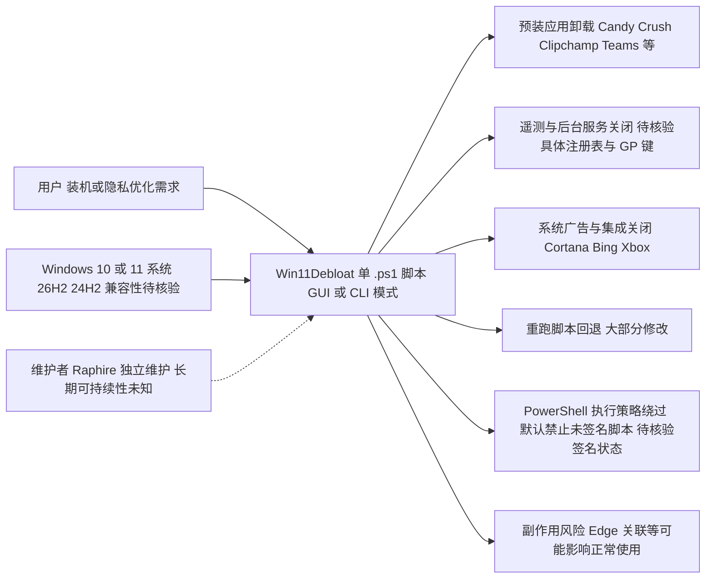

# Win11Debloat

## 一句话定位
单文件 PowerShell 脚本——一键移除 Win10/Win11 预装应用、关闭遥测、禁用系统广告与不必要的后台服务，**无需安装任何依赖**。

## 它解决的问题
Windows 默认安装预装大量"应用"（Candy Crush、Clipchamp、LinkedIn、Teams 等）和不可关闭的遥测。手动禁用需要注册表编辑 + Group Policy 修改，普通用户无法完成。Win11Debloat 把常用优化项合并到一个 `.ps1` 文件，提供 GUI/CLI 模式任选，5 年维护至今成为事实标准。

## 为什么值得关注（2026-08-15）
被 daily/2026-08-15.md 选为今日系统清理工具重点。Win11 26H2 / Win12 预装趋势愈演愈烈，社区对"去 OEM 化"工具的需求稳定——Win11Debloat 是明星项目。新手装机、隐私党、企业 baseline 部署都会复用它。

## 热度来源判断
热度来源是 **"持久刚需 × 5 年运营 × win11 持续加预装"。** 这是经典长尾工具型项目——不靠风口，但预装越多、Win 版本越激进，对它的依赖越深。55,791 stars 5 年增长曲线平滑，是真实的装机工具刚需。

## 关键技术亮点
1. **零依赖:** 单 .ps1 文件，不需要 .NET、PowerShellGet、模块安装
2. **交互式 + CLI 双模式:** 既支持向导（默认）也支持脚本化静默调用
3. **可逆性:** 大部分修改可通过重新运行脚本回退
4. **广泛覆盖:** 应用卸载、遥测关闭、Cortana 禁用、Bing 集成关闭、Xbox 应用等
5. **win10/win11 通用:** 同一份脚本兼容两个系统版本

## 架构师速览

| 决策问题 | 研究判断 | 证据边界 |
|---|---|---|
| 系统边界 | 边界位于用户运行的单文件 PowerShell 脚本与 Windows 10/11 系统配置（注册表、Group Policy、预装应用、后台服务）之间；脚本以管理员权限直接修改本机系统状态，无网络组件、无服务端 | 档案明确"单文件 PowerShell 脚本""无需安装任何依赖""应用卸载、遥测关闭、Cortana 禁用、Bing 集成关闭、Xbox 应用等"；网络行为、签名机制未在档案中描述 |
| 主路径 | 用户运行 `.ps1` → 选择 GUI 或 CLI 模式 → 对预装应用执行卸载、对注册表/组策略执行遥测与广告相关修改 → 必要时重跑脚本回退 | 档案明确"提供 GUI/CLI 模式任选""大部分修改可通过重新运行脚本回退"；具体注册表键值、卸载 API 调用、错误处理细节均未披露 |
| 关键权衡 | 极简零依赖（单 .ps1）换取"PowerShell 执行策略需用户手动绕过"以及"微软大版本升级时清单可能失效"的代价；覆盖面广（含 Edge 关联类设置）换取"误关可能影响正常使用" | 档案明确"默认 Windows 禁止运行未签名脚本""微软更新可能让部分清单失效""关闭 Edge 关联等操作可能影响正常使用"；性能数据、API 版本要求未给出 |
| 最小 PoC | 在隔离虚拟机中以 Win10 与 Win11 各一份镜像，分别用 GUI 与 CLI 两种模式运行脚本，验证：① PowerShell 执行策略绕过方式；② 卸载清单命中数与残留；③ 重跑脚本的回退有效性；④ 26H2/24H2 等近期版本兼容性 | 档案明确"win10/win11 通用""建议在隔离环境验证"；具体脚本版本号、hash、参数清单需在 PoC 阶段自 README/源码核验 |

## 架构启发
"以最小依赖封装高频操作"是值得借鉴的设计原则——脚本项目不应该引入额外运行时，PowerShell 的优点恰恰是 Windows 自带。

## 架构图（MMD）

> 证据边界：此图只采用本档案已有可核验描述；“待核验”节点不应视为项目实现事实。

## 定位判断
**工具型 / Windows 清理脚本标杆。** 不是平台，但已成为 Windows 社区装机"事实标准"。在 Win12 推出前预计稳定运行，长期属于开发者 / 极客装机必备。

## 风险 / 局限 / 泡沫点
- **PowerShell 安全策略:** 默认 Windows 禁止运行未签名脚本，部分用户首次需绕过
- **大版本升级风险:** 微软更新可能让部分清单失效，需持续同步
- **极简 ≠ 无副作用:** 关闭 Edge 关联等操作可能影响正常使用
- **个人项目属性:** 维护者 Raphire 独立维护，长期维护可持续性未知

## 与同类项目的关系
- **vs ChrisTitusTech/winutil:** winutil 用 WinGet 路径，更"现代"；Win11Debloat 更轻
- **vs Sycnex/Windows10Debloater:** 同类项目的最直接前辈，Win11Debloat 是其精神继承
- **vs 开箱即用 clean install:** 企业 baseline 仍优先 LTSC/Server Core，Win11Debloat 偏个人/中小团队

## 是否值得持续跟踪
**值得长期跟踪（装机工具刚需）。** 任何新 Windows 版本发布时都建议 review 此项目，建议个人装机 + 中小企业 baseline 一并使用。其更新模式不会指数增长，但衰退风险也极低。

## 后续观察点
- 对 Windows 12 / Win11 24H2 的兼容性更新节奏
- 是否新增 AI/Recall 类新功能的关闭项
- 是否补 PowerShell 7 配套签名（避免 PSRemoting 环境运行错误）
- 维护者活跃度（commit 频率是否下降）

---
> 数据来源: GitHub API (2026-08-21) | Stars: 55,791 | Forks: 2,377 | License: MIT | 语言: PowerShell | 创建: 2020-10-27
