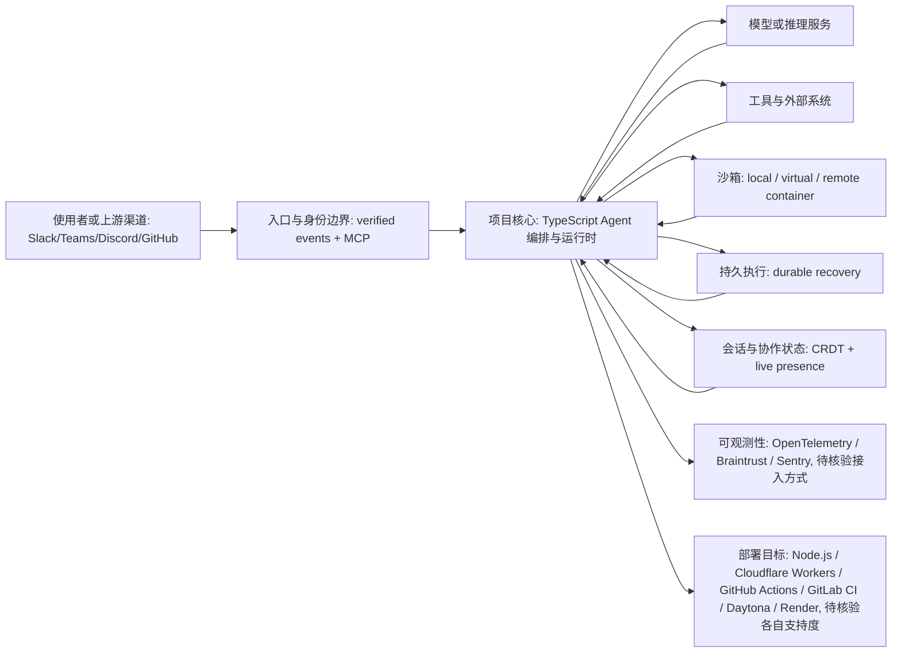

# Astro flue

## 一句话定位

Astro 团队出品的可编程 TypeScript Agent harness——内置沙箱、持久执行、CRDT 多人协作，目标是让任何模型获得 Claude Code 级别的自主工作能力。

## 它解决的问题

构建自主 Agent 需要 sessions、tools、skills、instructions、filesystem access 和安全沙箱——这些能力每个开发者都在重复实现。flue 把这些打包成一个可编程的 TypeScript harness，让 Agent 开发从"raw LLM API 调用"升级到"Claude Code 级别的自主工作"。

## 为什么值得关注（2026-06-20）

Astro 团队（Fred K. Schott + cpojer 等）出品的框架自带品牌信誉。5,803 stars 日增 305。核心差异化是"不是另一个 SDK"——它是一个完整的 harness，包含沙箱（virtual/local/remote container）、持久执行（durable recovery）、多人协作（CRDT + live presence）、channels（Slack/Teams/Discord/GitHub）和完整的可观测性（OpenTelemetry/Braintrust/Sentry）。

## 热度来源判断

**Astro 品牌红利 + 真实需求。** Astro 是最成功的前端框架之一，开发者信任其团队的工程能力。flue 解决的"Agent 从 chatbot 升级到自主工作者"问题是行业刚需。日增 305 不算爆发，但质量高——这说明深度用户在关注。

## 关键技术亮点亮点

1. **可编程沙箱：** `local()` / `virtual()` / `remote()` 三种沙箱模式。Agent 可以在沙箱中安全地使用工具、修改文件、执行代码。

2. **持久执行（Durable Execution）：** Agent 任务在失败和重启后可恢复。这对生产环境至关重要——长时间运行的 Agent 任务不会因为进程崩溃而丢失。

3. **CRDT 多人协作：** 人类和 Agent 可以在同一个 document 上实时协作。live presence（cursor、selection ring、who's on which slide），Agent 作为 first-class peer editor。

4. **Channels + MCP 集成：** 从 Slack/Teams/Discord/GitHub 接收 verified events，通过 MCP 连接 authenticated tools。

5. **多部署目标：** Node.js / Cloudflare Workers / GitHub Actions / GitLab CI / Daytona / Render。

## 架构师速览

| 决策问题 | 研究判断 | 证据边界 |
|---|---|---|
| 系统边界 | flue 是位于入口渠道、模型供应商与工具/数据源之间的 TypeScript Agent 编排与运行时层，自身封装 sandbox（local/virtual/remote）、durable execution 与 CRDT 多人协作 | 基于标签与定位陈述的抽象；具体协议、进程模型与外部依赖须查源码 |
| 主路径 | 上游事件 → 入口与身份边界 → 编排/运行时（含 session、skills、tools）→ 调用模型与工具 → 状态/会话/审计回写，CRDT 与 live presence 作为协作状态通道 | 主路径来自档案对 harness 职责的描述；具体控制面与数据面协议未在档案中给出 |
| 关键权衡 | 扩展能力（多渠道、多沙箱模式、多部署目标）与权限/可观测性/供应商耦合之间的平衡；TypeScript 限定带来 AI/ML 生态采用面收窄 | 权衡源自档案明示的能力集与"TypeScript 限定"风险条目；性能基准与生产案例未在档案中 |
| 最小 PoC | 建议先在单一渠道（如 GitHub 或 Slack）接入、采用 local/virtual 沙箱、最小工具权限与 OpenTelemetry/Braintrust/Sentry 日志，跑通 durable recovery 后再扩大接入面 | PoC 范围依据档案"可观测性/沙箱三模式/多渠道"表述；具体 API 与 SDK 形态以源码/文档核验 |

## 架构启发

flue 的核心设计理念是"harness 而非 SDK"：
- SDK 模式：你写代码调用 LLM API，SDK 提供辅助函数
- Harness 模式：harness 提供完整的运行环境（sessions、tools、skills、sandbox），你只需要定义 Agent 的行为

这种设计与 Vercel eve 的 "filesystem-first" 和 omnigent 的 "meta-harness" 在哲学上接近——都认为 Agent 需要的是"运行环境"而非"函数库"。但 flue 更强调"可编程性"（TypeScript harness）和"可部署性"（多目标）。

## 架构图（MMD）

> 证据边界：此图只采用本档案已有可核验描述；“待核验”节点不应视为项目实现事实。

## 定位判断

**通用 Agent 应用框架。** 在框架光谱中：
- Kilo Code / Cursor = IDE-bound Coding Agent
- omnigent / vercel eve = Agent 编排/定义层
- Astro flue = 通用 Agent 应用运行时
- BuilderIO agent-native = Agent 原生 SaaS 应用框架

flue 更接近"Agent 版的 Next.js"——一个让你快速构建和部署 Agent 应用的全栈框架。

## 风险 / 局限 / 泡沫点

1. **TypeScript 限定：** 不支持 Python，限制了在 AI/ML 社区的采用。
2. **早期阶段：** API 可能不稳定，文档可能不完整。
3. **Astro 团队精力分配：** Astro 框架本身仍在活跃开发，flue 是否会获得持续投入存疑。
4. **竞争激烈：** Vercel eve、BuilderIO agent-native、Inngest、Temporal 等都在争夺类似生态位。

## 与同类项目的关系

| 项目 | 定位 | 语言 | 沙箱 | 持久执行 |
|------|------|------|------|----------|
| Astro flue | 通用 Agent 应用框架 | TypeScript | ✅ 三模式 | ✅ Durable |
| Vercel eve | Filesystem-first Agent 框架 | TypeScript | ❌ | ❌ |
| BuilderIO agent-native | Agent 原生 SaaS 框架 | TypeScript | ❌ | ❌ |
| Temporal | 通用工作流引擎 | Multi | ❌ | ✅ |

flue 与 vercel eve 是竞争关系（同为 TS Agent 框架），但 flue 更完整（沙箱 + 持久执行 + 多人协作）。

## 是否值得持续跟踪

**是。** flue 的沙箱 + 持久执行 + CRDT 多人协作组合在 Agent 框架中独一无二。如果 Astro 团队全力投入，有潜力成为 TypeScript Agent 应用的默认框架。

## 后续观察点

1. 是否有真实生产应用基于 flue 构建
2. npm 包下载量趋势
3. CRDT 多人协作在真实场景中的稳定性
4. 与 Vercel eve 的差异化是否能持续
5. Cloudflare Workers 部署模式的采用情况

---
*首次记录：2026-06-20*
