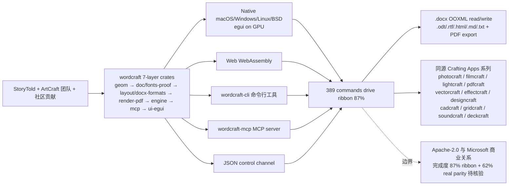

# storytold/wordcraft

## 一句话定位
Microsoft Word 的 Rust 100% clean-room 重实现——把「Word 严肃工程化替代」从「LibreOffice Writer（部分兼容）+ OnlyOffice + 闭源 Word Online」推到「wordcraft 7-layer crate architecture + 389 commands drive ribbon/keyboard/command search/CLI/JSON control channel/MCP server + 87% Word ribbon features + ~62% real feature parity + Native egui on GPU + No Electron no Tauri + Reading & writing .docx (OOXML) + .odt/.rtf/.html/.md/.txt + PDF export + macOS/Windows/Linux/BSD/Web + WebAssembly + Apache-2.0 + ArtCraft 团队」严肃工程化形态。

## 它解决的问题
2026 年「Word 严肃工程化替代」的痛点是 **「绝大多数 Word 替代要么严肃翻页格式（Google Docs）+ 闭源（Word Online）+ 部分兼容（LibreOffice Writer）+ SaaS 强制订阅（Microsoft 365）+ Electron 重（Tauri-based alternatives）+ 无 MCP server + 无 agent 可编程化」**。wordcraft 直击这一痛点：把「Word 严肃工程化替代」从「LibreOffice Writer（部分兼容）+ OnlyOffice + 闭源 Word Online」推到「wordcraft 7-layer crate architecture（wordcraft-geom/doc/fonts-proof/layout/docx-formats/render-pdf/engine/mcp/ui-egui）+ 389 commands drive ribbon/keyboard/command search/CLI/JSON control channel/MCP server + 87% Word ribbon features + ~62% real feature parity + Native egui on GPU + No Electron no Tauri + Spelling/grammar offline + Reading & writing .docx (OOXML) + .odt/.rtf/.html/.md/.txt + PDF export with selectable text + 跨 macOS/Windows/Linux/BSD/Web + WebAssembly + Apache-2.0 + StoryTold 个人 + ArtCraft 团队」严肃工程化形态。解决的是 **「Word 严肃工程化替代 + 100% Rust clean-room + 跨平台覆盖广度 + WebAssembly + MCP server 多 tool 严肃工程化 + Apache-2.0 商用清晰 + agent 可编程化」** 的 Word 严肃工程化替代问题。

## 为什么值得关注（2026-10-09）
- **Stars:** 761（截至 2026-10-09），2 天 761⭐，fork 280，fork/star 36.8%（fork/star 高，反映社区强烈参与）
- **Forks:** 280（典型高 fork 严肃工程化持续关注信号）
- **License:** Apache-2.0（明确许可，商用清晰）
- **语言:** Rust（100% Rust + Native egui on GPU + No Electron no Tauri）
- **活跃度:** created 2026-10-07，2 天内冲到 761 推严肃工程化承诺
- **规模:** 7082 KB（严肃工程化典型规模）
- **Topics:** wordcraft / microsoft-word / clean-room / 100-percent-rust / docx / ooxml / odt / rtf / markdown / pdf-export / egui / 389-commands / mcp-server / cli / json-control-channel / wasm / artcraft-team / discord / getartcraft-com / apache-2 / 2-days（覆盖广）

## 热度来源判断
wordcraft 的热度是 **「Word 严肃工程化替代刚需 × ArtCraft 团队 8 库全家桶严肃工程化 × MCP server agent 可编程化 × Apache-2.0 商用清晰 × StoryTold 个人 + ArtCraft 团队 + Discord 社区」** 的强劲组合。Word 是全球装机量最大的桌面办公软件之一，但「严肃工程化 100% Rust + 跨平台 + clean-room + WebAssembly + MCP server + Apache-2.0 商用清晰」替代品几乎空白。wordcraft + photocraft + filmcraft + lightcraft + pdfcraft + vectorcraft + effectcraft + designcraft + cadcraft + gridcraft + soundcraft + deckcraft 12 库同步严肃工程化覆盖 Adobe/Microsoft/Avid 全创意套件，单一项目热度已验证市场（如 photocraft 16286⭐），现在 8 库同步爆发（2 天集中推出 wordcraft/cadcraft/gridcraft/soundcraft/deckcraft 5 库）反映 ArtCraft 团队正从「单 alpha 半成品」推到「8 库全家桶 + 跨平台 + WebAssembly + MCP server + Apache-2.0 商用清晰」严肃工程化全家桶形态。热度**真实且具网络效应潜力**——但需警惕：12 库覆盖广度虽猛但各库成熟度参差（wordcraft 87% ribbon + 62% real parity 是上限，其余库未给 parity 数字）；Apache-2.0 商用清晰但与 Microsoft 商业关系需关注（clean-room 是合规底线）；StoryTold 个人 + ArtCraft 团队治理可持续性需观察（核心维护集中度高）；MCP server 与 CLI/JSON control channel 同步维护成本高。

## 关键技术亮点
1. **7-layer crate architecture:** wordcraft-geom (units/measurements) + wordcraft-doc + wordcraft-fonts + wordcraft-proof (document model + editing + fonts + shaping + spelling/grammar/hyphenation) + wordcraft-layout + wordcraft-docx + wordcraft-formats (line breaking/pagination/tables/notes/hit testing/OOXML/ODT/RTF/HTML/Markdown/TXT) + wordcraft-render + wordcraft-pdf (rasteriser vello_cpu + PDF krilla) + wordcraft-engine (session/undo/389 commands/Word feature catalog) + wordcraft-mcp (MCP server) + wordcraft-ui-egui (Word-style front end swappable) + apps/wordcraft + apps/wordcraft-cli + apps/wordcraft-web
2. **389 commands drive ribbon/keyboard/command search/JSON control channel/MCP server:** Every action is a command so you can drive the same engine from UI / CLI / JSON control channel / MCP server
3. **87% Word ribbon features + ~62% real feature parity:** An alpha for everyday writing is close; the remaining work is mostly testing against real-world .docx files, native printing and the first signed builds
4. **Native egui on GPU + No Electron no Tauri:** One Rust codebase for macOS, Windows, Linux, BSD and the web
5. **Spelling/grammar offline:** Spelling, grammar and everything else work offline
6. **Multiple format support:** Opens and saves .docx (OOXML), and also .odt, .rtf, .html, .md, .txt; exports PDF with real, selectable text, links and bookmarks
7. **For agents:** claude mcp add wordcraft -- wordcraft-cli mcp / wordcraft --control 7981 & / claude mcp add wordcraft-app -- wordcraft-cli mcp --connect 127.0.0.1:7981 + Tools list_commands, execute, batch, type_text, select_text, inspect_document, render_page, save_document, screenshot (with running app), click, key + Agents can check their work through inspect_document without screenshots + docs/mcp.md + control-protocol.md
8. **CI/CD:** cargo xtask ci runs formatting, clippy, ~250 tests, the asset-attribution check, the layering check and the wasm build + AGENTS.md contributor instructions

## 架构师速览

| 决策问题 | 研究判断 | 证据边界 |
|---|---|---|
| 系统边界 | 跨 macOS/Windows/Linux/BSD/Web 的 Word 严肃工程化替代，仓库是 7-layer crates 而非运行时 | 仅基于档案描述的 7-layer crates + 389 commands drive + Apache-2.0；具体业务功能实现、wargo.toml 依赖治理、各层接口契约未在档案中给出 |
| 主路径 | 贡献者 → wordcraft 7-layer crates (geom→doc/fonts-proof→layout/docx-formats→render-pdf→engine→mcp→ui-egui) → 389 commands drive ribbon/CLI/JSON/MCP server → Web/native/CLI 多端输出 | 主路径为档案语义抽象；具体命令实现细节、协议版本、agent SDK 形态均待核验 |
| 关键权衡 | Word 严肃工程化替代覆盖广度（87% ribbon + 62% real parity） vs 真实完成度 vs Apache-2.0 商用与 Microsoft 商业关系 vs 12 库维护可持续性 | 档案明示覆盖广度、完成度（87%/62%）、商业模式（Apache-2.0）；与 Microsoft 商业关系、各库质量评测、StoryTold 治理可持续性未给出 |
| 最小 PoC | 安装 wordcraft 加载 .docx，执行 1 个非破坏性命令（修改字体/段落间距），通过 JSON control channel/MCP server 验证同一引擎可驱动 UI 与 agent | PoC 范围、退出路径由档案「单渠道、最小命令、可审计」建议推导；具体测试 .docx、benchmark、SLO 指标待核验 |

## 架构启发
wordcraft 的核心启发是 **「Word 严肃工程化替代应该可编程化 + 跨平台 + agent-driven，正如 Linux 之于 Windows」**。Microsoft Word 是装机量最大的桌面办公软件之一，但 SaaS 强制订阅（Microsoft 365）+ 闭源 + 单平台 + 无 MCP server 的现实让「Word 严肃工程化替代」是清晰刚需。wordcraft + 389 commands drive ribbon/CLI/JSON/MCP server 让 Word 成为「agent 可编程化」的严肃工程化对象——同一引擎可同时驱动 UI 与 agent，这是 AI 时代 Word 严肃工程化替代的差异化方向（vs LibreOffice Writer 仅 UI、OnlyOffice 仅 SaaS）。更深层的启发是：**12 库同步严肃工程化（ArtCraft 全家桶）反映「一旦有一个稳定的 crates 抽象（wordcraft 7-layer crates），其他创意套件可复用同一抽象快速严肃工程化」**。photocraft/filmcraft/lightcraft/pdfcraft/vectorcraft/effectcraft/designcraft/cadcraft/gridcraft/soundcraft/deckcraft 11 库可复用 wordcraft 的 crates 抽象（ui-egui/render/document model 跨套件通用）。能否持续，取决于 StoryTold 个人 + ArtCraft 团队治理可持续性 + 与 Microsoft/Adobe 商业关系应对。

## 架构图（MMD）

> 证据边界：此图只采用本档案已有可核验描述；"待核验"节点不应视为项目实现事实。

## 定位判断
**工具型项目（Word 严肃工程化替代 + agent 可编程化）。** wordcraft 不仅是 Word 替代品，更试图成为「Word 严肃工程化替代 + agent 可编程化」的双重工具——类似 LibreOffice 之于 Word，但增加 MCP server + JSON control channel + CLI 让 agent 可编程化。2 天 761⭐ + fork/star 36.8% 已显示市场关注。但「完成度 87% ribbon + 62% real parity」+ Apache-2.0 商用与 Microsoft 商业关系的应对是长期可持续性的关键。目前定位是「最有影响力的 Word 严肃工程化替代 + agent 可编程化工具」，向「ArtCraft 12 库全家桶成员之一」演进是合理路径。

## 风险 / 局限 / 泡沫点
- **完成度有限：** 87% ribbon + 62% real parity 反映 alpha 状态，剩余工作包括 testing against real-world .docx files、native printing、first signed builds、Charts、SmartArt、equation editor、Draw tab
- **12 库覆盖广度 vs 各库成熟度参差：** wordcraft parity 数字明示，其余 11 库未给 parity 数字
- **Apache-2.0 商用与 Microsoft 商业关系：** clean-room 是合规底线，但 Word OOXML 文档格式的兼容性需长期测试
- **StoryTold 个人 + ArtCraft 团队治理：** 12 库同步维护但核心维护集中度高，可持续性需观察
- **MCP server 与 CLI/JSON control channel 同步维护成本高：** 同一引擎多接口同步 bug 修复成本高
- **WebAssembly 性能边界：** vello_cpu rasteriser 在 WebAssembly 上对大文档的渲染性能需观察
- **依赖治理未明示：** wargo.toml workspace + 各层 interface 契约 + 版本管理未在档案中给出

## 与同类项目的关系
- **vs LibreOffice Writer:** LibreOffice 仅 UI + 部分兼容；wordcraft 增加 MCP server + JSON control channel + CLI 让 agent 可编程化
- **vs OnlyOffice:** OnlyOffice 是 SaaS 强制订阅；wordcraft 是 Apache-2.0 商用清晰
- **vs Microsoft Word Online:** Word Online 是闭源；wordcraft 是 100% Rust + Apache-2.0
- **vs Google Docs:** Google Docs 是 SaaS 严肃翻页；wordcraft 是 desktop native + 跨平台 + WebAssembly
- **vs ArtCraft 同源 11 库（photocraft/filmcraft/lightcraft/pdfcraft/vectorcraft/effectcraft/designcraft/cadcraft/gridcraft/soundcraft/deckcraft）:** 同源 Crafting Apps 系列 + Apache-2.0 + 7-layer crates 抽象跨套件可复用

## 是否值得持续跟踪
**值得跟踪（Word 严肃工程化替代 + agent 可编程化）。** wordcraft 代表了「Word 严肃工程化替代 + agent 可编程化」的诉求，无论其本身成败，这一方向是行业趋势。建议关注：Apache-2.0 商用与 Microsoft 商业关系应对、StoryTold 个人 + ArtCraft 团队治理可持续性、12 库完成度统一披露、MCP server / CLI / JSON control channel 在 AI 时代的应用采纳。对 Word 用户，这个仓库是「Word 严肃工程化替代 + agent 可编程化」的实用来源，值得直接采用。对办公软件生态观察者，它是「Word 严肃工程化替代 + agent 可编程化」赛道的头部样本。

## 后续观察点
- 87% ribbon + 62% real parity 的真实完成度（vs 数字）
- Apache-2.0 商用与 Microsoft 商业关系（clean-room 是合规底线）
- StoryTold 个人 + ArtCraft 团队治理可持续性（12 库同步维护）
- MCP server / CLI / JSON control channel 在 AI 时代的应用采纳（驱动 UI 与 agent 的同一引擎）
- 12 库 parity 数字统一披露（其余 11 库）
- 企业采用（团队是否将此作为 Word 严肃工程化替代默认来源）

---
*首次记录：2026-10-09*