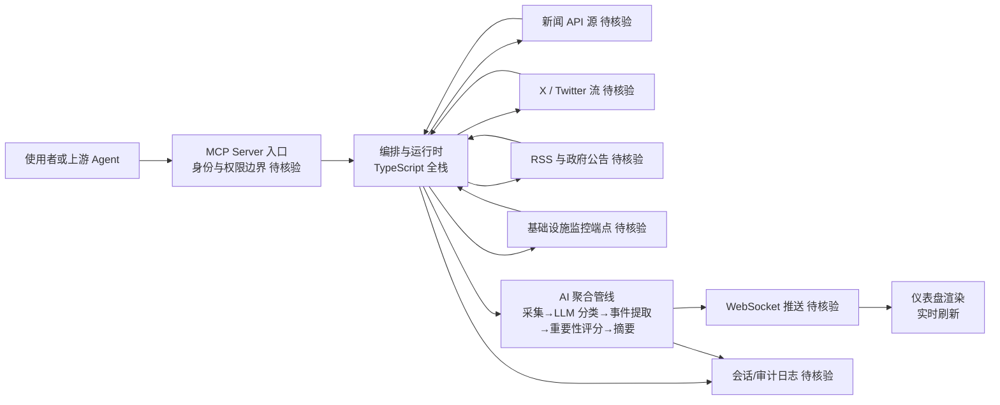

# koala73/worldmonitor

## 一句话定位
实时全球情报仪表盘，利用 AI 聚合新闻、监控地缘政治动态和基础设施状态，在统一的态势感知界面中呈现。

## 它解决的问题
信息工作者（分析师、记者、企业安全团队）需要从数十个来源追踪全球事件——新闻网站、社交媒体、政府公告、基础设施监控。手动追踪效率低且容易遗漏。WorldMonitor 将多源信息聚合到单一仪表盘，利用 AI 进行分类、摘要和重要性判断，实现"一屏看世界"的态势感知能力。

## 为什么值得关注
- **Stars:** 79,539 stars，2026 年增长迅速
- **AI 驱动情报:** 不是简单的 RSS 聚合，而是利用 AI 进行内容理解、分类和摘要
- **多维度监控:** 新闻 + 地缘政治 + 基础设施（网络 / 服务状态），跨领域态势感知
- **实时性:** 实时数据管道，事件发生后快速呈现在仪表盘
- **MCP 集成:** 提供 MCP Server 接口，可被 AI Agent 调用作为信息源
- **多语言:** 支持简体中文和日文界面

## 热度来源判断
WorldMonitor 的热度来自两个趋势交汇：(1) 地缘政治不确定性增加（2024-2026 年全球冲突频发），对实时情报的需求上升；(2) AI 聚合能力成熟——LLM 可以可靠地从海量信息中提取关键事件和摘要。Star 数的快速增长（从 2024 年的数千到 2026 年的 79K）反映了"AI + 情报"赛道的爆发。这是一个刚需 + 技术成熟度双驱动的项目。

## 关键技术亮点亮点
- **AI 聚合管线:** 数据采集 → LLM 分类 → 事件提取 → 重要性评分 → 摘要生成 → 仪表盘渲染
- **多源数据:** 新闻 API、社交媒体流（X/Twitter）、RSS、政府公告、基础设施监控端点
- **TypeScript 全栈:** 前端仪表盘 + 后端数据管道，统一语言降低复杂度
- **MCP Server:** 将情报能力暴露为 MCP 工具，AI Agent 可调用查询
- **实时更新:** WebSocket 推送，仪表盘实时刷新

## 架构师速览

| 决策问题 | 研究判断 | 证据边界 |
|---|---|---|
| 系统边界 | koala73/worldmonitor 是一个聚合型仪表盘：外部数据源（新闻 API、X/Twitter、RSS、政府公告、基础设施监控）→ AI 聚合管线（LLM 分类、事件提取、重要性评分、摘要）→ TypeScript 全栈渲染层，并通过 MCP Server 暴露给上游 Agent | 数据源类型、AI 管线阶段、TypeScript 栈、MCP Server 在档案中明确；具体供应商、API 鉴权、部署形态未在 README 证实 |
| 主路径 | 多源采集 → AI 分类与摘要 → WebSocket 推送到仪表盘；并提供 MCP Server 工具调用路径供 AI Agent 作为信息源消费 | "实时数据管道 / WebSocket 推送 / MCP 集成"在档案中明确；管线实现细节、模型选型、摘要 prompt 未证实 |
| 关键权衡 | 多源覆盖广度 vs 数据源中断/收费的可用性风险；AI 摘要价值 vs LLM 偏见与错误；聚合体验 vs 版权合规与信息茧房；单维护者 vs bus factor | 风险条目均为档案明文；具体缓解策略、可观测性、合规方案未给出 |
| 最小 PoC | 单一公开新闻 + 单 RSS 渠道接入，本地 LLM 做分类与摘要，仪表盘只验证实时刷新与摘要输出；验收项须包含数据源失败回退、摘要可审计日志、成本上限、MCP 调用退出路径 | PoC 步骤由档案"AI 聚合管线 + 多源数据 + 实时更新 + MCP Server"组合推导；具体模型、队列、部署未证实 |

## 架构启发
WorldMonitor 的架构启发在于"AI 作为信息过滤器"——在信息过载时代，人类无法手动处理所有信息源，AI 的价值不在于生成新内容，而在于"理解、筛选、摘要"已有信息。其"采集 → AI 处理 → 仪表盘呈现"的管线模式适用于任何监控场景（如市场监控、舆情监控、运维监控）。MCP Server 的设计也值得借鉴——将情报能力"工具化"，使其可被 Agent 调用。

## 架构图（MMD）

> 证据边界：此图只采用本档案已有可核验描述；“待核验”节点不应视为项目实现事实。

## 定位判断
**工具型项目（成长期）。** WorldMonitor 是一个面向信息工作者的实时情报工具。它的定位不是"通用仪表盘"（如 Grafana），而是"AI 增强的情报聚合器"。其价值取决于数据源覆盖度和 AI 分析质量。有潜力演进为"个人情报助理"平台。

## 风险 / 局限 / 泡沫点
- **数据源依赖:** 依赖外部 API 和数据源，数据源中断或收费会影响可用性
- **AI 分析准确性:** LLM 对地缘政治事件的理解可能存在偏见或错误
- **信息茧房:** 算法筛选可能遗漏重要但低频的事件
- **合规风险:** 聚合新闻内容可能涉及版权问题
- **维护者单一:** 主要由 koala73 维护，bus factor 风险

## 与同类项目的关系
- **vs Grafana:** Grafana 是通用监控仪表盘（运维 / 业务指标），WorldMonitor 专注情报聚合
- **vs RSS 阅读器:** RSS 阅读器是被动聚合，WorldMonitor 是 AI 主动分析和摘要
- **vs 商业情报平台 (Palantir / Recorded Future):** 商业平台更专业但昂贵，WorldMonitor 是开源替代
- **vs News API 聚合:** WorldMonitor 增加了 AI 分析层和地缘政治维度

## 是否值得持续跟踪
**是。** WorldMonitor 代表了"AI + 情报聚合"的新范式。值得关注的是：数据源覆盖的扩展、AI 分析质量的提升、MCP 生态集成（作为 Agent 的信息源）、以及是否从工具演进为平台。

## 后续观察点
- MCP Server 在 Agent 生态中的采用情况（是否成为 Agent 的默认情报源）
- AI 分析的准确性和偏见控制机制
- 数据源的扩展（是否接入实时卫星图、金融数据等）
- 企业版 / 商业化路径
- 开源社区的贡献活跃度

---
> 数据来源: GitHub API (2026-08-07) | 首次发现: 2026-06-24
