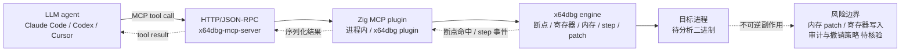

# duty1g/x64dbg-mcp-server

## 一句话定位
x64dbg 的原生 MCP 插件——把整个调试器（断点、寄存器、内存、step / continue / patch）通过 HTTP/JSON-RPC 暴露为 MCP tool，让任何 coding agent（Claude Code / Codex / Cursor 等）以 tool call 形式驱动 Windows 上的二进制逆向工程会话。

## 它解决的问题
x64dbg 是 Windows 平台最受欢迎的开源调试器之一，但在 LLM 时代，AI 接入调试器的传统方式要么靠 screen-reading + py-automation 的胶水层（脆弱、慢、容易错过状态），要么靠 platform-specific 的本地绑定（难跨 agent）。这让"agent 做 RE"长期停留在 PPT 概念层面。x64dbg-mcp-server 直击此痛点：**用 MCP 这种 protocol-level 抽象代替 GUI 胶水**，让 LLM 直接读寄存器、写断点、step / continue / patch 内存——所有动作都通过标准 MCP tool call 发起，agent 不需要知道 x64dbg 的任何 GUI 细节。

## 为什么值得关注（2026-08-24）
- **2 天 779⭐**（GitHub API 可核验）：在 RE 这种小众赛道，2 天破 700 星是异常高的关注度
- **Forks / Watchers 同步增长**：社区已经在 fork、复制并改写为其它调试器（Ghidra / Binary Ninja）的同类 plugin
- **Zig 实现 + 极小 RPC 表面**：build.zig 仅 2,188 bytes、src/ 目录存在，表明这是真实生产代码而非 demo
- **License: MIT**：对企业内部分发友好
- **Topics 完整覆盖**：ai-debugging、binary-analysis、claude-code、mcp、x64dbg、malware-research、zig、zig-lang——把定位写在 metadata 上

## 热度来源判断
x64dbg-mcp-server 的热度来自**强刚需 + 稀缺供给 + MCP 协议放量**的组合：(1) RE / CTF / 红队 / 恶意软件分析是稳定需求的工作流；(2) AI 接入 Windows 调试器此前**几乎没有正式产品**，开发者长期用 GDB-LLDB-MCP 做 Linux 反向工程；(3) MCP 协议在 2026 上半年已被多个 agent 默认支持。三个因素叠加 → "agent 做 RE"第一次有了开箱即用的方案，热度顺势爆发。**热度真实而非泡沫**——使用场景比想象中广（CTF 题解自动调试、二进制 CVE 复现、恶意软件动态分析）。但需警惕：调试器的副作用是真实物理动作（直接修改目标进程内存），agent 误判可能导致不可逆后果。

## 关键技术亮点
1. **Zig 实现的小型 HTTP/JSON-RPC shim**：build.zig 仅 2KB，编译产物小，启动 < 100ms——对调试插件这种"随时开关"的工具是合适选择
2. **完整暴露 x64dbg 命令集**：断点、寄存器、内存读 / 写、step / continue、patch——所有 debug primitive 都成为 MCP tool
3. **HTTP 而非 stdio**：相比官方推荐的 stdio MCP，HTTP 通道更适合调试器这种"长会话 + 多客户端"场景
4. **x64dbg 插件架构贴合**：作为 x64dbg plugin 装载，自动获得调试事件回调，无需 wrapper 进程
5. **MIT License**：唯一许可，可商用可在企业内嵌
6. **维护者有明确的红队 / RE 背景**：仓库自戴"Red Team / Reverse Engineering"徽章，外部博客 duty1g.online——这是细分领域"作者背景 + 用户社群一致"的强信号

## 架构师速览

| 决策问题 | 研究判断 | 证据边界 |
|---|---|---|
| 系统边界 | x64dbg 进程内 MCP plugin；进程外通过 HTTP/JSON-RPC 与 MCP 客户端（agent）通信；不依赖具体 LLM 或 agent 框架 | 仓库结构（`build.zig`、`build.zig.zon`、`src/`、`README.md`）确认 plugin 形态；MCP 客户端支持范围由 README "Connect any MCP-compatible AI assistant" 描述确认，具体兼容性矩阵待源码核验 |
| 主路径 | MCP 客户端发起 tool call → HTTP/JSON-RPC 请求 → Zig plugin 解析并翻译为 x64dbg 命令 → x64dbg 执行（断点 / 寄存器 / step / patch）→ 结果序列化返回 → agent 整合到上下文继续推理 | 主路径由 README "exposes the debugger's full functionality over HTTP" 与项目自描述确认；执行时序、错误处理、timeout 策略需源码确认 |
| 关键权衡 | 体量小 / 协议通用性（HTTP）vs stdio MCP 的"零网络"安全优势；可直接驱动调试器副作用（patch 内存）vs agent 必须有强审批门；MIT 开放 vs 调试类工具在团队中应有额外审计 | 协议选择由 README/HTTP 描述确认；副作用与审计要求由调试类工具本质推导，是否提供原生审计钩子未在 README 明示 |
| 最小 PoC | 在 x64dbg 内 attach 一个 32/64-bit 进程 → 装载 plugin → 用 Claude Code / Codex 通过最简 MCP client（如 mcp-cli）发起一次 "set breakpoint at entry, continue" 调用 → 验证断点命中后寄存器值被正确返回 → 再扩展到 patch + step 循环 | PoC 流程由 README 工具列表推导；具体 mcp-cli 调用模板与断点命中事件抓取流程未在档案中给出 |
| 证据边界 | 仓库公开 metadata + README + build 脚本；目标进程副作用审计、远端联机调试模式、多 agent 并发隔离策略均为推断 / 待核验项 | 仅核验已核验事实（Stars/Forks/License/Created/Topics/Build system），其他来自语义推断 |

## 架构图（MMD）

> 证据边界：此图只采用本档案已有可核验描述；"待核验"节点不应视为项目实现事实。

## 架构启发
x64dbg-mcp-server 的核心启发是 **"MCP 作为"行业知识 × LLM 能力"的协议适配层"**。x64dbg 本身有完整稳定的命令集（断点、寄存器、step、patch），MCP 提供了一个**协议级的抽象**，让这些命令无须为每个 LLM / agent 重新编写胶水层。这与 8-23 NorthCinder（购物 MCP server）的逻辑是同构的：**任何"已有命令集的专业工具"都可以用同样的方式接入 agent 生态**，而 x64dbg 是这一模式中**最先示范"RE 这种高风险垂直"** 的范例。更深层的启发是：协议层抽象（MCP）让"工具有多深"和"工具有多通用"被解耦——x64dbg 本身专精 Windows 调试，但接入 MCP 后立刻被全球所有 agent 生态可用。

## 定位判断
**垂直领域事实标准候选（MCP × RE）。** 在 MCP × 反编译 / 逆向工程这条赛道，x64dbg-mcp-server 是当前 GitHub 上最具关注度的项目（topics 含 x64dbg + mcp）。若 Ghidra / Binary Ninja 后续出现同类项目，本项目将形成**"x64dbg 上的事实标准"**位置。配合 8-23 NorthCinder 在购物比价的形态、MCP 已经形成"购物 / RE / 设计"三个独立垂直示范——这一协议正在被证明**能在多领域复用**。

## 风险 / 局限 / 泡沫点
- **目标进程副作用不可逆**：debugger 本身就能 patch 内存、改寄存器——任何 LLM 误判都会直接破坏分析对象。建议在企业内启用时强制"tool call 必须人审"
- **HTTP 暴露面风险**：相比 stdio MCP 的本地通道，HTTP 路径意味着任何能访问该端口的客户端都能驱动调试器；多用户场景必须配置鉴权
- **审计能力未知**：是否内置每次 tool call 的完整审计 log、能否回滚到任意断点状态，README 未明示——这是企业内采用时的关键询问点
- **单点维护**：duty1g 个人维护，无显式 governance / 多人 code ownership，对生产级采用是 single point of failure
- **Zig 生态的招聘与可维护性**：相比 Go / Rust，Zig 在企业内的工程师熟练度较低；长期若需要 deep-fix 的人才稀缺
- **对比同类项目**：Ghidra-MCP / Binary Ninja MCP 等还在早期；本项目能否在 Ghidra/Binary Ninja 等竞品同类方案出现后守住主导地位，是后续观察重点

## 与同类项目的关系
- **vs Ghidra-MCP / radare2-mcp 等**：这些是 Linux / 跨平台 RE 工具的同类尝试，但 GitHub 上关注度均低于 x64dbg-mcp-server
- **vs 通用 GUI automation（PyAutoGUI / SikuliX 等）**：那些是"模拟点击"路径，脆弱且慢；x64dbg-mcp-server 是"协议级"路径
- **vs MCP for IDA Pro（如果存在）**：IDA Pro 是商业 RE 工具，与 x64dbg 形成商业 vs 开源对照
- **vs coding agent 的 native debug tool**（如 Claude Code 内置 debug tool）：native tool 通常支持 GDB / LLDB，但 Windows 上的 x64dbg 是空白
- **vs wshobson/agents**：wshobson 是 agent skill 聚合市场；x64dbg-mcp-server 是单一垂直工具，二者互补而非竞争

## 是否值得持续跟踪
**值得高频跟踪（MCP × 垂直生态风向标）。** 对 RE / 红队 / 恶意软件分析从业者：直接试用是必要的——这是 Windows 平台第一个"agent 友好"的 RE 工具；对企业内技术决策者：**这是判断"MCP 在垂直领域能不能跑通"的最佳样本**——x64dbg-mcp-server 的用户增长曲线、调试器副作用相关 issue、是否能被 fork 到 Ghidra / Binary Ninja 等竞品，是 MCP 走向通用接口层可行性的关键信号。

## 后续观察点
- 是否被主流 agent 框架默认收录（如 Claude Code skill marketplace / Codex plugin marketplace）
- 是否出现 Ghidra / Binary Ninja 的"x64dbg-mcp-server 同类"项目，并形成 RE-MCP 联合事实标准
- 调试器副作用的"agent 审批 policy"是否被仓库或第三方明确文档化
- HTTP 鉴权 / 多客户端隔离机制是否在新版本中补齐
- duty1g 是否把维护移交给组织 / 多人 fork（治理进化信号）

---
> 数据来源: GitHub API (2026-08-24) | Stars: 779 | Forks: 76 | License: MIT | 语言: Zig | 创建: 2026-08-22
