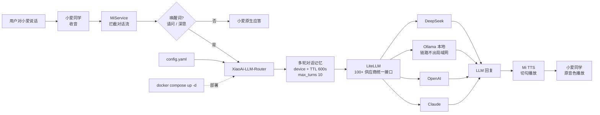

# FelixQiu1/XiaoAi-LLM-Router

## 一句话定位
老旧小米小爱同学升级 DeepSeek / Ollama / OpenAI / Claude 本地智能管家网关；「不拆硬件、不刷固件、不改原音色」通过 LiteLLM 中间层加 LLM 思考回路；唤醒词路由 + 多轮对话记忆 + Docker Compose 一键部署。

## 它解决的问题
智能音箱升级痛点是 **「老设备硬件不支持新 LLM 客户端 SDK」**——小爱同学的对话接口由小米官方控制，第三方无法把 DeepSeek / Claude 等模型直接植入。XiaoAi-LLM-Router 的解法是 **「不绕过小米官方，做一条 AI 回路」**——收音仍走 MiService（与小米音箱完全兼容），TTS 仍走 MiTTS（保持小爱原音色），中间接入一层 LiteLLM + 记忆 + 唤醒词路由。**这是「不拆硬件 / 不刷固件 / 不破坏厂商生态」的中间层路径**——与「Root 后注入自定义 SDK」类方案对比，对普通家庭用户的可用性显著更高（Docker Compose 一键部署 + 不动小爱本身）。

## 为什么值得关注（2026-09-15）
- **Stars:** 20（截至 2026-09-15），1 天 20⭐，本地 AI 智能音箱升级早期信号
- **Forks:** 0
- **Watchers/Subscribers:** 0
- **Open Issues:** 0
- **License:** NOASSERTION（合规风险）
- **语言:** Python 3.11+ / Docker Compose
- **活跃度:** created 2026-09-14，pushed_at 2026-09-14
- **规模:** 20 KB，极简配置 + 一键部署形态
- **Topics:** （GitHub API 未列出 topics）

## 热度来源判断
XiaoAi-LLM-Router 的热度是 **「中国家庭普遍持有小米 / 天猫精灵 / 小度等老音箱的市场痛点 × LiteLLM 100+ 供应商统一接口 × Ollama 模式链路不出局域网的隐私亮点 × Docker Compose 一键部署」** 的组合。「不拆硬件升级智能音箱」是普通家庭用户的真实需求——配置驱动多供应商 + Ollama 隐私模式 + 小爱原音色保留都是关键卖点。**唤醒词路由「请深入思考 / 请问」** 是细节亮点——避免「所有对话都先问 LLM」导致的延迟与误判。20⭐ / fork 0 / 1 天是「家庭用户 + 个人开发者」圈层典型扩散速度。热度 **真实且具本地 AI 应用层价值**——但需关注 MiService / MiTTS 接口的稳定性（这两个是小米官方接口逆向）。

## 关键技术亮点
1. **三段拆分数据流**——「小爱同学(收音) → MiService → XiaoAi-LLM-Router → LiteLLM/REST → DeepSeek / Ollama / OpenAI → Mi TTS → 小爱同学(播放)」
2. **组件复用**——收音：MiService 拦截对话流（仅过滤唤醒词）；思考：LiteLLM（100+ 供应商统一接口）+ 多轮对话记忆 session；嘴：小米 MiTTS 接口 + LLM 回复切成短句播回
3. **多模型无缝切换**——一个 YAML 配置切换 DeepSeek / Ollama 本地 / OpenAI / Claude 同套唤醒词同套记忆零代码改动
4. **多轮对话记忆**——按 device + 时间窗自动维护上下文（TTL 默认 600s + max_turns 10）；「它刚才说的那个东西再大一点」指代也能接住
5. **本地部署隐私保护**——Ollama 模式整条链路不离开局域网；对话不经第三方服务器（云端模式除外）
6. **一条命令部署**——`docker compose up -d`；连上现有 MiService 即可
7. **唤醒词路由**——只有说「请深入思考」/「请问」时才把请求转给 LLM，否则小爱正常应答
8. **config.yaml 配置示例完整**——含 mi.username/password/device_id + llm.default_provider (deepseek/ollama/openai) + session.ttl_seconds/max_turns + trigger.wake_words + tts.engine
9. **完整示例对话**——「小爱同学，请深入思考：为什么月亮晚上才上班？」+ 小爱自身音色念回回答
10. **20 KB repo + Python 3.11+**——极简配置 + Docker Compose 一键部署形态

## 架构师速览

| 决策问题 | 研究判断 | 证据边界 |
|---|---|---|
| 系统边界 | 智能音箱升级中间层；收音层（MiService 拦截小爱对话流）+ 思考层（LiteLLM 100+ 供应商统一接口 + 多轮对话记忆 session）+ 嘴层（MiTTS 切句播放回小爱原音色）；数据流：小爱收音 → MiService → XiaoAi-LLM-Router → LiteLLM/REST → DeepSeek/Ollama/OpenAI → Mi TTS → 小爱播放 | 来自 README 关于「三段拆分」「LiteLLM 100+ 供应商」「session 按 device + 时间窗 TTL 600s + max_turns 10」「唤醒词路由」「Ollama 模式链路不出局域网」「docker compose up -d」的明示；具体 MiService / MiTTS 接口稳定性、session 持久化机制、config.yaml schema 在 README 中未完全展开 |
| 主路径 | 用户对小爱说话 → 小爱收音 → MiService 拦截对话流 → 唤醒词判断（「请问 / 深思」命中才走 LLM，否则小爱原生应答）→ XiaoAi-LLM-Router → 多轮对话记忆 session 维护上下文 → LiteLLM 适配器调用 DeepSeek / Ollama / OpenAI / Claude → LLM 回复切短句 → MiTTS 播放回小爱原音色 | 主路径来自 README 描述的三段拆分 + 完整示例对话；MiService 抓包接口的具体协议、LiteLLM session 持久化机制、MiTTS 切句算法待核验 |
| 关键权衡 | 不拆硬件 / 不刷固件 / 不破坏厂商生态（兼容 vs 受限）/ MiService 抓包逆向（无官方支持 vs 可用）/ Ollama 模式链路不出局域网（隐私 vs 需用户自部署 Ollama）/ 唤醒词路由「请深入思考 / 请问」硬编码（避免 LLM 接管所有 vs 用户无法自定义）/ NOASSERTION 许可（开源 vs 企业合规） | 权衡六因素均从 README 推导；具体 MiService 接口稳定性、唤醒词可配置性、LiteLLM session 在 Docker 重启后是否丢失待核验 |
| 最小 PoC | Raspberry Pi / NAS / NUC + Docker + 现有小米小爱同学 + MiService 已部署 + LiteLLM 配置（deepseek API key 或 ollama 本地模型如 qwen2.5:7b）+ config.yaml 配置小爱账号密码 + docker compose up -d；触发条件：对小爱说「小爱同学，请深入思考：为什么月亮晚上才上班？」观察 LLM 回复切短句 MiTTS 播放回小爱 | PoC 由「Docker 一键部署 + MiService 拦截 + LiteLLM 适配 + 多轮对话记忆 + 唤醒词路由」路径推导；具体 MiService 部署步骤、LiteLLM 供应商配置示例、config.yaml schema 严格度待核验 |

## 架构启发
XiaoAi-LLM-Router 的核心启发是 **「不拆硬件 + LiteLLM 中间层」是智能音箱升级的可行模式**。现代硬件升级痛点不止 LLM 应用层，**智能音箱这种「硬件封闭 + 接口官方控制」设备**的升级需要中间层路径：**(a) 不绕过厂商**——保留 MiService / MiTTS 等官方接口以避免兼容性问题；**(b) 加 LLM 思考回路**——通过 LiteLLM 适配多供应商，加多轮对话记忆；**(c) 保留原音色**——TTS 仍走 MiTTS 让用户听到熟悉的小爱声音。更深层的启发是 **「本地 + 反 SaaS + 自带 key」范式扩张到硬件受限设备**——与昨日 tracecrate（本地 trace）/ maskit（本地隐私）/ mural（iOS 自带 API key）/ asset-studio（本地资产生成）同构，但推到「硬件受限设备的 LLM 升级」这一新场景。**唤醒词路由是值得借鉴的工程细节**——日常问答走原生 / 深度问答走 LLM 的清晰分工避免 LLM 接管所有请求导致的延迟与误判。

## 架构图（MMD）

> 证据边界：此图只采用本档案已有可核验描述；"待核验"节点不应视为项目实现事实。

## 定位判断
**工具型（本地 AI 智能音箱升级网关）。** XiaoAi-LLM-Router 不是又一个 LLM Chat 客户端（那是 Open WebUI / LM Studio 等），而是 **「硬件受限设备 + 厂商封闭生态 + LiteLLM 中间层」的智能音箱升级路径**。它的价值不在于「功能多」，而在于 **「不拆硬件 / 不刷固件 / 不破坏厂商生态」** 三件套 + **「Ollama 模式链路不出局域网」** 隐私亮点。对中国家庭普遍持有小米 / 天猫精灵 / 小度等老音箱的市场，这是「配置驱动多供应商」+「Docker 一键部署」的具体路径。

## 风险/局限/泡沫点
- **NOASSERTION 许可**——合规扫描拒绝；企业直接采用有风险
- **MiService / MiTTS 是小米官方接口逆向**——版本变动立刻破坏项目；接口稳定性依赖小米未公开
- **Ollama 模式链路不出局域网**是亮点但需用户自部署 Ollama + 兼容模型（qwen2.5:7b 等）
- **fork 0 / 1 天反映当前主要是早期关注**——企业 fork 信号还未出现
- **依赖 MiService 已部署**——README 明示「连上你现有的 MiService 即可」；MiService 是独立项目需用户自行部署
- **唤醒词路由「请深入思考 / 请问」是硬编码**——用户能否自定义唤醒词是 README 未明确问题
- **多轮对话记忆 TTL 600s + max_turns 10** 是默认配置——长对话需求可能需调整

## 与同类项目的关系
- **vs MiService**：MiService 是小米设备控制网关（提供 MiService REST API）；XiaoAi-LLM-Router 是 LLM 增强中间层——**依赖**
- **vs LiteLLM**：LiteLLM 是 100+ LLM 供应商统一接口；XiaoAi-LLM-Router 是智能音箱升级场景的应用——**复用**
- **vs Open WebUI / LM Studio**：Open WebUI / LM Studio 是本地 LLM Chat 客户端；XiaoAi-LLM-Router 是智能音箱场景的 LLM 集成——**不同场景**
- **vs 昨日 tracecrate / maskit / mural / asset-studio**：tracecrate（本地 trace）/ maskit（本地隐私）/ mural（iOS 自带 API key）/ asset-studio（本地资产生成）同构「本地 + 反 SaaS + 自带 key」范式——**XiaoAi-LLM-Router 推到硬件受限设备的 LLM 升级**
- **vs 智能音箱厂商官方升级**：小米 / 天猫精灵 / 小度等官方升级受限于硬件 + 商业模式；XiaoAi-LLM-Router 是社区绕过路径

## 是否值得持续跟踪
**值得跟踪（本地 AI 智能音箱升级赛道）。** XiaoAi-LLM-Router 代表了「不拆硬件 + LiteLLM 中间层」智能音箱升级的可行模式，无论其本身成败，这一方向是行业趋势。建议关注：**(a) MiService / MiTTS 接口的稳定性**（决定项目可持续性）、**(b) 是否扩展到天猫精灵 / 小度等其他智能音箱**（决定模式可推广性）、**(c) Ollama 模式链路不出局域网的隐私卖点是否成为同类项目的标配**（决定「本地 + 反 SaaS」范式扩张速度）。对中国家庭用户：值得直接尝试；对企业：MiService 抓包接口的合规性需评估。

## 后续观察点
- MiService / MiTTS 接口逆向稳定性 + 接口变动对项目的影响
- 是否扩展到天猫精灵 / 小度等其他智能音箱品牌
- Ollama 模式链路不出局域网的隐私卖点是否被同类项目采纳
- 唤醒词路由能否用户自定义
- 多轮对话记忆 TTL / max_turns 默认值是否调整
- Docker Compose 一键部署是否补齐 GitHub Actions CI
- 是否出现「LiteLLM + 智能音箱」类官方集成

---
> 数据来源: GitHub API (2026-09-15) + README API readme 字段 base64 解码 | Stars: 20 | Forks: 0 | License: NOASSERTION | 语言: Python | 创建: 2026-09-14
