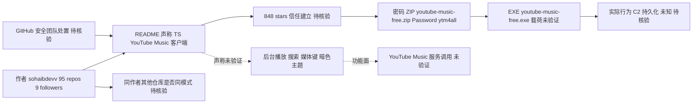

# sohaibdevv/youtube-music

## 一句话定位
疑似恶意软件投递伪装样本——README 声称"YouTube Music 免费客户端"，但以密码保护 ZIP（Password: ytm4all）分发可执行文件，848 stars / 0 forks 的极端背离 + 密码 ZIP 分发模式是经典恶意软件投递特征，作为"开源平台信任滥用"的新型风险对照案例入库（推断，ZIP 载荷未下载验证）。

## 它解决的问题（声称 vs 实际）
**README 声称：** 轻量级、无广告 YouTube Music 流媒体客户端，支持后台播放、搜索、本地播放列表、媒体键控制、暗色主题、单文件 EXE 免安装。
**实际判断（推断）：** 分发模式（密码保护 ZIP + 可执行文件）与"开源项目"定位矛盾。合法开源项目以源码仓库 + CI/CD 构建分发，而非密码保护的二进制压缩包。848 stars / 0 forks 的极端背离进一步支持"非自然热度"判断。

## 为什么值得关注（2026-08-13）
- **新型风险样本：** 与 WeChat-AI（fork≈star 刷量模式）不同，youtube-music 呈现 **0 fork + 密码 ZIP 分发**——这是经典恶意软件投递向量，代表"开源平台信任滥用"的新模式。
- **方法论对照价值：** 与 WeChat-AI（热度数据异常）+ open-kimi-ppt-skill（归档后 fork 异常增长）构成三类不同的"热度≠价值"风险样本。
- **平台安全信号：** GitHub 作为开源分发平台的信任正在被利用——密码 ZIP + 高 star 低参与度是新的风险信号模式，值得研究者建立检测规则。

## 热度来源判断
**判断：疑似恶意软件投递驱动的非自然热度（推断，未验证载荷）。**
- **848 stars / 0 forks = 极端背离：** 一个有 848 人 star 的项目不可能 0 fork。fork 是开源项目参与的最低门槛，0 fork 意味着"848 人看了 README 想 star，但没人想看代码/fork/改进"——这与正常开源项目行为模式严重矛盾。
- **密码保护 ZIP：** README 明确 `Password: ytm4all`，下载 `youtube-music-free.zip` 解压运行 `youtube-music-free.exe`。合法开源项目不使用密码 ZIP 分发——密码 ZIP 是规避自动扫描的经典手法。
- **作者画像：** sohaibdevv（2024-10 注册，95 公开仓库，9 followers）。95 个公开仓库但仅 9 followers，账号活跃度与影响力不匹配。
- **0 open issues：** 848 stars / 0 issues 意味着无用户反馈——对一个"音乐客户端"来说不正常（通常会有 bug 报告、功能请求）。

**⚠️ 关键证据边界：以上为基于 API 字段和 README 分发模式的推断。未下载 ZIP、未分析实际载荷——标记为待观察。**

## 关键技术亮点
**不适用。** 本档案的价值在于风险分析而非技术评估。README 描述的"功能"（无广告、后台播放等）为声称内容，未验证。

## 架构师速览

| 决策问题 | 研究判断 | 证据边界 |
|---|---|---|
| 系统边界 | 这是一个以"开源 YouTube Music 客户端"为外壳、通过密码保护 ZIP 分发可执行文件的疑似投递样本；真正的系统边界不在源码，而在于 README 声明（TypeScript 客户端）与分发通道（密码 ZIP + EXE）之间的断裂——仓库侧与投递侧是两个互不验证的边界。 | 边界判断基于分类标签（case-study, suspected-malware, password-zip, zero-fork-anomaly）与 README 描述的 `youtube-music-free.zip` / `Password: ytm4all` 分发模式；未读取 TypeScript 源码，未下载 ZIP 验证 EXE 载荷。 |
| 主路径 | 若按 README 字面：用户 → 下载密码 ZIP → 解压运行 `youtube-music-free.exe` → 单文件客户端 → 调用 YouTube Music 服务；若按风险观察：README（信任建立）→ star 灌入 → 密码 ZIP（规避扫描）→ EXE 执行 → 未知 C2/载荷落地，主路径在第二步被劫持。 | 主路径前半段（README 声称的功能）来自项目自身描述，未运行时验证；后半段（投递/载荷行为）来自对 848 stars / 0 forks / 0 issues 异常数据的推断，ZIP 与 EXE 内容均未核验。 |
| 关键权衡 | 不是工程权衡，而是"信任信号 vs 分发模式"的权衡：848 stars 的开源信誉背书 vs 密码 ZIP + 0 fork + 0 issue 的非自然参与度——前者被设计用于掩护后者，决策不能依赖 star/license/tag 等 GitHub 表层信号。 | 权衡基于仓库 API 字段（stars=848, forks=0, open_issues=0, license=MIT, language=TypeScript）与 README 分发描述；MIT license 为声称、未核验 license 文件；"恶意"判断为推断而非扫描结论。 |
| 最小 PoC | 不建议对该项目做功能性 PoC；最小可行验证应在隔离沙箱中做三项取证——(1) README 与仓库实际内容是否一致，(2) ZIP + 密码 `ytm4all` 解压后 EXE 的静态特征（签名、哈希、字符串），(3) 沙箱内动态行为（网络连接、持久化、加载项）。任何 PoC 不得在生产或日常主机执行。 | PoC 范围由档案"ZIP 载荷未下载验证"明确限定；具体哈希、签名、IOC、依赖、协议均未在档案中出现，全部须以沙箱取证核验，档案不提供任何已确认技术细节。 |

## 架构启发
（不适用——风险样本，非技术参考项目）

## 架构图（MMD）

> 证据边界：此图只采用本档案已有可核验描述；“待核验”节点不应视为项目实现事实。

## 定位判断
**观察型（疑似恶意软件投递样本，证据账本对照案例）。** youtube-music 的核心价值是作为"开源平台信任滥用"的证据样本。它与 WeChat-AI（刷量型）、open-kimi-ppt-skill（归档后异常增长型）构成三类不同的"热度≠价值"风险模式。研究者可基于此建立检测规则：**密码 ZIP + 高 star 低参与度（0 fork/0 issue）= 投递型风险信号。**

## 风险 / 局限 / 泡沫点
- **疑似恶意软件投递（核心风险，推断未验证）：** 密码保护 ZIP + 可执行文件分发是经典恶意软件投递向量。未下载验证实际载荷。
- **版权侵权风险：** 即使功能如 README 所述（无广告 YouTube Music 流媒体），也涉及 YouTube 服务条款违规和潜在版权问题。
- **平台信任侵蚀：** 此类项目利用 GitHub 的开源信誉作为分发渠道，侵蚀平台信任。
- **热度真实性存疑：** 848 stars / 0 forks 的极端背离可能是刷量/购买 star，也可能是恶意软件投递 campaign 的一部分。

## 与同类项目的关系
- **vs SMNETSTUDIO/WeChat-AI（刷量型）：** WeChat-AI 是 fork≈star 的刷量模式（热度数据异常）；youtube-music 是 0 fork + 密码 ZIP 的投递模式（分发模式异常）。两者风险本质不同。
- **vs Binaryify/open-kimi-ppt-skill（归档后异常增长型）：** open-kimi-ppt-skill 归档后 fork 仍异常增长，是"僵尸热度"信号；youtube-music 是"活跃投递"信号。

## 是否值得持续跟踪
**作为证据账本对照案例入库（非技术跟踪）。** youtube-music 的价值在于方法论——为"开源平台信任滥用"提供新的检测信号模式（密码 ZIP + 0 fork + 0 issue）。建议关注：项目是否被 GitHub 下架、star 数后续变化（是否持续增长说明投递 campaign 活跃）、是否出现更多同模式项目。

## 后续观察点
- 项目是否被 GitHub 安全团队下架/标记
- star 数后续变化（若持续快速增长，说明投递 campaign 仍在活跃）
- 是否出现更多"密码 ZIP + 高 star 低 fork"同模式项目
- 作者 sohaibdevv 其他 95 个仓库是否有类似模式

---
> 数据来源: GitHub API (2026-08-13) | Stars: 848 | Forks: 0 | Open Issues: 0 | License: MIT (声称) | 语言: TypeScript | 创建: 2026-08-11 | 作者: sohaibdevv (GitHub since 2024-10, 95 repos, 9 followers) | ⚠️ 疑似恶意软件投递样本——ZIP 载荷未下载验证，"恶意软件"判断为推断
