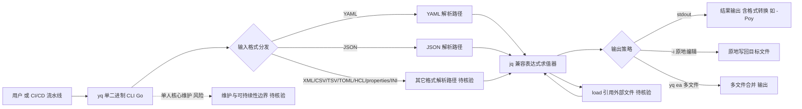

# mikefarah/yq

## 一句话定位
一个轻量级、可移植的命令行 YAML/JSON/XML/CSV/TOML/HCL/properties 处理器，使用类似 jq 的语法，用 Go 编写，单二进制无依赖。

## 它解决的问题
DevOps 和云原生工程师每天需要处理大量 YAML 配置文件（Kubernetes manifests、Helm charts、CI/CD 配置等），但传统的 jq 只能处理 JSON，手动编辑 YAML 又容易出错（缩进、引号、类型推断等问题）。yq 填补了这个空白：它将 jq 强大的查询语法扩展到了 YAML、XML、CSV、TOML、HCL 等多种格式，同时支持格式间的互相转换。对任何在 Kubernetes 生态中工作的开发者来说，yq 几乎是必备工具。

## 为什么值得关注（2026-07-08）
- 15,796 stars，创建于 2015 年，持续维护至今（最近一次 push: 2026-08-06），是 DevOps 工具链中久经考验的基础设施级项目
- MIT 许可证，Go 语言编写，单二进制部署，通过 brew、snap、docker、wget 等多种方式安装
- 活跃的 Discussions 社区（6 万+话题），问题响应迅速
- 在 GitHub Actions 和各种 CI/CD 流水线中被广泛引用

## 热度来源判断
**真实刚需驱动**。yq 的热度并非来自 AI 或 Web3 等热门概念的炒作，而是来自 DevOps/云原生生态的硬性需求。每当有人需要批量修改 Kubernetes YAML 或从 Helm values 中提取数据，yq 就是标准答案。15K stars 对于一个纯命令行工具来说是非常高的数字，说明渗透率极高。热度稳定且可持续——只要 YAML 还在，yq 就有价值。

## 关键技术亮点亮点
1. **jq 语法兼容**：采用业界成熟的 jq 表达式语法（如 `.a.b[0].c`），学习曲线极低，熟悉 jq 的用户可以无缝迁移。支持管道操作、条件判断、变量绑定等高级特性。
2. **多格式统一处理**：单一工具支持 YAML、JSON、XML、CSV/TSV、TOML、HCL、properties、INI 等格式，且支持格式间互转（如 `yq -Poy sample.json` 将 JSON 转为 YAML）。这避免了安装多个专用工具。
3. **原地编辑与环境变量替换**：`-i` 参数支持原地修改文件，`strenv()` 函数可将环境变量注入 YAML，非常适合在 CI/CD 模板渲染中使用。
4. **Go 单二进制 + 跨平台**：零依赖编译，支持 Linux/macOS/Windows/ARM，Docker 镜像 `mikefarah/yq` 可直接在流水线中使用。
5. **多文件合并与 globs**：`yq ea` 支持同时处理多个文件（Helm values 合并场景），`load()` 函数支持引用外部文件。

## 架构师速览

| 决策问题 | 研究判断 | 证据边界 |
|---|---|---|
| 系统边界 | yq 是一个独立 CLI 工具，外部边界是用户/CI 流水线、输入文件（YAML/JSON/XML/CSV/TOML/HCL/properties/INI）以及被引用或原地修改的目标文件；不涉及模型推理或外部 SaaS。 | 仅依据档案中"多格式统一处理""原地编辑 -i""多文件合并与 globs"的描述；具体 I/O 协议、文件监听机制、并发模型未在档案中给出。 |
| 主路径 | 用户或上游脚本 → `yq` 单二进制 CLI → 解析器（按格式分发到 YAML/JSON/XML/CSV/TOML/HCL/properties 解析路径）→ jq 兼容表达式求值 → 输出（stdout 或 `-i` 原地写回，或 `-Poy` 等格式转换）。 | 基于"jq 语法兼容""格式间互转 `-Poy`""-i 原地修改""load() 引用外部文件"等明示特性；表达式引擎内部实现、数据结构、错误恢复路径档案未描述。 |
| 关键权衡 | 一是"jq 语法覆盖广度 vs 不完全兼容"的取舍（README 自承尚未覆盖全部 jq 特性）；二是"单二进制零依赖、跨平台部署"与"单人核心维护（mikefarah）"的可持续性风险；三是"格式覆盖广度"与"边界 case 复杂度"（open_issues 279 个）的张力。 | 权衡判断直接来自档案"语法覆盖率不及 jq""单人维护风险""格式覆盖广度带来的复杂度"三段；其它如性能基准、安全审计结果、许可证合规细节未在档案中给出。 |
| 最小 PoC | 在 CI/CD 流水线中选取一个 Helm values 或 Kubernetes manifest，使用 `yq` 做一次只读查询（如 `.spec.replicas`），再以 `-i` 做一次原地修改并提交，观察格式保真度、表达式覆盖范围与错误信息是否满足日常运维需求；通过 brew/snap/docker/wget 任一渠道安装验证"单二进制零依赖"假设。 | PoC 设计仅使用档案中明确列出的特性（jq 兼容路径语法、`-i`、`-Poy`、`load()`、`yq ea`）；不引入档案未证实的插件机制、远程数据源或并发能力。 |

## 架构启发
yq 的设计哲学是"做好一件事"——它不试图成为通用配置管理平台，而是专注于命令行数据处理这一垂直场景。将 jq 的设计理念（声明式查询语言 + 流式处理管道）扩展到多格式，是一个非常聪明的产品决策：既复用了已有的心智模型，又扩大了适用范围。单二进制、无运行时依赖的 Go 部署模型，也是 CLI 工具的最佳实践——用户安装即用，无需配 Python 环境或 Node.js。

## 架构图（MMD）

> 证据边界：此图只采用本档案已有可核验描述；“待核验”节点不应视为项目实现事实。

## 定位判断
yq 在 DevOps 工具链中处于**基础设施级刚需工具**的位置，与 jq、kubectl、helm 并列。它不是"创新项目"而是"成熟工具"——15K stars 的增长已经趋稳，但渗透率仍在提高。对于 GitHub 趋势研究而言，yq 更像是"常青树"而非"新发现"——它出现在趋势榜上往往是因为某个新版本发布或某个热门教程引用。

## 风险 / 局限 / 泡沫点
1. **语法覆盖率不及 jq**：README 明确说明"doesn't yet support everything jq does"，对于复杂 jq 用户来说，某些高级函数可能不可用。
2. **单人维护风险**：主要由 mikefarah 一人维护，虽然社区活跃但核心开发依赖单人是长期隐患（相比之下 jq 有更广泛的贡献者基础）。
3. **格式覆盖广度带来的复杂度**：支持如此多格式意味着边界 case 处理复杂，从 open_issues（279 个）可以看出用户经常遇到各种边缘问题。

## 与同类项目的关系
- **jq (stedolan/jq)**：yq 的精神前辈和语法来源。jq 是 JSON 处理的黄金标准，但只支持 JSON。yq 在 jq 的基础上扩展了格式支持。两者是互补而非竞争关系。
- **dasel (TomWright/dasel)**：另一个多格式数据选择器，支持 JSON/YAML/TOML/XML/CSV，但语法设计不同于 jq。dasel 约 7K stars，yq 在社区规模和生态成熟度上领先。
- **ytt (vmware-tanzu/carvel-ytt)**：VMware 的 YAML 模板工具，专注于 Kubernetes 配置的模板化渲染，语法更接近 Python，适合复杂模板场景但学习成本更高。

## 是否值得持续跟踪
**持续关注但不作为"新趋势"跟踪**。yq 已经是成熟的生产工具，不需要像新兴 AI 项目那样密切跟踪。但如果研究范围涵盖 DevOps 工具生态，yq 是不可或缺的标杆项目。建议每季度检查一次版本更新和功能演进。

## 后续观察点
1. **v4 → v5 是否有重大架构变更**：yq 目前处于 v4，未来大版本可能重构表达式引擎或引入新格式支持
2. **与 AI 工具链的融合**：yq 是否会被用于 AI/LLM 配置管理（如 model card YAML 处理、prompt 配置管理等新场景）
3. **jq 兼容性路线图**：是否有计划实现 100% jq 语法兼容，以及是否会被新的标准（如 JMESPath）挑战

---
*首次记录：2026-07-08*
