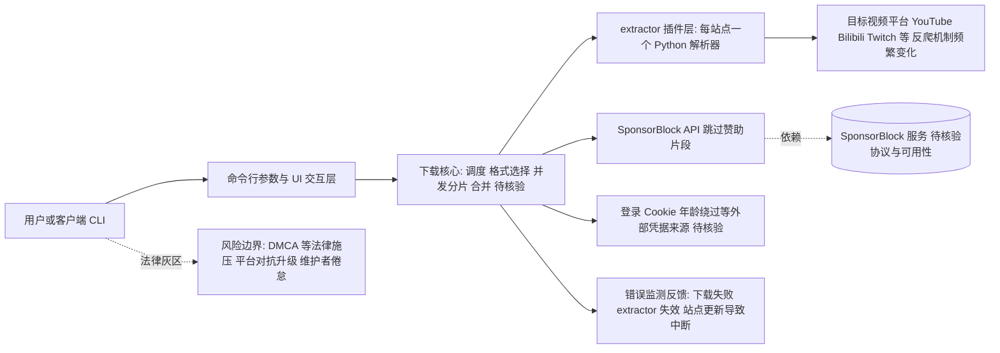

# yt-dlp/yt-dlp

## 一句话定位
youtube-dl 的社区 fork 增强版，支持 YouTube 及上千个视频站点的命令行音视频下载工具，功能丰富、持续维护，是事实上的开源下载工具之王。

## 它解决的问题
原版 youtube-dl 因 DMCA 法律压力和核心维护停滞，导致 YouTube 等站点频繁更新反爬机制后无法下载。yt-dlp 作为活跃 fork，解决了三大痛点：(1) 持续跟进 YouTube 等站点的反爬变化；(2) 支持 SponsorBlock（自动跳过赞助片段）、字幕、年龄限制绕过等高级功能；(3) 性能优化（并发下载、更好的进度显示）。它是 youtube-dl 精神的事实继承者。

## 为什么值得关注
- **Stars:** 182,979（截至 2026-08-07），GitHub Top 20 级别
- **Forks:** 15,734，社区贡献者持续添加新站点 extractor
- **Watchers:** 905，用户关注度极高
- **License:** Unlicense（完全公有领域）
- **活跃度:** pushed_at 2026-08-04，几乎每周更新
- **覆盖范围:** 支持 1000+ 视频站点（YouTube、Bilibili、Twitch、TikTok 等）

## 热度来源判断
yt-dlp 的热度是**真实用户刚需 + 法律真空地带的社区互助**驱动。视频下载是普罗大众的刚需（离线观看、存档、无广告体验），而 YouTube 等平台持续加强反下载措施。yt-dlp 作为"持续对抗平台封锁的开下载工具"，天然获得巨大流量。每次 YouTube 更新反爬机制，都会带来一波 star 增长——它是用户用 star "投票支持维护者继续对抗"的方式。

## 关键技术亮点亮点
1. **extractor 架构:** 每个站点是独立 Python 类，解析页面提取真实视频 URL，新增站点只需添加一个 extractor
2. **format selection:** `-f` 参数支持复杂格式选择表达式（"最佳 mp4 + 最佳 m4a"），灵活组合分辨率/编码
3. **SponsorBlock 集成:** 自动调用 SponsorBlock API 在下载时跳过赞助片段
4. **年龄限制绕过:** 支持登录 Cookie 和多种年龄验证绕过方案
5. **并发下载:** 多线程分片下载，充分利用带宽
6. **插件系统:** 支持 Python 插件扩展，无需修改核心代码

## 架构师速览

| 决策问题 | 研究判断 | 证据边界 |
|---|---|---|
| 系统边界 | 一个基于"核心 + extractor 插件"的 CLI 工具，核心负责下载/合并/格式选择，extractor 负责站点解析；外部边界含 SponsorBlock API、目标站点反爬机制与登录 Cookie 来源 | 架构启发来自档案描述；具体 extractor 数量、SponsorBlock 调用协议、Cookie 注入方式未在档案中详述，需源码核验 |
| 主路径 | 用户通过 CLI 传参 → 核心调度匹配的 extractor → extractor 解析页面得到真实视频 URL → 核心并发分片下载与合并（ffmpeg 待核验） → 可选调用 SponsorBlock API 标记赞助区间；本地无持久化（待核验） | 并发分片、SponsorBlock 集成在档案亮点中明确；合并后端是否依赖 ffmpeg 未标注 |
| 关键权衡 | 站点覆盖广度 vs 对平台反爬变化的脆弱性；功能性丰富（赞助跳过、年龄绕过）vs 法律灰区与维护者倦怠风险；CLI 可扩展性 vs 缺乏 GUI 的使用门槛 | 法律风险与维护者压力档案明示；赞助跳过与年龄绕过方案的具体实现机制档案未展开 |
| 最小 PoC | 选定一个稳定可访问的站点（非 YouTube 以规避最高对抗强度），执行单视频下载 + 指定 `-f` 格式 + 启用 SponsorBlock，记录成功率、对反爬变更的敏感度与依赖项缺失时的降级行为 | 是否需要 ffmpeg、代理、Cookie 等环境前置依赖均待核验 |

## 架构启发
yt-dlp 的架构是经典的 **"核心 + extractor 插件"** 模式。核心负责下载/合并/格式选择；每个站点一个 extractor，只做"页面 → 视频 URL"的解析。这种"关注点分离"让新增站点成本极低——社区贡献者只需写一个 extractor 类。启发是：**工具型项目的可扩展性，比功能本身更重要**。yt-dlp 的 1000+ 站点覆盖，是社区力量的胜利，而非核心团队能力。

## 架构图（MMD）

> 证据边界：此图只采用本档案已有可核验描述；“待核验”节点不应视为项目实现事实。

## 定位判断
**基础设施级工具。** yt-dlp 已成为视频下载领域的事实标准，类似 curl 之于 HTTP 请求。它不是"值得关注的新技术"，而是"互联网用户的基本工具"。长期存在取决于法律环境和平台对抗的动态平衡。

## 风险/局限/泡沫点
- **法律风险:** 视频下载在多国处于灰色地带，DMCA 等法律可能施压（youtube-dl 曾被下架）
- **平台对抗升级:** YouTube 等可能采用更严格的 DRM 或客户端签名，增加维护成本
- **维护者压力:** 核心维护者承担巨大工作量，存在倦怠风险
- **替代方案:** 商业下载工具、浏览器扩展分流部分用户
- **API 变化频繁:** 每次平台更新可能导致短时间失效

## 与同类项目的关系
- **vs youtube-dl:** 原版，已半停滞；yt-dlp 是活跃继承者，绝大多数用户已迁移
- **vs youtube-dl-nightly:** 部分维护者的另一个 fork，但影响力远不如 yt-dlp
- **vs gallery-dl:** gallery-dl 专注图片批量下载，与 yt-dlp 互补
- **vs 商业工具（4K Video Downloader 等）:** 收费但有 GUI；yt-dlp 是 CLI 工具，免费开源
- **vs cobalt (CLI/Web):** cobalt 是较新的 API-first 下载服务，更现代化

## 是否值得持续跟踪
**值得跟踪。** yt-dlp 是互联网"用户主权"的标志性项目。它的健康度反映开源社区对抗平台封闭化的能力。建议关注法律动态、维护者可持续性、以及是否有 Web3/去中心化版本出现。

## 后续观察点
- 是否遭遇法律打击（类似 youtube-dl 2020 年事件）
- 维护者团队规模和可持续性
- 是否扩展到 AI 时代的新需求（如 AI 生成视频批量下载）
- SponsorBlock / 元数据增强等社区项目的协同演进

---
> 数据来源: GitHub API (2026-08-07) | Stars: 182,979 | Forks: 15,734 | License: Unlicense
