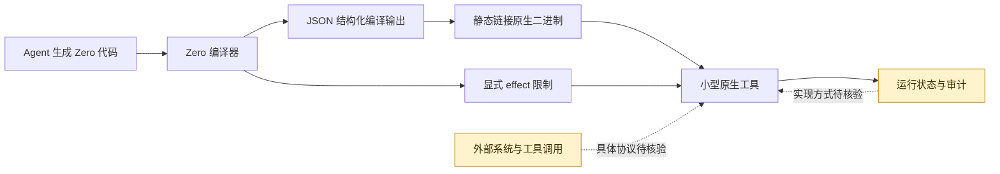

# Zero

## 一句话定位
Vercel Labs 推出的面向 Agent 的系统编程语言，专为生成小型、安全、可预测的原生工具而设计。

## 它解决的问题
当 AI Agent 需要动态生成和执行代码时，现有语言（Python、JavaScript）缺乏安全边界：隐式副作用、不可预测的内存行为、缺乏结构化的编译器输出。Zero 为 Agent 代码生成场景设计了一个有边界的语言。

## 为什么值得关注（2026-05-17）
- 由 Vercel Labs 推出，代表前端生态领导者对 Agent Runtime 的技术判断
- "面向 Agent 的系统语言"是一个全新的品类
- 显式 effect 系统 + 可预测内存管理是 Agent 代码安全执行的关键需求
- 可能影响未来 Agent 生成代码的范式

## 热度来源判断
- Vercel 品牌背书
- Agent 生态的持续热度
- 编程语言本身的猎奇吸引力
- 实际用户和应用场景极少

## 关键技术亮点亮点
1. **显式 effect 系统** — 编译器可追踪和限制代码的副作用，Agent 生成的代码在安全边界内运行
2. **可预测内存管理** — 不使用 GC，内存行为可预测，适合小型原生二进制
3. **结构化编译输出** — 编译器输出 JSON 格式的结构化数据，可被 Agent 解析和推理
4. **多目标支持** — `zero build --target linux-musl-x64`，生成静态链接原生二进制

## 架构师速览

| 决策问题 | 研究判断 | 证据边界 |
|---|---|---|
| 系统边界 | Zero 是面向 Agent 生成原生工具的系统编程语言；档案仅明确其语言、编译器、显式 effect、可预测内存管理、结构化编译输出和静态链接原生二进制能力。 | 未证实 Agent 框架、模型供应商、工具协议、身份、沙箱、状态存储或部署拓扑，相关边界待源码核验。 |
| 主路径 | Agent 生成 Zero 代码后，经编译输出结构化 JSON，再构建为指定目标静态链接原生二进制并执行。 | `zero build --target linux-musl-x64` 获明确记录；代码生成、审核、执行时序及运行时接口均未证实。 |
| 关键权衡 | 可在语言层追踪并限制副作用，同时提供无 GC 的可预测内存行为和可解析编译结果；代价是新语言的生态、工具链成熟度及长期维护风险尚无验证。 | 不得据此推断已提供完整沙箱、内存安全证明、跨平台目标、生态兼容性或生产可靠性。 |
| 最小 PoC | 用一个权限最小、无隐式外部依赖的确定性小工具，验证编译、JSON 输出、linux-musl-x64 静态链接及显式 effect 行为，并保留拒绝和审计记录。 | 档案未给出 effect 声明语法、工具接口、测试方法或审计机制；PoC 应聚焦这些待核验项并设置明确退出条件。 |

## 架构启发
- Agent 生成代码的安全性问题需要语言层面解决，不能只靠沙箱
- 显式 effect 与 Rust 的类型系统异曲同工，但面向不同的消费者（Agent vs 人类）
- 编译器输出结构化是 Agent 与工具链交互的新模式

## 架构图（MMD）

> 证据边界：此图只采用本档案已有可核验描述；“待核验”节点不应视为项目实现事实。

## 定位判断
在 Agent 生态中处于"语言层"的探索位置。如果成功，可能成为 Agent Runtime 的基础组件。但编程语言的成功率极低，Zero 更可能作为概念验证影响后续语言设计。

## 风险 / 局限 / 泡沫点
1. **语言存活率低** — 绝大多数新编程语言在 2-3 年内消亡
2. **Vercel 长期投入存疑** — Vercel 的核心业务是前端部署，Zero 与核心业务的关联度不明确
3. **916 stars，社区极早期** — 没有真实用户和应用场景验证
4. **与现有 Agent 生态的集成路径不清晰** — Agent 目前主要生成 Python/JS 代码

## 与同类项目的关系
- vs **Python/JavaScript**：Zero 更安全但生态为零，短期不可能替代
- vs **WebAssembly**：WASM 在 Agent 沙箱方向已有进展，Zero 需要证明独特价值
- vs **DSL/配置语言**：Zero 更接近系统语言而非 DSL

## 是否值得持续跟踪
**是，但低优先级。** 每月检查一次，关注 star 增速和 Vercel 的投入信号。

## 后续观察点
1. Vercel 是否在 Vercel AI SDK 中集成 Zero
2. 是否有真实 Agent 使用 Zero 生成代码的案例
3. 社区贡献者和 issue 活跃度是否持续增长

---
*首次记录：2026-05-17*
