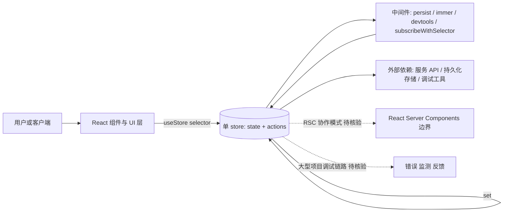

# zustand

## 一句话定位
"🐻 Bear necessities for state management in React"——极简 React 状态管理库，单文件、无 Provider、无 boilerplate、TS-first。Redux 的现代替代。

## 它解决的问题
Redux 学习曲线陡峭（reducer / action / store / middleware 样板多）；Context API 在大型组件树中易引发 re-render。zustand 提供：
- 单 store 创建：`create((set) => ({...}))`
- 选择性订阅：`useStore(s => s.part)`
- 同步/异步逻辑同源
- 无需 Provider，store 是 hook-friendly

## 为什么值得关注（2026-08-18）
被 daily/2026-08-18.md 选为今日 React 生态重点。其 58,590 stars 6 年增长曲线稳定，与 Jotai、Valtio、Redux Toolkit 等同处 React 状态管理第一梯队。open_issues=6 反映项目维护极简且稳定。

## 热度来源判断
热度来源是 **"极简 Redux 替代 × pmndrs 品牌 + 生态 × React 主流栈扩张"**。zustand 是 pmndrs（Poimandres）组织旗舰项目，与 react-three-fiber、valtio、jotai 共同奠定其在 React 生态中的影响力。

## 关键技术亮点
1. **单 store API:** `create(set => ({count: 0, inc: () => set(...)}))`
2. **无 Provider:** store 即 hook，组件树结构保持简洁
3. **选择器优化:** 显式 selector，避免不必要 re-render
4. **中间件:** persist、immer、devtools、subscribeWithSelector 等
5. **TS 支持:** 类型推导友好

## 架构师速览

| 决策问题 | 研究判断 | 证据边界 |
|---|---|---|
| 系统边界 | 边界落在 React 组件层与领域 store 之间：组件用 hook 选择性订阅单 store，store 内部即状态+actions，不引入 Provider/Context 树 | 仅依据档案中"单 store API、无 Provider、selector 优化"事实，未审计源码 |
| 主路径 | `create((set)=>({...}))` 定义 store → 组件 `useStore(selector)` 订阅 → set 触发更新 → 可选中间件（persist/immer/devtools/subscribeWithSelector）落地 | 中间件名单与 API 名称取自档案"关键技术亮点"段 |
| 关键权衡 | 极简（无 boilerplate、无 Provider）vs 大型应用可观测性/调试能力（devtools 非默认，需自行补 build pipeline） | 权衡描述源自档案"风险/局限"与"核心权衡"行；未给出性能基准 |
| 最小 PoC | 用 create 建一个带 count/inc 的 store，经 useStore(s=>s.count) 在组件中渲染并触发更新，验证 re-render 范围与 selector 行为 | PoC 仅复述档案给出的 API 形态；不补写未列出的部署/持久化细节 |

## 架构启发
"用 React 原生 hook 抽象状态" 是 zustand 的核心哲学——它不引入新概念（action/reducer），而是用 React 函数式思路重写 store。这一模式值得借鉴：**用宿主语言已有概念做最小封装**，比强制新思维框架的项目更长寿。

## 架构图（MMD）

> 证据边界：此图只采用本档案已有可核验描述；“待核验”节点不应视为项目实现事实。

## 定位判断
**工具型 / React 状态管理长青树。** 与 Redux Toolkit 共同占据 React 状态管理 Top 2，60k stars 量级稳定。预期未来 5-10 年仍是 React 状态管理主流选项之一。

## 风险 / 局限 / 泡沫点
- **大型项目调试:** 缺乏 devtools 标准（虽支持但非默认），大型团队需要补 build pipeline
- **与 React Server Components 协作:** RSC 下纯客户端 store 架构需要重新思考，未来或需调整
- **同质化压力:** Redux Toolkit 已大幅简化，新 RTK Query 进一步覆盖 zustand 部分场景
- **维护风险:** pmndrs 是社区组织，无大公司背书

## 与同类项目的关系
- **vs Redux Toolkit:** RTK 仍是企业首选；zustand 偏现代 / 极简
- **vs Jotai:** Jotai 是 atom 化（细粒度）；zustand 是单 store
- **vs Valtio:** Valtio 是 Proxy 化（mutate 友好）；zustand 是显式 set
- **vs React Context:** Context 不分选择器，zustand 性能更优

## 是否值得持续跟踪
**对 React 项目强烈推荐使用。** 跟踪价值中等（已进入成熟期）。其长期稳定性足以作为基础依赖，无需为同期替代品（如 Signal Store）频繁切换。

## 后续观察点
- React Server Components 下的最佳实践演进
- 与 TanStack Query / Router 的搭配模式
- 是否原生支持 RSC + Suspense
- pmndrs 生态（valtio、jotai、@react-three/fiber）协同演化

---
> 数据来源: GitHub API (2026-08-21) | Stars: 58,590 | Forks: 2,184 | License: MIT | 语言: TypeScript | 创建: 2019-04-09
