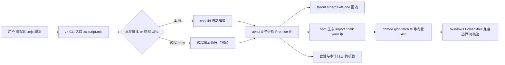

# zx

## 一句话定位
Google 出品的 JavaScript 化 shell 脚本工具——用 JS 写 shell 脚本，支持 `await`、`import`、`chmod`、glob 与 esbuild 编译。

## 它解决的问题
传统 shell 脚本（bash/zsh）语法晦涩、跨平台困难、缺乏现代语言特性；Node.js 子进程 API 又过于底层。zx 在两者之间架起桥梁：用 JS 写脚本但保留 shell 的简洁，能直接 `await $` 包装子进程、能 `glob`、`fetch`、`fs`、`yaml`、`chalk`，让自动化脚本可读、可调试、可复用 npm 生态。

## 为什么值得关注（2026-08-14）
被 daily/2026-08-14.md 选为今日 AI Coding 周边工具重点之一。在 Claude Code / Codex CLI 等 Coding Agent 推动 npm 工具链扩张的背景下，zx 作为"给 AI 用的脚本入口"重新获得关注——Agent 可以直接用 Node 写 shell 替代 bash。

## 热度来源判断
热度来源是**真实长期刚需**：自 2021 年发布以来持续维护，5 年稳定在 4 万+ stars，是 Google 官方开源的脚本工具标杆。近期再次回归 trending 主要受 Coding Agent 浪潮带动——Agent 需要可被 Node 生态调用的脚本能力。对比其他 shell 库（如 shelljs），zx 更现代、与 Promise/await 兼容更自然。

## 关键技术亮点
1. **Bash-like API in JS:** 提供 `$`、`cd`、`fetch`、`glob`、`which`、`chmod` 等函数，可直接在 JS 文件中调用
2. **自动 esbuild 编译:** `.mjs` 脚本可直接 `zx script.mjs` 运行，无需打包
3. **子进程 Promise 化:** `await $` 让 shell 命令天然支持 await，并返回 stdout/stderr/exitCode
4. **npm 生态复用:** 可直接 `import` 任何 Node 包，结合 chalk、yaml 等做复杂编排
5. **远程脚本支持:** `zx https://example.com/script.mjs` 可执行远程脚本

## 架构师速览

| 决策问题 | 研究判断 | 证据边界 |
|---|---|---|
| 系统边界 | zx 是一个 Node 生态内的脚本 DSL 增强层，边界在"JS 文件 ↔ 子进程 + npm 包"，外部依赖是 Node 运行时与可选的 esbuild 编译 | 仅基于档案明示的 `$`/`glob`/`chmod`/`fetch`/`import` 能力与 esbuild 编译，部署/分发形态未给出 |
| 主路径 | 用户写 `.mjs` → `zx script.mjs` 入口 → 自动 esbuild 编译 → `await $` 触发子进程 → stdout/stderr/exitCode 回流 → 可 `import` 的 npm 生态辅助（chalk/yaml 等） | 主路径来自档案"关键技术亮点"1–4；远程脚本分支 `zx https://...` 属另一入口 |
| 关键权衡 | JS 异步表达力 + npm 复用 vs 远程脚本执行的攻击面、跨平台（Windows）差异、与 Bun/Deno Shell 的运行时重叠 | 权衡依据档案"风险/局限"与"vs 同类"小节，无性能/基准数据 |
| 最小 PoC | 单一 `.mjs` 脚本，限定本地文件路径与最小 npm 依赖，开启审计日志；暂不启用远程 `zx https://...`，并将退出路径与 PowerShell 兼容性列为验收项 | PoC 范围受限于档案未披露的协议/部署细节，需源码核验 |

## 架构启发
"复用主流语言生态包装底层接口"的设计哲学值得借鉴。zx 没有发明新协议，而是让 JS 开发者用熟悉的语法写 shell，把 Node 的进程模型 + 包生态 + 语言能力顺势注入 shell 场景。

## 架构图（MMD）

> 证据边界：此图只采用本档案已有可核验描述；“待核验”节点不应视为项目实现事实。

## 定位判断
**脚本工具标准库型项目（DSL 增强层）。** 不是平台，但已成为"Node 写 shell"的事实标准。在 Coding Agent 推动 npm 工具泛化的 2026 年，zx 重新获得了关注，但其天花板较低——它解决的是"脚本语言选型"，而非底层协议。

## 风险 / 局限 / 泡沫点
- **安全风险:** `zx https://...` 远程执行是巨大攻击面；官方有警告但实际生产慎用
- **跨平台差异:** Windows 兼容仍依赖 PowerShell 兼容性测试，部分 bash 特有语法无法使用
- **AI 时代价值存疑:** 当 Agent 直接生成 Python 而非脚本时，zx 的角色会被稀释
- **门槛低但上限也低:** 学习曲线平滑但表达能力受限于 JS 异步语义

## 与同类项目的关系
- **vs shelljs:** shelljs 是同步命令模拟器；zx 走原生 Promise/await，更现代
- **vs Node 原生 child_process:** zx 提供 bash 风格 API，封装 child_process 的样板
- **vs Bun Shell:** Bun 内置 shell 体验类似，但 zx 跨 runtime（Node/Bun/Deno）
- **vs Deno subprocess API:** Deno 用 import + 同源策略；zx 兼容性更广

## 是否值得持续跟踪
**值得跟踪但优先级中等。** zx 是稳定的基础工具，问题不是它火不火，而是 AI Coding 时代是否需要更多 shell 抽象。对实际做 CLI 工具、CI/CD 编排、Coding Agent 脚本生成的开发者，zx 仍是首选之一。

## 后续观察点
- 是否进入 Coding Agent 的"标准脚本入口"清单（如 Claude Code 内置推荐）
- 是否发布 v8/v9 适配 Node 22+ 内置 fetch/glob
- 远程脚本模式是否被滥用或被禁用
- 与 Bun Shell、Deno Shell 的竞争是否被边缘化

---
> 数据来源: GitHub API (2026-08-21) | Stars: 45,676 | Forks: 1,284 | License: Apache-2.0 | 语言: JavaScript | 创建: 2021-05-05
